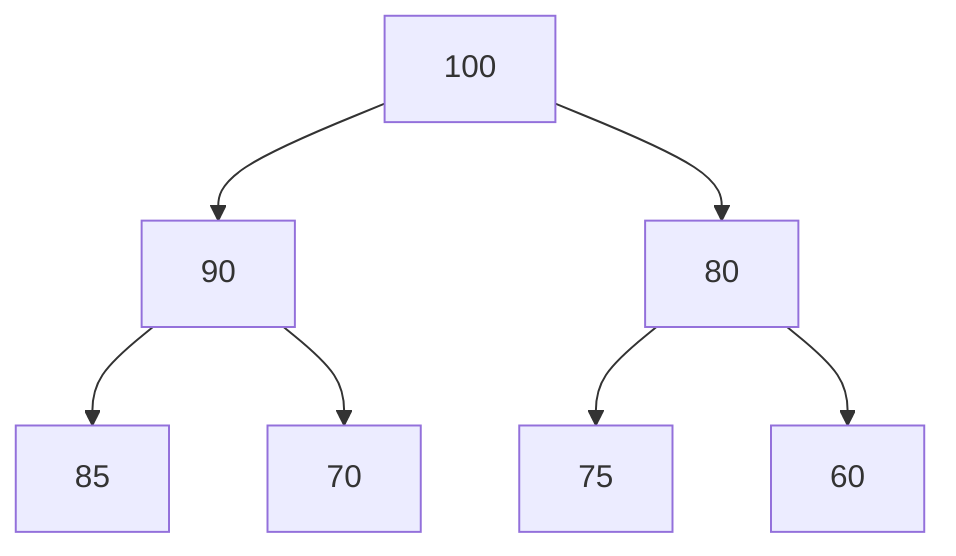
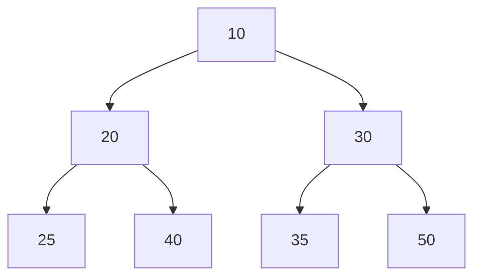

# 最大堆与最小堆

在计算机科学中，**堆（Heap）** 是一种特殊的树形数据结构，通常用于实现优先队列。堆可以分为**最大堆（Max Heap）** 和**最小堆（Min Heap）**。本文将详细介绍这两种堆的概念、实现方式以及它们的实际应用。

## 什么是堆？

堆是一种完全二叉树，它满足以下性质：

- **最大堆**：每个节点的值都大于或等于其子节点的值。根节点是堆中的最大值。
- **最小堆**：每个节点的值都小于或等于其子节点的值。根节点是堆中的最小值。

堆通常用于实现优先队列，因为堆可以快速访问、插入和删除最大或最小元素。

## 堆的性质

堆的一个重要性质是它是一个**完全二叉树**。这意味着除了最后一层，其他层都是完全填满的，并且最后一层的节点都尽可能地靠左排列。

### 最大堆示例



在这个最大堆中，根节点 `100` 是最大值，每个节点的值都大于或等于其子节点的值。

### 最小堆示例



在这个最小堆中，根节点 `10` 是最小值，每个节点的值都小于或等于其子节点的值。

## 堆的实现

堆通常使用数组来实现。对于一个索引为 `i` 的节点：

- 其父节点的索引为 `(i - 1) / 2`
- 其左子节点的索引为 `2 * i + 1`
- 其右子节点的索引为 `2 * i + 2`

### 最大堆的插入操作

插入一个新元素时，首先将其添加到数组的末尾，然后通过“上浮”操作将其调整到正确的位置。

```python
def insert_max_heap(heap, value):
    heap.append(value)
    index = len(heap) - 1
    while index > 0:
        parent_index = (index - 1) // 2
        if heap[index] > heap[parent_index]:
            heap[index], heap[parent_index] = heap[parent_index], heap[index]
            index = parent_index
        else:
            break
```

### 最大堆的删除操作

删除堆顶元素时，首先将堆的最后一个元素移动到堆顶，然后通过“下沉”操作将其调整到正确的位置。

```python
def delete_max_heap(heap):
    if not heap:
        return None
    max_value = heap[0]
    heap[0] = heap[-1]
    heap.pop()
    index = 0
    while True:
        left_child = 2 * index + 1
        right_child = 2 * index + 2
        largest = index
        if left_child < len(heap) and heap[left_child] > heap[largest]:
            largest = left_child
        if right_child < len(heap) and heap[right_child] > heap[largest]:
            largest = right_child
        if largest != index:
            heap[index], heap[largest] = heap[largest], heap[index]
            index = largest
        else:
            break
    return max_value
```

## 实际应用场景

### 优先队列

堆最常见的应用是实现优先队列。优先队列允许我们快速访问、插入和删除具有最高优先级的元素。例如，在任务调度系统中，可以使用最大堆来优先处理优先级最高的任务。

### 堆排序

堆排序是一种基于堆的排序算法。它的基本思想是将待排序的数组构建成一个最大堆，然后依次将堆顶元素（最大值）与数组的最后一个元素交换，并调整堆，直到整个数组有序。

```python
def heap_sort(arr):
    n = len(arr)
    for i in range(n // 2 - 1, -1, -1):
        heapify(arr, n, i)
    for i in range(n - 1, 0, -1):
        arr[i], arr[0] = arr[0], arr[i]
        heapify(arr, i, 0)

def heapify(arr, n, i):
    largest = i
    left = 2 * i + 1
    right = 2 * i + 2
    if left < n and arr[left] > arr[largest]:
        largest = left
    if right < n and arr[right] > arr[largest]:
        largest = right
    if largest != i:
        arr[i], arr[largest] = arr[largest], arr[i]
        heapify(arr, n, largest)
```

### 示例

```python
arr = [12, 11, 13, 5, 6, 7]
heap_sort(arr)
print("排序后的数组:", arr)
```

**输出：**

```
排序后的数组: [5, 6, 7, 11, 12, 13]
```

## 总结

最大堆和最小堆是两种重要的数据结构，它们在优先队列、堆排序等场景中有着广泛的应用。通过本文的学习，你应该已经掌握了堆的基本概念、实现方式以及它们的实际应用。

:::tip 提示
如果你对堆的实现和应用感兴趣，可以尝试自己实现一个最小堆，并探索更多基于堆的算法。
:::

## 附加资源与练习

- **练习 1**：实现一个最小堆，并编写插入和删除操作的代码。
- **练习 2**：使用堆排序算法对一个随机数组进行排序，并分析其时间复杂度。
- **附加资源**：阅读更多关于堆的优化和应用场景，例如 Dijkstra 算法中的优先队列实现。

通过不断练习和探索，你将能够更深入地理解堆这一数据结构，并在实际编程中灵活运用它。