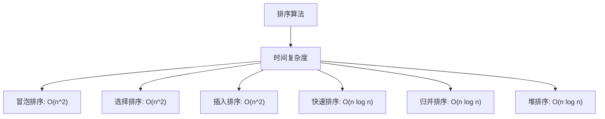

## 什么是排序算法？

排序算法是计算机科学中的一类算法，用于将一组数据按照特定的顺序（如升序或降序）重新排列。排序是编程中非常基础且重要的操作，广泛应用于数据处理、搜索优化、数据库管理等领域。

排序算法的核心目标是通过比较和交换元素，将数据整理成有序的序列。不同的排序算法在效率、实现复杂度和适用场景上各有特点。

---

## 常见的排序算法

以下是几种常见的排序算法：

1. **冒泡排序（Bubble Sort）**
2. **选择排序（Selection Sort）**
3. **插入排序（Insertion Sort）**
4. **快速排序（Quick Sort）**
5. **归并排序（Merge Sort）**
6. **堆排序（Heap Sort）**

每种算法都有其独特的实现方式和性能特点。接下来，我们将通过代码示例和实际案例逐步讲解这些算法。

---

## 冒泡排序

冒泡排序是一种简单的排序算法，它通过重复地遍历列表，比较相邻的元素并交换它们的位置，直到整个列表有序。

### 代码示例

```python
def bubble_sort(arr):
    n = len(arr)
    for i in range(n):
        for j in range(0, n-i-1):
            if arr[j] > arr[j+1]:
                arr[j], arr[j+1] = arr[j+1], arr[j]
    return arr

# 示例输入
arr = [64, 34, 25, 12, 22, 11, 90]
sorted_arr = bubble_sort(arr)
print("排序后的数组:", sorted_arr)
```

**输入:** `[64, 34, 25, 12, 22, 11, 90]`  
**输出:** `[11, 12, 22, 25, 34, 64, 90]`

### 实际应用

冒泡排序虽然简单，但由于其时间复杂度为 `O(n^2)`，通常只适用于小规模数据集。例如，在需要对少量数据进行快速排序时，可以使用冒泡排序。

---

## 快速排序

快速排序是一种高效的排序算法，采用分治法（Divide and Conquer）策略。它通过选择一个“基准”元素，将数组分为两部分，然后递归地对这两部分进行排序。

### 代码示例

```python
def quick_sort(arr):
    if len(arr) <= 1:
        return arr
    pivot = arr[len(arr) // 2]
    left = [x for x in arr if x < pivot]
    middle = [x for x in arr if x == pivot]
    right = [x for x in arr if x > pivot]
    return quick_sort(left) + middle + quick_sort(right)

# 示例输入
arr = [64, 34, 25, 12, 22, 11, 90]
sorted_arr = quick_sort(arr)
print("排序后的数组:", sorted_arr)
```

**输入:** `[64, 34, 25, 12, 22, 11, 90]`  
**输出:** `[11, 12, 22, 25, 34, 64, 90]`

### 实际应用

快速排序的平均时间复杂度为 `O(n log n)`，适用于大规模数据集。例如，在数据库中对大量记录进行排序时，快速排序是一个常用的选择。

---

## 归并排序

归并排序也是一种分治算法，它将数组分成两半，分别对每一半进行排序，然后将排序后的两半合并。

### 代码示例

```python
def merge_sort(arr):
    if len(arr) <= 1:
        return arr
    mid = len(arr) // 2
    left = merge_sort(arr[:mid])
    right = merge_sort(arr[mid:])
    return merge(left, right)

def merge(left, right):
    result = []
    i = j = 0
    while i < len(left) and j < len(right):
        if left[i] < right[j]:
            result.append(left[i])
            i += 1
        else:
            result.append(right[j])
            j += 1
    result.extend(left[i:])
    result.extend(right[j:])
    return result

# 示例输入
arr = [64, 34, 25, 12, 22, 11, 90]
sorted_arr = merge_sort(arr)
print("排序后的数组:", sorted_arr)
```

**输入:** `[64, 34, 25, 12, 22, 11, 90]`  
**输出:** `[11, 12, 22, 25, 34, 64, 90]`

### 实际应用

归并排序的时间复杂度为 `O(n log n)`，并且是稳定的排序算法。它常用于需要稳定排序的场景，例如在排序对象数组时保持相同键值的相对顺序。

---

## 排序算法的比较

以下是几种常见排序算法的性能比较：



:::tip
选择排序算法时，需要根据数据规模、是否需要稳定排序以及实现复杂度等因素综合考虑。
:::

---

## 总结

排序算法是编程中的基础工具，掌握它们对于解决实际问题至关重要。本文介绍了冒泡排序、快速排序和归并排序的基本原理和实现方法，并通过代码示例和实际应用场景帮助初学者理解这些算法。

---

## 附加资源与练习

1. **练习：** 尝试实现选择排序和插入排序，并比较它们的性能。
2. **资源：** 阅读《算法导论》中关于排序算法的章节，深入了解算法的数学原理。
3. **挑战：** 尝试优化快速排序，使其在最坏情况下也能高效运行。

:::caution
在实际开发中，尽量避免重复造轮子。大多数编程语言的标准库已经提供了高效的排序函数，例如 Python 的 `sorted()` 函数。
:::