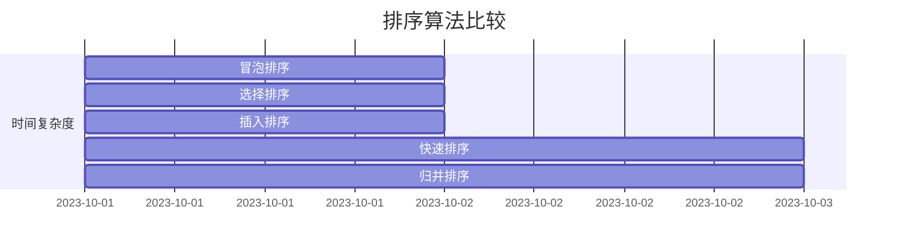

# 排序算法比较

排序是计算机科学中最基本且重要的操作之一。无论是处理数据、优化搜索，还是实现其他算法，排序都扮演着关键角色。本文将介绍几种常见的排序算法，分析它们的优缺点，并通过实际案例帮助你理解如何选择合适的排序算法。

## 什么是排序算法？

排序算法是一种将一组数据按照特定顺序（如升序或降序）重新排列的算法。常见的排序算法包括冒泡排序、选择排序、插入排序、快速排序、归并排序等。每种算法都有其独特的实现方式和性能特点。

## 常见排序算法

### 1. 冒泡排序（Bubble Sort）

冒泡排序是一种简单的排序算法。它重复地遍历列表，比较相邻的元素，如果顺序错误就交换它们。遍历列表的工作会重复进行，直到列表排序完成。

**代码示例：**
```python
def bubble_sort(arr):
    n = len(arr)
    for i in range(n):
        for j in range(0, n-i-1):
            if arr[j] > arr[j+1]:
                arr[j], arr[j+1] = arr[j+1], arr[j]
    return arr

# 示例输入
arr = [64, 34, 25, 12, 22, 11, 90]
print("排序前:", arr)
print("排序后:", bubble_sort(arr))
```

**输出：**
```
排序前: [64, 34, 25, 12, 22, 11, 90]
排序后: [11, 12, 22, 25, 34, 64, 90]
```

**时间复杂度：** O(n²)  
**适用场景：** 小规模数据或几乎已经排序的数据。

:::caution
冒泡排序的效率较低，不适合处理大规模数据。
:::

### 2. 选择排序（Selection Sort）

选择排序通过不断选择剩余元素中的最小值，并将其放到已排序部分的末尾。

**代码示例：**
```python
def selection_sort(arr):
    n = len(arr)
    for i in range(n):
        min_idx = i
        for j in range(i+1, n):
            if arr[j] < arr[min_idx]:
                min_idx = j
        arr[i], arr[min_idx] = arr[min_idx], arr[i]
    return arr

# 示例输入
arr = [64, 25, 12, 22, 11]
print("排序前:", arr)
print("排序后:", selection_sort(arr))
```

**输出：**
```
排序前: [64, 25, 12, 22, 11]
排序后: [11, 12, 22, 25, 64]
```

**时间复杂度：** O(n²)  
**适用场景：** 小规模数据，且内存空间有限。

### 3. 插入排序（Insertion Sort）

插入排序通过构建有序序列，对于未排序数据，在已排序序列中从后向前扫描，找到相应位置并插入。

**代码示例：**
```python
def insertion_sort(arr):
    for i in range(1, len(arr)):
        key = arr[i]
        j = i - 1
        while j >= 0 and key < arr[j]:
            arr[j + 1] = arr[j]
            j -= 1
        arr[j + 1] = key
    return arr

# 示例输入
arr = [12, 11, 13, 5, 6]
print("排序前:", arr)
print("排序后:", insertion_sort(arr))
```

**输出：**
```
排序前: [12, 11, 13, 5, 6]
排序后: [5, 6, 11, 12, 13]
```

**时间复杂度：** O(n²)  
**适用场景：** 小规模数据或几乎已经排序的数据。

### 4. 快速排序（Quick Sort）

快速排序是一种分治算法。它通过选择一个“基准”元素，将数组分为两部分，一部分小于基准，另一部分大于基准，然后递归地对这两部分进行排序。

**代码示例：**
```python
def quick_sort(arr):
    if len(arr) <= 1:
        return arr
    pivot = arr[len(arr) // 2]
    left = [x for x in arr if x < pivot]
    middle = [x for x in arr if x == pivot]
    right = [x for x in arr if x > pivot]
    return quick_sort(left) + middle + quick_sort(right)

# 示例输入
arr = [10, 7, 8, 9, 1, 5]
print("排序前:", arr)
print("排序后:", quick_sort(arr))
```

**输出：**
```
排序前: [10, 7, 8, 9, 1, 5]
排序后: [1, 5, 7, 8, 9, 10]
```

**时间复杂度：** 平均 O(n log n)，最坏 O(n²)  
**适用场景：** 大规模数据，性能较好。

:::tip
快速排序是实际应用中最常用的排序算法之一，因为它的平均性能非常好。
:::

### 5. 归并排序（Merge Sort）

归并排序也是一种分治算法。它将数组分成两半，分别对它们进行排序，然后将排序后的两半合并。

**代码示例：**
```python
def merge_sort(arr):
    if len(arr) <= 1:
        return arr
    mid = len(arr) // 2
    left = merge_sort(arr[:mid])
    right = merge_sort(arr[mid:])
    return merge(left, right)

def merge(left, right):
    result = []
    i = j = 0
    while i < len(left) and j < len(right):
        if left[i] < right[j]:
            result.append(left[i])
            i += 1
        else:
            result.append(right[j])
            j += 1
    result.extend(left[i:])
    result.extend(right[j:])
    return result

# 示例输入
arr = [38, 27, 43, 3, 9, 82, 10]
print("排序前:", arr)
print("排序后:", merge_sort(arr))
```

**输出：**
```
排序前: [38, 27, 43, 3, 9, 82, 10]
排序后: [3, 9, 10, 27, 38, 43, 82]
```

**时间复杂度：** O(n log n)  
**适用场景：** 大规模数据，稳定性要求高。

## 排序算法比较

以下是一个简单的比较表，总结了上述排序算法的性能特点：



| 算法         | 平均时间复杂度 | 最坏时间复杂度 | 空间复杂度 | 稳定性 |
|--------------|----------------|----------------|------------|--------|
| 冒泡排序     | O(n²)          | O(n²)          | O(1)       | 稳定   |
| 选择排序     | O(n²)          | O(n²)          | O(1)       | 不稳定 |
| 插入排序     | O(n²)          | O(n²)          | O(1)       | 稳定   |
| 快速排序     | O(n log n)     | O(n²)          | O(log n)   | 不稳定 |
| 归并排序     | O(n log n)     | O(n log n)     | O(n)       | 稳定   |

## 实际应用场景

1. **冒泡排序**：适用于小规模数据或教学演示。
2. **选择排序**：适用于内存空间有限的小规模数据。
3. **插入排序**：适用于几乎已经排序的数据或小规模数据。
4. **快速排序**：适用于大规模数据，性能要求高的场景。
5. **归并排序**：适用于需要稳定排序的大规模数据。

## 总结

排序算法是编程中的基础工具，选择合适的排序算法可以显著提高程序的性能。对于初学者来说，理解每种算法的原理和适用场景非常重要。希望本文能帮助你更好地掌握排序算法的知识。

## 附加资源

- [《算法导论》](https://mitpress.mit.edu/books/introduction-algorithms) - 深入理解算法设计与分析。
- [LeetCode](https://leetcode.com/) - 练习排序算法相关的编程题目。

:::note
建议初学者多动手实践，通过编写代码来加深对排序算法的理解。
:::