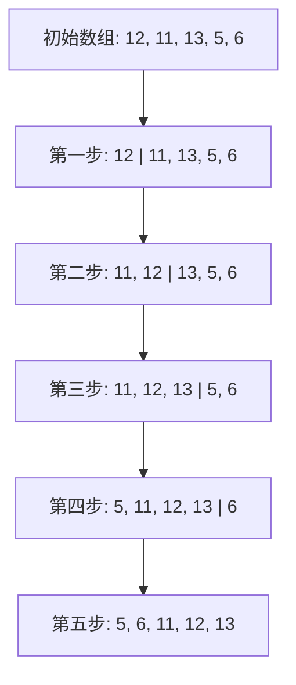

## 什么是插入排序？

插入排序（Insertion Sort）是一种简单直观的排序算法。它的工作原理类似于我们整理扑克牌的方式：每次从未排序的部分取出一张牌，将其插入到已排序部分的正确位置。插入排序适用于小规模数据或部分有序的数据集。

## 插入排序的工作原理

插入排序的核心思想是将数组分为两部分：已排序部分和未排序部分。初始时，已排序部分只包含数组的第一个元素，未排序部分包含剩余的元素。然后，算法逐步从未排序部分取出元素，并将其插入到已排序部分的正确位置，直到所有元素都被排序。

### 步骤详解

1. **初始化**：将数组的第一个元素视为已排序部分，其余部分为未排序部分。
2. **遍历未排序部分**：从第二个元素开始，依次取出未排序部分的元素。
3. **插入到已排序部分**：将取出的元素与已排序部分的元素从后向前比较，找到合适的位置插入。
4. **重复**：重复上述步骤，直到所有元素都被插入到已排序部分。

### 代码示例

以下是一个用 Python 实现的插入排序算法：

```python
def insertion_sort(arr):
    for i in range(1, len(arr)):
        key = arr[i]
        j = i - 1
        while j >= 0 and key < arr[j]:
            arr[j + 1] = arr[j]
            j -= 1
        arr[j + 1] = key
    return arr

# 示例输入
arr = [12, 11, 13, 5, 6]
sorted_arr = insertion_sort(arr)
print("排序后的数组:", sorted_arr)
```

**输入**: `[12, 11, 13, 5, 6]`  
**输出**: `[5, 6, 11, 12, 13]`

### 可视化过程

为了更好地理解插入排序的过程，我们可以使用 Mermaid 图表来展示每一步的变化：




## 实际应用场景

插入排序虽然在大规模数据集上效率不高，但在某些特定场景下非常有用：

1. **小规模数据集**：当数据量较小时，插入排序的性能优于更复杂的排序算法。
2. **部分有序的数据**：如果数据已经部分有序，插入排序的效率会显著提高。
3. **在线算法**：插入排序适用于数据流式输入的场景，因为它可以逐步处理数据。

:::tip
**提示**：插入排序的时间复杂度为 O(n²)，但在最佳情况下（数据已经有序），时间复杂度可以降至 O(n)。
:::

## 总结

插入排序是一种简单且易于理解的排序算法，特别适合小规模数据集或部分有序的数据。虽然它在处理大规模数据时效率较低，但在某些特定场景下仍然非常有用。

## 附加资源与练习

1. **练习**：尝试用你喜欢的编程语言实现插入排序，并测试不同数据集下的性能。
2. **进一步学习**：了解其他排序算法，如冒泡排序、选择排序和快速排序，比较它们的优缺点。

:::caution
**注意**：插入排序在处理大规模数据时效率较低，建议在实际应用中选择更高效的排序算法。
:::