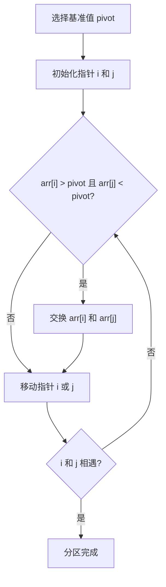

# 快速排序

快速排序（Quick Sort）是一种高效的排序算法，由英国计算机科学家 Tony Hoare 于 1959 年提出。它采用分治法（Divide and Conquer）策略，通过递归地将数组分成较小的子数组来实现排序。快速排序的平均时间复杂度为 O(n log n)，在大多数情况下表现优异。

## 快速排序的基本思想

快速排序的核心思想是选择一个“基准值”（pivot），然后将数组分为两部分：一部分小于基准值，另一部分大于基准值。接着，递归地对这两部分进行排序，最终合并成一个有序数组。

### 步骤分解

1. **选择基准值**：从数组中选择一个元素作为基准值（通常选择第一个、最后一个或中间的元素）。
2. **分区**：将数组重新排列，使得所有小于基准值的元素都在基准值的左侧，所有大于基准值的元素都在基准值的右侧。
3. **递归排序**：对基准值左侧和右侧的子数组递归地应用快速排序。
4. **合并**：由于分区后的子数组已经有序，合并后整个数组即有序。

:::tip
选择基准值的方式会影响算法的性能。通常选择数组的第一个、最后一个或中间元素作为基准值。
:::

## 代码示例

以下是一个使用 Python 实现的快速排序算法：

```python
def quick_sort(arr):
    if len(arr) <= 1:
        return arr
    pivot = arr[len(arr) // 2]  # 选择中间元素作为基准值
    left = [x for x in arr if x < pivot]
    middle = [x for x in arr if x == pivot]
    right = [x for x in arr if x > pivot]
    return quick_sort(left) + middle + quick_sort(right)

# 示例输入
arr = [3, 6, 8, 10, 1, 2, 1]
print("排序前:", arr)
sorted_arr = quick_sort(arr)
print("排序后:", sorted_arr)
```

**输出：**
```
排序前: [3, 6, 8, 10, 1, 2, 1]
排序后: [1, 1, 2, 3, 6, 8, 10]
```

:::note
在上述代码中，我们选择数组的中间元素作为基准值。你也可以选择其他策略，例如选择第一个或最后一个元素。
:::

## 快速排序的分区过程

为了更好地理解快速排序的分区过程，我们可以通过以下步骤来分解：

1. 选择基准值 `pivot`。
2. 使用两个指针 `i` 和 `j`，分别从数组的起始和末尾向中间移动。
3. 当 `arr[i]` 大于 `pivot` 且 `arr[j]` 小于 `pivot` 时，交换这两个元素。
4. 重复上述过程，直到 `i` 和 `j` 相遇。



## 实际应用场景

快速排序广泛应用于各种需要高效排序的场景，例如：

- **数据库排序**：在数据库中，快速排序常用于对查询结果进行排序。
- **编程语言内置排序函数**：许多编程语言（如 Python 的 `sorted()` 函数）在内部使用快速排序或其变体。
- **大数据处理**：在处理大规模数据集时，快速排序的高效性使其成为首选算法之一。

:::caution
尽管快速排序在大多数情况下表现优异，但在最坏情况下（例如数组已经有序），其时间复杂度会退化为 O(n²)。为了避免这种情况，可以采用随机化选择基准值的方法。
:::

## 总结

快速排序是一种高效的排序算法，通过分治法将数组递归地分成较小的子数组进行排序。它的平均时间复杂度为 O(n log n)，在大多数情况下表现优异。然而，在最坏情况下，其性能可能会下降，因此在实际应用中需要注意基准值的选择。

## 附加资源与练习

- **练习**：尝试实现一个随机化选择基准值的快速排序算法。
- **进一步学习**：了解其他排序算法，如归并排序、堆排序，并比较它们的性能。
- **参考书籍**：《算法导论》是学习排序算法的经典教材，推荐阅读。

:::warning
在实现快速排序时，务必注意递归深度，避免栈溢出。对于非常大的数据集，可以考虑使用迭代版本的快速排序。
:::