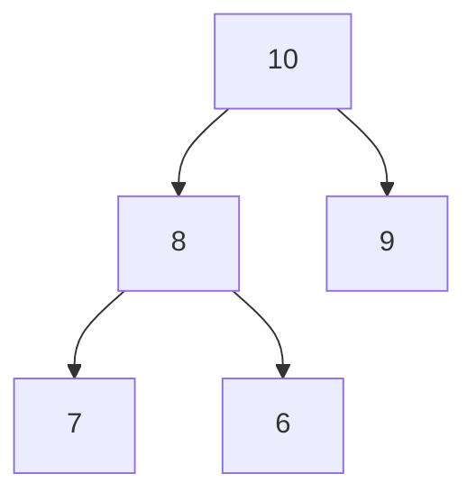

# 堆排序

堆排序（Heap Sort）是一种基于二叉堆数据结构的排序算法。它通过将待排序的数组构建成一个最大堆（或最小堆），然后逐步将堆顶元素与堆的最后一个元素交换，并调整堆，最终实现排序。堆排序的时间复杂度为 O(n log n)，是一种高效的排序算法。

## 什么是堆？

在介绍堆排序之前，我们需要先了解什么是堆。堆是一种特殊的完全二叉树，它满足以下性质：

- **最大堆**：每个节点的值都大于或等于其子节点的值。
- **最小堆**：每个节点的值都小于或等于其子节点的值。

堆通常用数组来表示，数组的下标与堆的节点位置对应。例如，对于数组 `[10, 8, 9, 7, 6]`，可以表示为以下最大堆：



## 堆排序的基本思想

堆排序的基本思想可以分为以下几个步骤：

1. **构建最大堆**：将待排序的数组构建成一个最大堆。
2. **交换堆顶元素**：将堆顶元素（最大值）与堆的最后一个元素交换。
3. **调整堆**：将剩余的元素重新调整为最大堆。
4. **重复步骤2和3**：直到所有元素都排序完成。

## 堆排序的实现

下面是一个用 Python 实现的堆排序算法：

```python
def heapify(arr, n, i):
    largest = i  # 初始化最大值为根节点
    left = 2 * i + 1  # 左子节点
    right = 2 * i + 2  # 右子节点

    # 如果左子节点存在且大于根节点
    if left < n and arr[left] > arr[largest]:
        largest = left

    # 如果右子节点存在且大于当前最大值
    if right < n and arr[right] > arr[largest]:
        largest = right

    # 如果最大值不是根节点
    if largest != i:
        arr[i], arr[largest] = arr[largest], arr[i]  # 交换
        heapify(arr, n, largest)  # 递归调整子树

def heap_sort(arr):
    n = len(arr)

    # 构建最大堆
    for i in range(n // 2 - 1, -1, -1):
        heapify(arr, n, i)

    # 逐个提取元素
    for i in range(n - 1, 0, -1):
        arr[i], arr[0] = arr[0], arr[i]  # 交换堆顶元素和最后一个元素
        heapify(arr, i, 0)  # 调整剩余堆

# 示例
arr = [12, 11, 13, 5, 6, 7]
heap_sort(arr)
print("排序后的数组:", arr)
```

**输入**: `[12, 11, 13, 5, 6, 7]`  
**输出**: `排序后的数组: [5, 6, 7, 11, 12, 13]`

:::note
在代码中，`heapify` 函数用于调整堆，确保每个子树都满足最大堆的性质。`heap_sort` 函数则负责构建最大堆并逐步提取堆顶元素。
:::

## 堆排序的时间复杂度

堆排序的时间复杂度为 O(n log n)，其中：

- **构建最大堆**：O(n)
- **每次调整堆**：O(log n)
- **总共调整 n-1 次**：O(n log n)

因此，堆排序的整体时间复杂度为 O(n log n)。

## 实际应用场景

堆排序在实际中有多种应用场景，例如：

1. **优先队列**：堆排序可以用于实现优先队列，确保每次都能快速获取最大或最小元素。
2. **实时系统**：在需要快速响应和排序的场景中，堆排序的高效性使其成为理想选择。
3. **大数据处理**：在处理大规模数据时，堆排序的时间复杂度使其能够高效完成任务。

:::tip
堆排序虽然高效，但由于其不稳定的特性（相同元素的相对位置可能改变），在某些场景下可能不适用。
:::

## 总结

堆排序是一种高效的排序算法，基于二叉堆数据结构实现。通过构建最大堆并逐步提取堆顶元素，堆排序能够在 O(n log n) 的时间复杂度内完成排序。尽管堆排序在某些场景下可能不稳定，但其高效性和广泛的应用使其成为排序算法中的重要一员。

## 附加资源与练习

- **练习**：尝试用其他编程语言（如 Java 或 C++）实现堆排序。
- **深入学习**：了解其他基于堆的数据结构，如优先队列和斐波那契堆。
- **挑战**：尝试优化堆排序的实现，使其在特定场景下表现更好。

:::caution
在学习堆排序时，务必理解堆的性质和调整过程，这是掌握堆排序的关键。
:::