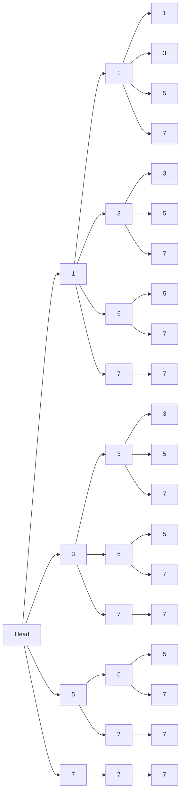

## 介绍

跳表（Skip List）是一种概率性的数据结构，它通过在有序链表的基础上添加多层索引来加速查找操作。跳表的查找、插入和删除操作的平均时间复杂度为 O(log n)，与平衡树（如红黑树）相当，但实现更为简单。

跳表的核心思想是通过“跳跃”来减少查找时的比较次数。每一层都是一个有序链表，底层包含所有元素，而上层则是底层链表的子集。通过这种方式，跳表可以在查找时快速跳过不需要比较的元素。

## 跳表的结构

跳表由多层链表组成，每一层都是一个有序链表。最底层（第 0 层）包含所有元素，而每一层都是其下一层的子集。每一层的元素通过指针连接，形成一个多层的链表结构。



在上图中，每一层都是一个有序链表，最底层包含所有元素，而上层则是底层链表的子集。通过这种方式，跳表可以在查找时快速跳过不需要比较的元素。

## 跳表的操作

### 查找

查找操作从最高层开始，逐层向下查找，直到找到目标元素或确定目标元素不存在。

```python
def search(skip_list, target):
    current = skip_list.head
    for level in reversed(range(len(skip_list.head.next))):
        while current.next[level] and current.next[level].value < target:
            current = current.next[level]
    current = current.next[0]
    if current and current.value == target:
        return current
    return None
```

### 插入

插入操作首先找到插入位置，然后随机决定新元素应该出现在哪些层中。

```python
import random

def insert(skip_list, value):
    update = [None] * len(skip_list.head.next)
    current = skip_list.head
    for level in reversed(range(len(skip_list.head.next))):
        while current.next[level] and current.next[level].value < value:
            current = current.next[level]
        update[level] = current
    current = current.next[0]
    if current and current.value == value:
        return  # 元素已存在
    new_level = random_level()
    if new_level > len(skip_list.head.next):
        for _ in range(len(skip_list.head.next), new_level):
            update.append(skip_list.head)
        skip_list.head.next.extend([None] * (new_level - len(skip_list.head.next)))
    new_node = Node(value, new_level)
    for level in range(new_level):
        new_node.next[level] = update[level].next[level]
        update[level].next[level] = new_node

def random_level():
    level = 1
    while random.random() < 0.5 and level < 32:
        level += 1
    return level
```

### 删除

删除操作首先找到要删除的元素，然后将其从所有层中移除。

```python
def delete(skip_list, value):
    update = [None] * len(skip_list.head.next)
    current = skip_list.head
    for level in reversed(range(len(skip_list.head.next))):
        while current.next[level] and current.next[level].value < value:
            current = current.next[level]
        update[level] = current
    current = current.next[0]
    if current and current.value == value:
        for level in range(len(current.next)):
            update[level].next[level] = current.next[level]
        return True
    return False
```

## 实际应用

跳表在实际应用中有广泛的用途，尤其是在需要高效查找、插入和删除操作的场景中。以下是一些常见的应用场景：

1. **Redis 中的有序集合**：Redis 使用跳表来实现其有序集合（Sorted Set）数据结构，以支持高效的插入、删除和范围查询操作。
2. **LevelDB 和 RocksDB**：这些键值存储引擎使用跳表来实现其内存中的数据结构，以支持高效的数据操作。
3. **并发数据结构**：跳表可以很容易地扩展为并发数据结构，支持多线程环境下的高效操作。

## 总结

跳表是一种高效的数据结构，通过多层索引加速查找操作。它的实现相对简单，且在实际应用中有广泛的用途。通过本文的介绍，你应该对跳表的概念、实现及其应用有了初步的了解。

## 附加资源

- [跳表的维基百科页面](https://en.wikipedia.org/wiki/Skip_list)
- [Redis 中的有序集合实现](https://redis.io/topics/data-types#sorted-sets)
- [LevelDB 和 RocksDB 的实现细节](https://github.com/google/leveldb)

## 练习

1. 实现一个跳表，并测试其查找、插入和删除操作的性能。
2. 比较跳表与平衡树（如红黑树）的性能差异。
3. 尝试将跳表扩展为并发数据结构，并测试其在多线程环境下的性能。