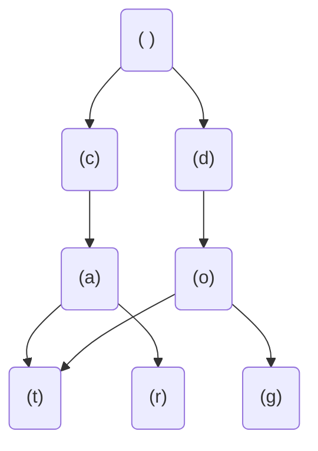

# 字典树 (Trie)

字典树（Trie），也称为前缀树或单词查找树，是一种用于高效存储和检索字符串集合的树形数据结构。它的核心思想是利用字符串的公共前缀来减少存储空间，并提高查询效率。字典树在搜索引擎、拼写检查、自动补全等场景中有着广泛的应用。

## 什么是字典树？

字典树是一种多叉树结构，每个节点代表一个字符。从根节点到某一节点的路径表示一个字符串的前缀。字典树的典型特点是：

- 根节点不包含字符，其他每个节点包含一个字符。
- 从根节点到某一节点的路径表示一个字符串的前缀。
- 每个节点的子节点代表下一个可能的字符。
- 通常，节点会标记是否为某个字符串的结尾。

### 字典树的结构

以下是一个简单的字典树示例，存储了单词 "cat"、"car"、"dog" 和 "dot"：



在这个图中：
- 根节点为空。
- 从根节点到 `t` 节点的路径表示单词 "cat"。
- 从根节点到 `r` 节点的路径表示单词 "car"。
- 从根节点到 `g` 节点的路径表示单词 "dog"。
- 从根节点到 `t` 节点的路径表示单词 "dot"。

## 字典树的实现

下面是一个用 Python 实现的简单字典树：

```python
class TrieNode:
    def __init__(self):
        self.children = {}
        self.is_end_of_word = False

class Trie:
    def __init__(self):
        self.root = TrieNode()

    def insert(self, word):
        node = self.root
        for char in word:
            if char not in node.children:
                node.children[char] = TrieNode()
            node = node.children[char]
        node.is_end_of_word = True

    def search(self, word):
        node = self.root
        for char in word:
            if char not in node.children:
                return False
            node = node.children[char]
        return node.is_end_of_word

    def starts_with(self, prefix):
        node = self.root
        for char in prefix:
            if char not in node.children:
                return False
            node = node.children[char]
        return True
```

### 示例用法

```python
trie = Trie()
trie.insert("cat")
trie.insert("car")
trie.insert("dog")
trie.insert("dot")

print(trie.search("cat"))  # 输出: True
print(trie.search("car"))  # 输出: True
print(trie.search("cap"))  # 输出: False
print(trie.starts_with("do"))  # 输出: True
print(trie.starts_with("ca"))  # 输出: True
print(trie.starts_with("da"))  # 输出: False
```

## 字典树的应用场景

字典树在许多实际应用中都非常有用，以下是一些常见的应用场景：

1. **自动补全**：在搜索引擎或输入法中，字典树可以用于快速查找以某个前缀开头的所有单词。
2. **拼写检查**：字典树可以用于检查一个单词是否存在于字典中。
3. **IP 路由**：在计算机网络中，字典树可以用于高效地查找最长前缀匹配的路由。
4. **单词游戏**：在 Scrabble 或 Boggle 等单词游戏中，字典树可以用于快速验证单词的有效性。

## 总结

字典树是一种高效的数据结构，特别适合处理字符串的存储和检索问题。通过利用字符串的公共前缀，字典树能够显著减少存储空间，并提高查询效率。掌握字典树的基本概念和实现方法，对于解决许多实际问题非常有帮助。

### 附加资源与练习

- **练习**：尝试实现一个支持删除操作的字典树。
- **扩展阅读**：学习如何优化字典树的空间复杂度，例如使用压缩字典树（Radix Tree）。
- **挑战**：实现一个简单的拼写检查器，使用字典树来存储和验证单词。

:::tip
如果你对字典树的应用有更多兴趣，可以尝试将其应用到实际项目中，例如实现一个简单的搜索引擎或输入法。
:::