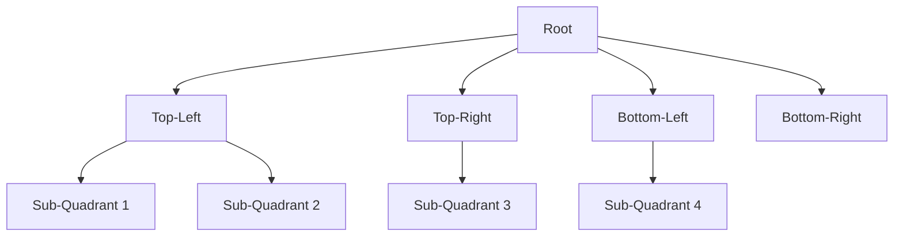
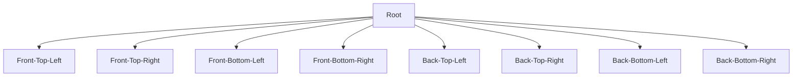

# 空间分割数据结构

空间分割数据结构是一种用于高效管理和查询空间数据的特殊数据结构。它们广泛应用于计算机图形学、地理信息系统（GIS）、游戏开发、碰撞检测等领域。通过将空间划分为更小的区域，这些数据结构能够快速定位和处理特定区域内的对象。

## 什么是空间分割数据结构？

空间分割数据结构的主要目的是将空间划分为多个区域，以便快速查询和操作空间中的对象。常见的空间分割数据结构包括：

1. **四叉树（Quadtree）**
2. **八叉树（Octree）**
3. **BSP树（Binary Space Partitioning Tree）**
4. **KD树（K-Dimensional Tree）**
5. **网格（Grid）**

这些数据结构通过递归或规则划分空间，使得查询操作（如范围查询、最近邻查询）更加高效。

---

## 四叉树（Quadtree）

四叉树是一种二维空间分割数据结构，常用于处理平面上的数据。它将空间递归地划分为四个象限，直到每个象限中的对象数量满足特定条件。

### 四叉树的结构



### 四叉树的实现

以下是一个简单的四叉树实现示例：

```python
class Point:
    def __init__(self, x, y):
        self.x = x
        self.y = y

class Rectangle:
    def __init__(self, x, y, width, height):
        self.x = x
        self.y = y
        self.width = width
        self.height = height

    def contains(self, point):
        return (self.x <= point.x <= self.x + self.width and
                self.y <= point.y <= self.y + self.height)

class Quadtree:
    def __init__(self, boundary, capacity):
        self.boundary = boundary
        self.capacity = capacity
        self.points = []
        self.divided = False

    def subdivide(self):
        x = self.boundary.x
        y = self.boundary.y
        w = self.boundary.width / 2
        h = self.boundary.height / 2

        ne = Rectangle(x + w, y, w, h)
        self.northeast = Quadtree(ne, self.capacity)
        nw = Rectangle(x, y, w, h)
        self.northwest = Quadtree(nw, self.capacity)
        se = Rectangle(x + w, y + h, w, h)
        self.southeast = Quadtree(se, self.capacity)
        sw = Rectangle(x, y + h, w, h)
        self.southwest = Quadtree(sw, self.capacity)

        self.divided = True

    def insert(self, point):
        if not self.boundary.contains(point):
            return False

        if len(self.points) < self.capacity:
            self.points.append(point)
            return True
        else:
            if not self.divided:
                self.subdivide()

            if self.northeast.insert(point):
                return True
            elif self.northwest.insert(point):
                return True
            elif self.southeast.insert(point):
                return True
            elif self.southwest.insert(point):
                return True

        return False
```

### 四叉树的应用

四叉树常用于以下场景：
- **碰撞检测**：快速检测物体是否发生碰撞。
- **图像处理**：用于图像压缩和区域划分。
- **游戏开发**：管理游戏中的对象位置。

---

## 八叉树（Octree）

八叉树是四叉树的三维扩展，用于处理三维空间中的数据。它将空间递归地划分为八个立方体区域。

### 八叉树的结构



### 八叉树的应用

八叉树常用于以下场景：
- **三维图形渲染**：管理三维场景中的对象。
- **医学成像**：处理体数据（如CT扫描）。
- **物理引擎**：检测三维空间中的碰撞。

---

## 实际案例：游戏中的碰撞检测

在游戏中，碰撞检测是一个常见的需求。使用四叉树或八叉树可以显著提高碰撞检测的效率。例如，在一个2D游戏中，四叉树可以快速定位玩家附近的敌人，从而减少不必要的计算。

```python
# 假设我们有一个游戏场景
boundary = Rectangle(0, 0, 800, 600)
quadtree = Quadtree(boundary, 4)

# 插入游戏对象
player = Point(100, 100)
enemy1 = Point(150, 150)
enemy2 = Point(200, 200)
quadtree.insert(player)
quadtree.insert(enemy1)
quadtree.insert(enemy2)

# 查询玩家附近的敌人
def query_range(tree, range):
    found = []
    if not tree.boundary.intersects(range):
        return found
    for point in tree.points:
        if range.contains(point):
            found.append(point)
    if tree.divided:
        found.extend(query_range(tree.northeast, range))
        found.extend(query_range(tree.northwest, range))
        found.extend(query_range(tree.southeast, range))
        found.extend(query_range(tree.southwest, range))
    return found

range = Rectangle(90, 90, 20, 20)
nearby_enemies = query_range(quadtree, range)
print(nearby_enemies)  # 输出：[Point(100, 100), Point(150, 150)]
```

---

## 总结

空间分割数据结构是处理空间数据的高效工具。通过将空间划分为更小的区域，这些数据结构能够显著提高查询和操作的效率。四叉树和八叉树是其中最常用的两种结构，分别适用于二维和三维空间。

:::tip 提示
如果你对空间分割数据结构感兴趣，可以尝试实现一个简单的四叉树或八叉树，并将其应用到你的项目中。
:::

---

## 附加资源

- [四叉树 - Wikipedia](https://en.wikipedia.org/wiki/Quadtree)
- [八叉树 - Wikipedia](https://en.wikipedia.org/wiki/Octree)
- [KD树 - Wikipedia](https://en.wikipedia.org/wiki/K-d_tree)

## 练习

1. 实现一个简单的四叉树，并测试其插入和查询功能。
2. 尝试将四叉树应用到碰撞检测中，比较其性能与暴力检测的差异。
3. 研究八叉树在三维图形渲染中的应用，并尝试实现一个简单的八叉树。