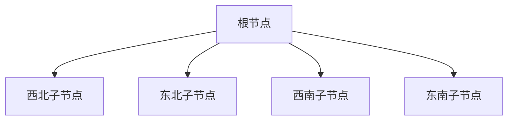

# 四叉树

## 介绍

四叉树（Quadtree）是一种树状数据结构，常用于空间划分和二维空间的搜索。它将空间递归地划分为四个象限（或称为子区域），每个象限可以进一步划分为更小的四个象限，直到满足某个条件为止。四叉树广泛应用于图像处理、地理信息系统（GIS）、碰撞检测等领域。

### 基本概念

四叉树的每个节点代表一个矩形区域，并包含四个子节点，分别代表该区域的四个象限：西北（NW）、东北（NE）、西南（SW）和东南（SE）。如果一个区域内的对象数量超过某个阈值，或者区域的大小超过某个限制，则该区域会被进一步划分为四个子区域。

## 四叉树的结构

四叉树的节点通常包含以下信息：

- 边界框（Bounding Box）：表示当前节点所代表的矩形区域。
- 子节点：四个子节点，分别代表四个象限。
- 数据：存储在当前节点中的对象或数据。



## 四叉树的实现

下面是一个简单的四叉树实现示例，使用 Python 编写：

```python
class Quadtree:
    def __init__(self, boundary, capacity):
        self.boundary = boundary  # 边界框 (x, y, width, height)
        self.capacity = capacity  # 节点容量
        self.points = []          # 存储的点
        self.divided = False      # 是否已划分

    def subdivide(self):
        x, y, w, h = self.boundary
        nw = (x, y, w/2, h/2)
        ne = (x + w/2, y, w/2, h/2)
        sw = (x, y + h/2, w/2, h/2)
        se = (x + w/2, y + h/2, w/2, h/2)

        self.nw = Quadtree(nw, self.capacity)
        self.ne = Quadtree(ne, self.capacity)
        self.sw = Quadtree(sw, self.capacity)
        self.se = Quadtree(se, self.capacity)
        self.divided = True

    def insert(self, point):
        if not self.boundary.contains(point):
            return False

        if len(self.points) < self.capacity:
            self.points.append(point)
            return True
        else:
            if not self.divided:
                self.subdivide()

            if self.nw.insert(point): return True
            if self.ne.insert(point): return True
            if self.sw.insert(point): return True
            if self.se.insert(point): return True

    def query(self, range, found):
        if not self.boundary.intersects(range):
            return

        for point in self.points:
            if range.contains(point):
                found.append(point)

        if self.divided:
            self.nw.query(range, found)
            self.ne.query(range, found)
            self.sw.query(range, found)
            self.se.query(range, found)

        return found
```

### 代码解释

- `boundary`：表示当前节点的边界框，通常是一个矩形区域。
- `capacity`：表示当前节点可以存储的最大点数。
- `points`：存储在当前节点中的点。
- `divided`：表示当前节点是否已经被划分为四个子节点。

### 插入操作

插入操作首先检查点是否在当前节点的边界框内。如果在边界框内且当前节点的点数未超过容量，则将点添加到当前节点。否则，如果当前节点尚未划分，则将其划分为四个子节点，并递归地将点插入到适当的子节点中。

### 查询操作

查询操作用于查找位于给定区域内的所有点。它首先检查当前节点的边界框是否与查询区域相交。如果相交，则遍历当前节点中的所有点，并将位于查询区域内的点添加到结果列表中。如果当前节点已被划分，则递归地在子节点中执行查询操作。

## 实际应用场景

### 图像处理

在图像处理中，四叉树常用于图像压缩和区域划分。通过将图像划分为多个区域，可以有效地减少图像数据的存储空间。

### 地理信息系统（GIS）

在 GIS 中，四叉树用于存储和查询地理空间数据。例如，可以使用四叉树来存储地图上的点数据，并快速查询某个区域内的所有点。

### 碰撞检测

在游戏开发中，四叉树常用于碰撞检测。通过将游戏世界划分为多个区域，可以快速检测物体之间的碰撞。

## 总结

四叉树是一种强大的数据结构，适用于处理二维空间中的数据和问题。通过递归地划分空间，四叉树可以有效地存储和查询空间数据。它在图像处理、地理信息系统和游戏开发等领域有着广泛的应用。

## 附加资源

- [四叉树 - 维基百科](https://zh.wikipedia.org/wiki/%E5%9B%9B%E5%8F%89%E6%A0%91)
- [Quadtree Implementation in Python](https://www.geeksforgeeks.org/quad-tree/)

## 练习

1. 实现一个四叉树，并插入一些随机点，然后查询某个区域内的所有点。
2. 修改四叉树的实现，使其支持动态调整节点容量。
3. 使用四叉树实现一个简单的碰撞检测系统。

:::tip
在实现四叉树时，确保边界框的划分和点的插入操作正确无误。可以通过可视化工具来验证四叉树的结构和查询结果。
:::