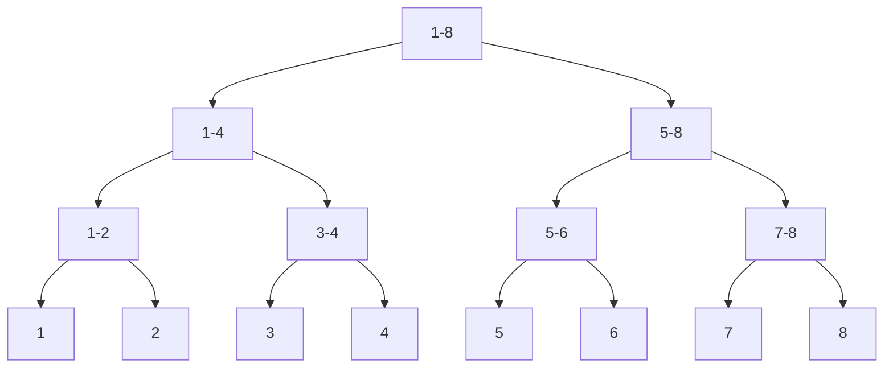

## 什么是线段树？

线段树（Segment Tree）是一种二叉树数据结构，用于高效处理区间查询和更新操作。它常用于解决涉及区间求和、区间最小值、区间最大值等问题。线段树的核心思想是将区间分解为多个子区间，并将这些子区间的信息存储在树的节点中，从而在查询和更新时能够快速获取或修改区间信息。

### 线段树的基本结构

线段树的每个节点代表一个区间。根节点代表整个区间，而叶子节点代表单个元素。每个非叶子节点将其区间划分为两个子区间，分别由左右子节点表示。



在上图中，线段树将区间 `[1, 8]` 分解为多个子区间，每个节点存储其对应区间的信息（如区间和、最小值等）。

---

## 线段树的实现

### 1. 构建线段树

线段树的构建过程是一个递归过程。我们从根节点开始，逐步将区间划分为子区间，直到区间长度为 1（即叶子节点）。

```python
class SegmentTree:
    def __init__(self, data):
        self.n = len(data)
        self.size = 4 * self.n  # 线段树的大小通常为 4n
        self.tree = [0] * self.size
        self.build(0, 0, self.n - 1, data)

    def build(self, node, start, end, data):
        if start == end:
            self.tree[node] = data[start]
        else:
            mid = (start + end) // 2
            left_child = 2 * node + 1
            right_child = 2 * node + 2
            self.build(left_child, start, mid, data)
            self.build(right_child, mid + 1, end, data)
            self.tree[node] = self.tree[left_child] + self.tree[right_child]
```

### 2. 区间查询

线段树的查询操作也是递归的。我们从根节点开始，逐步检查目标区间与当前节点区间的交集。

```python
def query(self, node, start, end, l, r):
    if r < start or end < l:
        return 0  # 区间无交集
    if l <= start and end <= r:
        return self.tree[node]  # 当前区间完全包含在目标区间内
    mid = (start + end) // 2
    left_child = 2 * node + 1
    right_child = 2 * node + 2
    left_sum = self.query(left_child, start, mid, l, r)
    right_sum = self.query(right_child, mid + 1, end, l, r)
    return left_sum + right_sum
```

### 3. 单点更新

更新操作需要从叶子节点开始，逐步向上更新父节点的值。

```python
def update(self, node, start, end, idx, value):
    if start == end:
        self.tree[node] = value
    else:
        mid = (start + end) // 2
        left_child = 2 * node + 1
        right_child = 2 * node + 2
        if idx <= mid:
            self.update(left_child, start, mid, idx, value)
        else:
            self.update(right_child, mid + 1, end, idx, value)
        self.tree[node] = self.tree[left_child] + self.tree[right_child]
```

---

## 实际应用案例

### 案例：区间求和

假设我们有一个数组 `[1, 3, 5, 7, 9, 11]`，我们需要频繁查询某个区间的和，并支持更新某个元素的值。

```python
data = [1, 3, 5, 7, 9, 11]
st = SegmentTree(data)

# 查询区间 [1, 4] 的和
print(st.query(0, 0, len(data) - 1, 1, 4))  # 输出：24

# 更新索引 2 的值为 6
st.update(0, 0, len(data) - 1, 2, 6)

# 再次查询区间 [1, 4] 的和
print(st.query(0, 0, len(data) - 1, 1, 4))  # 输出：25
```

---

## 总结

线段树是一种强大的数据结构，适用于需要频繁进行区间查询和更新的场景。通过将区间分解为子区间并存储在树结构中，线段树能够在 `O(log n)` 的时间复杂度内完成查询和更新操作。

:::tip 提示
线段树的变体（如惰性线段树）可以进一步优化某些场景下的性能。如果你对更高级的线段树实现感兴趣，可以深入研究这些变体。
:::

---

## 附加资源与练习

1. **练习**：实现一个支持区间最小值查询的线段树。
2. **资源**：
   - [线段树 - GeeksforGeeks](https://www.geeksforgeeks.org/segment-tree-set-1-sum-of-given-range/)
   - [线段树 - Wikipedia](https://en.wikipedia.org/wiki/Segment_tree)

通过不断练习和探索，你将能够熟练掌握线段树的应用，并解决更复杂的区间操作问题！