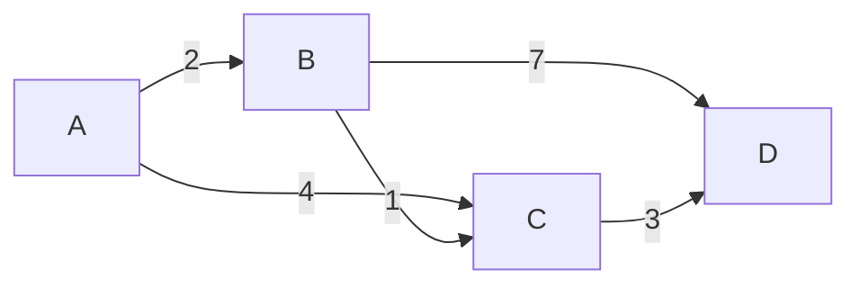

## 介绍

在图论中，**最短路径问题**是指在图中找到两个节点之间的最短路径。这里的“最短”可以指路径的边数最少，或者路径的权重总和最小（如果边有权重）。最短路径问题在现实生活中有着广泛的应用，例如导航系统中的路线规划、网络中的数据传输路径选择等。

## 基本概念

### 图的表示

在解决最短路径问题之前，我们需要了解如何表示图。图通常由节点（顶点）和边组成。边可以是有向的或无向的，也可以有权重。常见的图表示方法有：

- **邻接矩阵**：一个二维数组，其中 `matrix[i][j]` 表示节点 `i` 和节点 `j` 之间是否存在边，或者边的权重。
- **邻接表**：一个数组，其中每个元素是一个链表，表示与该节点直接相连的节点。

### 最短路径问题的分类

最短路径问题可以分为以下几类：

1. **单源最短路径**：从一个源节点到图中所有其他节点的最短路径。常见的算法有 **Dijkstra 算法** 和 **Bellman-Ford 算法**。
2. **多源最短路径**：从所有节点到所有其他节点的最短路径。常见的算法有 **Floyd-Warshall 算法**。

## Dijkstra 算法

Dijkstra 算法是解决单源最短路径问题的经典算法，适用于边权重为非负数的图。算法的基本思想是通过贪心策略逐步扩展最短路径。

### 算法步骤

1. 初始化：将源节点的距离设为 0，其他节点的距离设为无穷大。
2. 选择当前距离最小的节点，标记为已访问。
3. 更新与该节点相邻的节点的距离。
4. 重复步骤 2 和 3，直到所有节点都被访问。

### 代码示例

```python
import heapq

def dijkstra(graph, start):
    distances = {node: float('inf') for node in graph}
    distances[start] = 0
    queue = [(0, start)]
    
    while queue:
        current_distance, current_node = heapq.heappop(queue)
        
        if current_distance > distances[current_node]:
            continue
        
        for neighbor, weight in graph[current_node].items():
            distance = current_distance + weight
            if distance < distances[neighbor]:
                distances[neighbor] = distance
                heapq.heappush(queue, (distance, neighbor))
    
    return distances
```

### 输入与输出

假设我们有以下图：



使用 Dijkstra 算法从节点 `A` 开始，输出各节点的最短距离：

```python
graph = {
    'A': {'B': 2, 'C': 4},
    'B': {'C': 1, 'D': 7},
    'C': {'D': 3},
    'D': {}
}

print(dijkstra(graph, 'A'))
```

输出结果为：

```python
{'A': 0, 'B': 2, 'C': 3, 'D': 6}
```

:::tip
Dijkstra 算法的时间复杂度为 `O(V^2)`，其中 `V` 是节点的数量。使用优先队列可以将时间复杂度优化到 `O((V + E) log V)`，其中 `E` 是边的数量。
:::

## Bellman-Ford 算法

Bellman-Ford 算法是另一种解决单源最短路径问题的算法，适用于边权重可能为负数的图。与 Dijkstra 算法不同，Bellman-Ford 算法可以检测负权环。

### 算法步骤

1. 初始化：将源节点的距离设为 0，其他节点的距离设为无穷大。
2. 对每条边进行松弛操作，更新节点的距离。
3. 重复步骤 2，共进行 `V-1` 次。
4. 检查是否存在负权环。

### 代码示例

```python
def bellman_ford(graph, start):
    distances = {node: float('inf') for node in graph}
    distances[start] = 0
    
    for _ in range(len(graph) - 1):
        for node in graph:
            for neighbor, weight in graph[node].items():
                if distances[node] + weight < distances[neighbor]:
                    distances[neighbor] = distances[node] + weight
    
    # 检查负权环
    for node in graph:
        for neighbor, weight in graph[node].items():
            if distances[node] + weight < distances[neighbor]:
                raise ValueError("图中存在负权环")
    
    return distances
```

### 输入与输出

假设我们有以下图：


使用 Bellman-Ford 算法从节点 `A` 开始，输出各节点的最短距离：

```python
graph = {
    'A': {'B': 2, 'C': 4},
    'B': {'C': 1, 'D': 7},
    'C': {'D': 3},
    'D': {}
}

print(bellman_ford(graph, 'A'))
```

输出结果为：

```python
{'A': 0, 'B': 2, 'C': 3, 'D': 6}
```

:::caution
Bellman-Ford 算法的时间复杂度为 `O(V * E)`，其中 `V` 是节点的数量，`E` 是边的数量。如果图中存在负权环，算法将抛出异常。
:::

## Floyd-Warshall 算法

Floyd-Warshall 算法是解决多源最短路径问题的经典算法，适用于所有节点对之间的最短路径计算。该算法可以处理边权重为负数的情况，但不能处理负权环。

### 算法步骤

1. 初始化：创建一个二维数组 `dist`，其中 `dist[i][j]` 表示节点 `i` 到节点 `j` 的最短距离。
2. 对于每个中间节点 `k`，更新所有节点对 `(i, j)` 的距离。
3. 重复步骤 2，直到所有中间节点都被考虑。

### 代码示例

```python
def floyd_warshall(graph):
    nodes = list(graph.keys())
    dist = {i: {j: float('inf') for j in nodes} for i in nodes}
    
    for i in nodes:
        dist[i][i] = 0
        for j, weight in graph[i].items():
            dist[i][j] = weight
    
    for k in nodes:
        for i in nodes:
            for j in nodes:
                if dist[i][j] > dist[i][k] + dist[k][j]:
                    dist[i][j] = dist[i][k] + dist[k][j]
    
    return dist
```

### 输入与输出

假设我们有以下图：


使用 Floyd-Warshall 算法计算所有节点对之间的最短距离：

```python
graph = {
    'A': {'B': 2, 'C': 4},
    'B': {'C': 1, 'D': 7},
    'C': {'D': 3},
    'D': {}
}

print(floyd_warshall(graph))
```

输出结果为：

```python
{
    'A': {'A': 0, 'B': 2, 'C': 3, 'D': 6},
    'B': {'A': inf, 'B': 0, 'C': 1, 'D': 4},
    'C': {'A': inf, 'B': inf, 'C': 0, 'D': 3},
    'D': {'A': inf, 'B': inf, 'C': inf, 'D': 0}
}
```

:::note
Floyd-Warshall 算法的时间复杂度为 `O(V^3)`，其中 `V` 是节点的数量。该算法适用于稠密图，但对于稀疏图可能效率较低。
:::

## 实际应用案例

最短路径问题在现实生活中有许多应用场景，例如：

1. **导航系统**：计算从起点到终点的最短路径。
2. **网络路由**：在计算机网络中，选择数据传输的最优路径。
3. **物流配送**：规划配送路线以最小化运输成本。

## 总结

最短路径问题是图论中的一个重要问题，具有广泛的应用。我们介绍了三种常见的算法：Dijkstra 算法、Bellman-Ford 算法和 Floyd-Warshall 算法。每种算法都有其适用的场景和限制条件。通过理解这些算法，你可以解决许多现实生活中的路径规划问题。

## 附加资源与练习

- **练习**：尝试实现这些算法，并在不同的图上进行测试。
- **进一步学习**：了解 A* 算法、Johnson 算法等其他最短路径算法。
- **参考书籍**：《算法导论》中的图论章节提供了更深入的理论和实现细节。

:::tip
如果你对最短路径问题有更多疑问，欢迎在评论区留言，我们会尽快回复！
:::