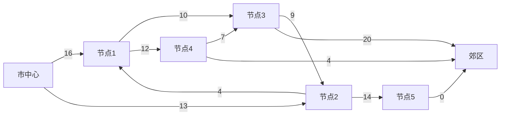

# 网络流问题

网络流问题是图论中的一个经典问题，广泛应用于交通网络、通信网络、资源分配等领域。本文将带你从基础概念入手，逐步理解网络流问题，并通过代码示例和实际案例帮助你掌握其核心思想。

## 什么是网络流问题？

网络流问题是指在有向图中，从源点（Source）到汇点（Sink）的流量分配问题。每条边都有一个容量限制，表示该边能够承载的最大流量。我们的目标是找到从源点到汇点的最大流量，同时满足每条边的容量限制。

### 基本概念

- **源点（Source）**：流量的起点，通常用 `s` 表示。
- **汇点（Sink）**：流量的终点，通常用 `t` 表示。
- **容量（Capacity）**：每条边 `(u, v)` 都有一个容量 `c(u, v)`，表示该边能够承载的最大流量。
- **流量（Flow）**：每条边 `(u, v)` 的实际流量 `f(u, v)`，必须满足 `0 ≤ f(u, v) ≤ c(u, v)`。
- **流量守恒**：除了源点和汇点，每个节点的流入流量等于流出流量。

## 最大流问题

最大流问题是网络流问题中最基本的问题之一。它的目标是找到从源点到汇点的最大流量。

### Ford-Fulkerson 算法

Ford-Fulkerson 算法是解决最大流问题的经典算法。其核心思想是通过不断寻找增广路径来增加流量，直到无法找到增广路径为止。

#### 算法步骤

1. 初始化所有边的流量为 0。
2. 在残量网络中寻找一条从源点到汇点的增广路径。
3. 如果找到增广路径，则沿着该路径增加流量。
4. 重复步骤 2 和 3，直到无法找到增广路径。

#### 代码示例

以下是一个简单的 Python 实现：

```python
from collections import defaultdict

class Graph:
    def __init__(self, graph):
        self.graph = graph
        self.ROW = len(graph)

    def BFS(self, s, t, parent):
        visited = [False] * (self.ROW)
        queue = []
        queue.append(s)
        visited[s] = True

        while queue:
            u = queue.pop(0)
            for ind, val in enumerate(self.graph[u]):
                if visited[ind] == False and val > 0:
                    queue.append(ind)
                    visited[ind] = True
                    parent[ind] = u
                    if ind == t:
                        return True
        return False

    def FordFulkerson(self, source, sink):
        parent = [-1] * (self.ROW)
        max_flow = 0

        while self.BFS(source, sink, parent):
            path_flow = float("Inf")
            s = sink
            while s != source:
                path_flow = min(path_flow, self.graph[parent[s]][s])
                s = parent[s]

            max_flow += path_flow

            v = sink
            while v != source:
                u = parent[v]
                self.graph[u][v] -= path_flow
                self.graph[v][u] += path_flow
                v = parent[v]

        return max_flow

# 示例图
graph = [[0, 16, 13, 0, 0, 0],
         [0, 0, 10, 12, 0, 0],
         [0, 4, 0, 0, 14, 0],
         [0, 0, 9, 0, 0, 20],
         [0, 0, 0, 7, 0, 4],
         [0, 0, 0, 0, 0, 0]]

g = Graph(graph)
source = 0
sink = 5

print("最大流量为: %d" % g.FordFulkerson(source, sink))
```

**输入**：  
```python
graph = [[0, 16, 13, 0, 0, 0],
         [0, 0, 10, 12, 0, 0],
         [0, 4, 0, 0, 14, 0],
         [0, 0, 9, 0, 0, 20],
         [0, 0, 0, 7, 0, 4],
         [0, 0, 0, 0, 0, 0]]
```

**输出**：  
```
最大流量为: 23
```

### 残量网络

残量网络是 Ford-Fulkerson 算法中的一个重要概念。它表示在当前流量下，每条边还能承载多少流量。残量网络的边容量为 `c(u, v) - f(u, v)`，其中 `c(u, v)` 是原始容量，`f(u, v)` 是当前流量。

## 实际应用

网络流问题在实际生活中有广泛的应用，例如：

- **交通网络**：计算城市交通网络中的最大车流量。
- **通信网络**：优化数据包在网络中的传输路径。
- **资源分配**：在多个任务之间分配有限的资源。

### 案例：交通网络中的最大流量

假设有一个城市的交通网络，每条道路都有一个最大车流量限制。我们需要计算从市中心到郊区的最大的车流量。



通过 Ford-Fulkerson 算法，我们可以计算出从市中心到郊区的最大车流量为 23。

## 总结

网络流问题是图论中的一个重要问题，广泛应用于实际生活中的多个领域。通过 Ford-Fulkerson 算法，我们可以有效地解决最大流问题。希望本文能帮助你理解网络流问题的基本概念和算法，并激发你进一步探索图论的兴趣。

## 附加资源与练习

- **练习**：尝试修改上述代码，计算不同图中的最大流量。
- **资源**：推荐阅读《算法导论》中的网络流章节，深入了解更高级的算法如 Edmonds-Karp 算法和 Dinic 算法。

:::tip
如果你对网络流问题感兴趣，可以尝试解决更复杂的问题，如最小割问题或多商品流问题。
:::