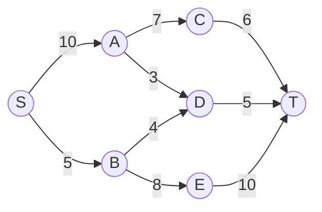

# Ford-Fulkerson算法

Ford-Fulkerson算法是图论中用于解决**最大流问题**的经典算法。最大流问题的目标是找到从源节点（source）到汇节点（sink）的最大流量。该算法通过不断寻找增广路径（augmenting path）并更新流量来实现这一目标。

## 基本概念

在深入算法之前，我们需要了解一些基本概念：

1. **网络流图（Flow Network）**：一个有向图，其中每条边都有一个容量（capacity），表示该边可以承载的最大流量。
2. **源节点（Source）**：流量的起点。
3. **汇节点（Sink）**：流量的终点。
4. **流量（Flow）**：实际通过某条边的流量，不能超过该边的容量。
5. **增广路径（Augmenting Path）**：从源节点到汇节点的一条路径，路径上的每条边都有剩余的容量（即容量减去当前流量）。

## 算法步骤

Ford-Fulkerson算法的核心思想是不断寻找增广路径，并沿着该路径增加流量，直到无法找到更多的增广路径为止。具体步骤如下：

1. **初始化**：将所有边的流量初始化为0。
2. **寻找增广路径**：使用深度优先搜索（DFS）或广度优先搜索（BFS）从源节点到汇节点寻找一条增广路径。
3. **计算路径上的最小剩余容量**：找到增广路径上所有边的最小剩余容量。
4. **更新流量**：沿着增广路径增加流量，增加的量等于最小剩余容量。
5. **重复**：重复步骤2-4，直到无法找到更多的增广路径。

## 代码示例

以下是一个使用Python实现的Ford-Fulkerson算法的简单示例：

```python
from collections import defaultdict

class Graph:
    def __init__(self, graph):
        self.graph = graph  # 残存图
        self.ROW = len(graph)

    def BFS(self, s, t, parent):
        visited = [False] * (self.ROW)
        queue = []
        queue.append(s)
        visited[s] = True

        while queue:
            u = queue.pop(0)
            for ind, val in enumerate(self.graph[u]):
                if visited[ind] == False and val > 0:
                    queue.append(ind)
                    visited[ind] = True
                    parent[ind] = u
                    if ind == t:
                        return True
        return False

    def FordFulkerson(self, source, sink):
        parent = [-1] * (self.ROW)
        max_flow = 0

        while self.BFS(source, sink, parent):
            path_flow = float("Inf")
            s = sink
            while s != source:
                path_flow = min(path_flow, self.graph[parent[s]][s])
                s = parent[s]

            max_flow += path_flow

            v = sink
            while v != source:
                u = parent[v]
                self.graph[u][v] -= path_flow
                self.graph[v][u] += path_flow
                v = parent[v]

        return max_flow

# 示例图
graph = [[0, 16, 13, 0, 0, 0],
         [0, 0, 10, 12, 0, 0],
         [0, 4, 0, 0, 14, 0],
         [0, 0, 9, 0, 0, 20],
         [0, 0, 0, 7, 0, 4],
         [0, 0, 0, 0, 0, 0]]

g = Graph(graph)
source = 0
sink = 5

print("最大流量为: %d" % g.FordFulkerson(source, sink))
```

**输入**：  
上述代码中的 `graph` 表示一个网络流图，其中 `graph[i][j]` 表示从节点 `i` 到节点 `j` 的容量。

**输出**：  
程序将输出从源节点到汇节点的最大流量。

## 实际应用场景

Ford-Fulkerson算法在许多实际场景中都有应用，例如：

1. **交通网络**：计算从起点到终点的最大车流量。
2. **计算机网络**：确定网络中的最大数据传输速率。
3. **供应链管理**：优化从供应商到消费者的物流流量。

## 总结

Ford-Fulkerson算法是解决最大流问题的经典算法，通过不断寻找增广路径并更新流量来实现目标。虽然该算法在最坏情况下可能效率较低，但其思想简单直观，适合初学者理解网络流问题的基本概念。

:::tip
为了提高算法的效率，可以使用**Edmonds-Karp算法**，它是Ford-Fulkerson算法的一个变种，使用广度优先搜索（BFS）来寻找增广路径，确保算法的时间复杂度为O(V * E^2)。
:::

## 附加资源与练习

1. **练习**：尝试在以下图中手动应用Ford-Fulkerson算法，计算从源节点到汇节点的最大流量。



2. **进一步学习**：阅读关于**Dinic算法**和**Push-Relabel算法**的资料，这些是更高效的最大流算法。

3. **参考书籍**：  
   - *Introduction to Algorithms* by Thomas H. Cormen  
   - *Algorithm Design* by Jon Kleinberg and Éva Tardos

通过不断练习和学习，你将能够更好地掌握Ford-Fulkerson算法及其应用。