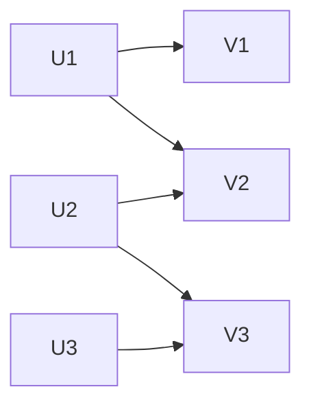
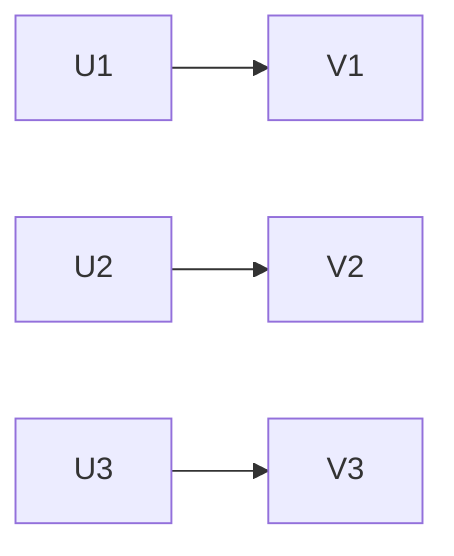

# 二分图匹配

## 介绍

二分图匹配是图论中的一个重要概念，广泛应用于任务分配、资源调度等领域。二分图（Bipartite Graph）是指图中的顶点可以分成两个不相交的集合，使得每条边的两个端点分别属于这两个集合。匹配（Matching）是指图中没有两条边共享同一个顶点的边的集合。

在二分图匹配中，我们通常寻找一个最大匹配，即包含最多边的匹配。最大匹配在许多实际问题中都有重要应用，例如任务分配、婚姻匹配等。

## 二分图的定义

二分图是一种特殊的图，其顶点集可以分为两个不相交的子集 $ U $ 和 $ V $，使得每条边的两个端点分别属于 $ U $ 和 $ V $。形式化地，二分图可以表示为 $ G = (U, V, E) $，其中 $ E $ 是边的集合。



在上图中，顶点集 $ U = \{U1, U2, U3\} $ 和 $ V = \{V1, V2, V3\} $ 是两个不相交的子集，所有边都连接 $ U $ 和 $ V $ 中的顶点。

## 匹配的定义

在图 $ G = (U, V, E) $ 中，匹配是指边的子集 $ M \subseteq E $，使得 $ M $ 中的任意两条边都没有共同的顶点。最大匹配是指包含最多边的匹配。



在上图中，边集 $ M = \{(U1, V1), (U2, V2), (U3, V3)\} $ 是一个最大匹配。

## 二分图匹配的算法

### 匈牙利算法

匈牙利算法是解决二分图最大匹配问题的经典算法。其基本思想是通过增广路径来逐步增加匹配的大小。

#### 算法步骤

1. 初始化匹配 $ M $ 为空。
2. 对于 $ U $ 中的每个顶点 $ u $，尝试找到一条从 $ u $ 开始的增广路径。
3. 如果找到增广路径，则更新匹配 $ M $。
4. 重复步骤 2 和 3，直到无法找到更多的增广路径。

#### 代码示例

```python
def bpm(u, visited, pair_u, pair_v, graph):
    for v in graph[u]:
        if not visited[v]:
            visited[v] = True
            if pair_v[v] == -1 or bpm(pair_v[v], visited, pair_u, pair_v, graph):
                pair_u[u] = v
                pair_v[v] = u
                return True
    return False

def max_bipartite_matching(graph, u_size, v_size):
    pair_u = [-1] * u_size
    pair_v = [-1] * v_size
    result = 0
    for u in range(u_size):
        visited = [False] * v_size
        if bpm(u, visited, pair_u, pair_v, graph):
            result += 1
    return result

# 示例图
graph = {
    0: [0, 1],
    1: [1, 2],
    2: [2]
}
u_size = 3
v_size = 3

print("最大匹配数:", max_bipartite_matching(graph, u_size, v_size))
```

**输入：**

```python
graph = {
    0: [0, 1],
    1: [1, 2],
    2: [2]
}
u_size = 3
v_size = 3
```

**输出：**

```
最大匹配数: 3
```

## 实际应用

### 任务分配

假设有 $ n $ 个任务和 $ m $ 个工人，每个工人可以完成某些任务。我们可以将任务和工人分别表示为二分图的两个顶点集，边表示工人可以完成的任务。通过二分图匹配，我们可以找到最大数量的任务分配方案。

### 婚姻匹配

在婚姻匹配问题中，假设有 $ n $ 个男性和 $ n $ 个女性，每个人对某些异性有一定的偏好。我们可以将男性和女性分别表示为二分图的两个顶点集，边表示双方可以接受的匹配。通过二分图匹配，我们可以找到最大数量的稳定婚姻匹配。

## 总结

二分图匹配是图论中的一个重要概念，广泛应用于任务分配、资源调度等领域。匈牙利算法是解决二分图最大匹配问题的经典算法，通过增广路径逐步增加匹配的大小。理解二分图匹配的概念和算法实现，对于解决实际问题具有重要意义。

## 附加资源

- [二分图匹配 - Wikipedia](https://en.wikipedia.org/wiki/Matching_(graph_theory))
- [匈牙利算法 - GeeksforGeeks](https://www.geeksforgeeks.org/maximum-bipartite-matching/)

## 练习

1. 给定一个二分图，尝试手动找到其最大匹配。
2. 实现匈牙利算法，并在不同的二分图上测试其性能。
3. 思考如何将二分图匹配应用于实际生活中的问题，例如课程安排或项目分配。