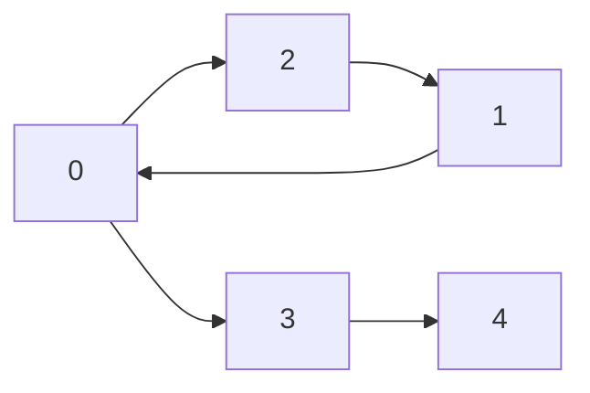

# 强连通分量

## 介绍

在图论中，**强连通分量（Strongly Connected Components, SCC）** 是指有向图中的一个子图，其中任意两个顶点之间都互相可达。换句话说，对于强连通分量中的任意两个顶点 `u` 和 `v`，都存在从 `u` 到 `v` 的路径，以及从 `v` 到 `u` 的路径。

强连通分量是分析有向图结构的重要工具，常用于解决诸如依赖关系、环路检测等问题。

:::note
强连通分量仅适用于有向图。对于无向图，类似的概念是**连通分量**。
:::

## 强连通分量的定义

给定一个有向图 `G = (V, E)`，其中 `V` 是顶点集，`E` 是边集。强连通分量是图 `G` 的一个极大子集 `C ⊆ V`，满足：

1. 对于任意两个顶点 `u, v ∈ C`，存在从 `u` 到 `v` 的路径。
2. 对于任意两个顶点 `u, v ∈ C`，存在从 `v` 到 `u` 的路径。

换句话说，强连通分量中的任意两个顶点都是互相可达的。

## 如何找到强连通分量？

常用的算法是 **Kosaraju 算法** 和 **Tarjan 算法**。下面我们将详细介绍 Kosaraju 算法。

### Kosaraju 算法

Kosaraju 算法通过两次深度优先搜索（DFS）来找到强连通分量。其步骤如下：

1. **第一次 DFS**：对图 `G` 进行深度优先搜索，记录每个顶点的完成时间（即退出 DFS 的时间）。
2. **反转图**：将图 `G` 的所有边反转，得到图 `G'`。
3. **第二次 DFS**：按照第一次 DFS 中记录的完成时间的逆序，对图 `G'` 进行深度优先搜索。每次 DFS 访问的顶点集合就是一个强连通分量。

#### 代码示例

以下是 Kosaraju 算法的 Python 实现：

```python
from collections import defaultdict

class Graph:
    def __init__(self, vertices):
        self.V = vertices
        self.graph = defaultdict(list)

    def add_edge(self, u, v):
        self.graph[u].append(v)

    def dfs(self, v, visited, stack):
        visited[v] = True
        for i in self.graph[v]:
            if not visited[i]:
                self.dfs(i, visited, stack)
        stack.append(v)

    def reverse_graph(self):
        reversed_graph = Graph(self.V)
        for i in self.graph:
            for j in self.graph[i]:
                reversed_graph.add_edge(j, i)
        return reversed_graph

    def get_scc(self):
        stack = []
        visited = [False] * self.V

        # 第一次 DFS，记录完成时间
        for i in range(self.V):
            if not visited[i]:
                self.dfs(i, visited, stack)

        # 反转图
        reversed_graph = self.reverse_graph()

        # 第二次 DFS，按照完成时间的逆序进行
        visited = [False] * self.V
        scc = []
        while stack:
            i = stack.pop()
            if not visited[i]:
                component = []
                reversed_graph.dfs(i, visited, component)
                scc.append(component)
        return scc

# 示例图
g = Graph(5)
g.add_edge(1, 0)
g.add_edge(0, 2)
g.add_edge(2, 1)
g.add_edge(0, 3)
g.add_edge(3, 4)

print("强连通分量：", g.get_scc())
```

**输入图结构：**



**输出：**

```
强连通分量： [[4], [3], [0, 1, 2]]
```

:::tip
Kosaraju 算法的时间复杂度为 `O(V + E)`，其中 `V` 是顶点数，`E` 是边数。
:::

## 实际应用场景

强连通分量在许多实际问题中都有应用，例如：

1. **编译器优化**：在编译器中，强连通分量用于检测代码中的循环依赖关系。
2. **社交网络分析**：在社交网络中，强连通分量可以用于识别紧密连接的群体。
3. **电路设计**：在电路设计中，强连通分量用于分析电路的反馈环路。

## 总结

强连通分量是图论中的一个重要概念，用于分析有向图中顶点之间的相互可达性。通过 Kosaraju 算法或 Tarjan 算法，我们可以有效地找到图中的所有强连通分量。理解强连通分量不仅有助于解决图论问题，还能应用于编译器优化、社交网络分析等实际场景。

## 附加资源与练习

- **练习 1**：尝试实现 Tarjan 算法来找到强连通分量。
- **练习 2**：给定一个有向图，手动计算其强连通分量，并与算法结果进行比较。
- **资源**：推荐阅读《算法导论》中的图论章节，深入了解强连通分量及其应用。

:::caution
在实现算法时，务必注意图的表示方式（邻接表或邻接矩阵），并确保正确处理边界情况。
:::