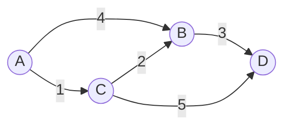

# Bellman-Ford算法

Bellman-Ford算法是一种用于在加权图中找到从单个源点到所有其他顶点的最短路径的算法。与Dijkstra算法不同，Bellman-Ford算法可以处理图中包含负权边的情况，但它不能处理包含负权环的图。

## 算法介绍

Bellman-Ford算法的基本思想是通过松弛操作逐步逼近最短路径。算法的核心是对图中的所有边进行多次松弛操作，直到找到最短路径或检测到负权环。

### 松弛操作

松弛操作是Bellman-Ford算法的核心。对于每一条边 `(u, v)`，如果通过 `u` 到达 `v` 的路径比当前已知的最短路径更短，则更新 `v` 的最短路径。

```python
if distance[u] + weight(u, v) < distance[v]:
    distance[v] = distance[u] + weight(u, v)
```

### 算法步骤

1. 初始化：将源点到所有顶点的距离设置为无穷大，源点到自身的距离设置为0。
2. 进行 `V-1` 次松弛操作，其中 `V` 是图中顶点的数量。
3. 检查是否存在负权环：如果在第 `V` 次松弛操作中仍然可以更新距离，则说明图中存在负权环。

### 代码示例

以下是一个使用Python实现的Bellman-Ford算法示例：

```python
def bellman_ford(graph, source):
    distance = {vertex: float('inf') for vertex in graph}
    distance[source] = 0

    for _ in range(len(graph) - 1):
        for u in graph:
            for v, weight in graph[u].items():
                if distance[u] + weight < distance[v]:
                    distance[v] = distance[u] + weight

    # 检查负权环
    for u in graph:
        for v, weight in graph[u].items():
            if distance[u] + weight < distance[v]:
                raise ValueError("图中存在负权环")

    return distance
```

### 输入和输出

假设我们有以下图：



使用 `A` 作为源点，运行上述代码将得到以下输出：

```python
{
    'A': 0,
    'B': 3,
    'C': 1,
    'D': 6
}
```

## 实际应用场景

Bellman-Ford算法在实际中有广泛的应用，特别是在需要处理负权边的场景中。例如：

- **网络路由**：在计算机网络中，路由器使用Bellman-Ford算法来计算最短路径，以便数据包能够高效地传输。
- **金融建模**：在金融领域，Bellman-Ford算法可以用于检测套利机会，即通过一系列交易获得无风险利润。

:::tip
虽然Bellman-Ford算法可以处理负权边，但在实际应用中，如果图中没有负权边，Dijkstra算法通常是更好的选择，因为它的时间复杂度更低。
:::

## 总结

Bellman-Ford算法是一种强大的工具，用于在加权图中找到从单个源点到所有其他顶点的最短路径。它能够处理负权边，但不能处理负权环。通过多次松弛操作，算法逐步逼近最短路径，并在最后一步检测负权环。

## 附加资源

- [Bellman-Ford算法维基百科](https://en.wikipedia.org/wiki/Bellman%E2%80%93Ford_algorithm)
- [Dijkstra算法与Bellman-Ford算法的比较](https://www.geeksforgeeks.org/comparison-dijkstras-bellman-ford-algorithms/)

## 练习

1. 修改上述代码，使其能够处理有向图和无向图。
2. 尝试在一个包含负权环的图上运行Bellman-Ford算法，观察结果。
3. 比较Bellman-Ford算法和Dijkstra算法在不同类型图上的性能。

:::caution
在实现Bellman-Ford算法时，务必注意负权环的检测，否则算法可能会陷入无限循环。
:::