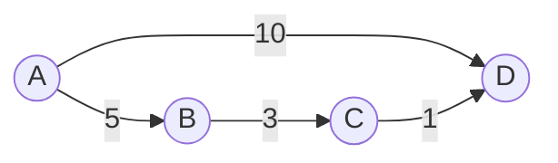

# Floyd-Warshall算法

Floyd-Warshall算法是一种用于计算**加权图中所有节点对之间最短路径**的动态规划算法。与Dijkstra算法不同，Floyd-Warshall算法可以处理**包含负权边**的图（但不能处理负权环）。它的核心思想是通过逐步更新节点对之间的最短路径来找到全局最优解。

## 算法简介

Floyd-Warshall算法通过一个三重循环来更新节点对之间的最短路径。假设图中有 `n` 个节点，算法的时间复杂度为 `O(n^3)`，空间复杂度为 `O(n^2)`。虽然时间复杂度较高，但它的优势在于能够一次性计算出所有节点对之间的最短路径。

### 核心思想

1. **初始化**：创建一个二维数组 `dist`，其中 `dist[i][j]` 表示从节点 `i` 到节点 `j` 的最短路径。初始时，`dist[i][j]` 为节点 `i` 到节点 `j` 的直接距离（如果存在边），否则为无穷大（`INF`）。`dist[i][i]` 为 `0`。
2. **动态规划更新**：对于每个中间节点 `k`，检查是否可以通过 `k` 来缩短从 `i` 到 `j` 的路径。如果可以，则更新 `dist[i][j]`。
3. **输出结果**：最终，`dist[i][j]` 将包含从节点 `i` 到节点 `j` 的最短路径。

### 伪代码

```python
for k from 1 to n:
    for i from 1 to n:
        for j from 1 to n:
            dist[i][j] = min(dist[i][j], dist[i][k] + dist[k][j])
```

---

## 代码示例

以下是一个Python实现的Floyd-Warshall算法示例：

```python
INF = float('inf')

def floyd_warshall(graph):
    n = len(graph)
    dist = [[graph[i][j] for j in range(n)] for i in range(n)]
    
    for k in range(n):
        for i in range(n):
            for j in range(n):
                dist[i][j] = min(dist[i][j], dist[i][k] + dist[k][j])
    
    return dist

# 示例图
graph = [
    [0, 5, INF, 10],
    [INF, 0, 3, INF],
    [INF, INF, 0, 1],
    [INF, INF, INF, 0]
]

result = floyd_warshall(graph)
for row in result:
    print(row)
```

### 输入与输出

**输入**：  
图的邻接矩阵表示，其中 `INF` 表示节点之间没有直接连接。

```python
graph = [
    [0, 5, INF, 10],
    [INF, 0, 3, INF],
    [INF, INF, 0, 1],
    [INF, INF, INF, 0]
]
```

**输出**：  
所有节点对之间的最短路径矩阵。

```python
[0, 5, 8, 9]
[INF, 0, 3, 4]
[INF, INF, 0, 1]
[INF, INF, INF, 0]
```

---

## 逐步讲解

### 1. 初始化

假设我们有一个图，其邻接矩阵如下：



对应的邻接矩阵为：

|   | A | B | C | D  |
|---|---|---|---|----|
| A | 0 | 5 | ∞ | 10 |
| B | ∞ | 0 | 3 | ∞  |
| C | ∞ | ∞ | 0 | 1  |
| D | ∞ | ∞ | ∞ | 0  |

### 2. 动态规划更新

算法通过三重循环逐步更新最短路径：

- **第一轮（k = A）**：检查是否可以通过节点 `A` 缩短其他节点对之间的路径。
- **第二轮（k = B）**：检查是否可以通过节点 `B` 缩短路径。
- **第三轮（k = C）**：检查是否可以通过节点 `C` 缩短路径。
- **第四轮（k = D）**：检查是否可以通过节点 `D` 缩短路径。

最终，`dist` 矩阵将包含所有节点对之间的最短路径。

---

## 实际应用场景

Floyd-Warshall算法在以下场景中非常有用：

1. **网络路由**：计算网络中所有节点之间的最短路径，用于优化数据传输。
2. **交通规划**：计算城市之间最短路径，用于导航系统。
3. **社交网络分析**：计算用户之间的最短关系链。

:::tip
Floyd-Warshall算法特别适合处理**稠密图**（边数接近节点数的平方），因为它的时间复杂度与节点数的立方成正比。
:::

---

## 总结

Floyd-Warshall算法是一种强大的工具，用于计算图中所有节点对之间的最短路径。尽管它的时间复杂度较高，但其能够处理负权边和一次性计算所有最短路径的特点使其在某些场景中不可替代。

### 附加资源

- [Wikipedia: Floyd-Warshall Algorithm](https://en.wikipedia.org/wiki/Floyd%E2%80%93Warshall_algorithm)
- 《算法导论》：详细讲解动态规划与图论算法。

### 练习

1. 修改上述代码，使其能够检测图中是否存在负权环。
2. 尝试用Floyd-Warshall算法解决一个实际的交通网络问题，例如计算多个城市之间的最短路径。

:::caution
注意：Floyd-Warshall算法不能处理包含负权环的图，因为负权环会导致最短路径无界（无限小）。
:::