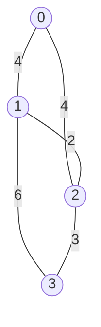

# 最小生成树算法

## 介绍

在图论中，**最小生成树（Minimum Spanning Tree, MST）** 是一个连通无向图的子集，它包含了图中的所有顶点，并且是一个树结构（即没有环），同时所有边的权重之和最小。最小生成树算法在解决网络设计、聚类分析等问题中有着广泛的应用。

:::note
**树** 是一种特殊的图，它没有环，并且连通。生成树是指包含图中所有顶点的树。
:::

## 最小生成树的应用场景

最小生成树算法在实际生活中有许多应用，例如：

- **网络设计**：在设计计算机网络或通信网络时，最小生成树可以帮助找到连接所有节点的最小成本路径。
- **聚类分析**：在数据科学中，最小生成树可以用于聚类分析，帮助识别数据中的自然分组。
- **电路设计**：在电路设计中，最小生成树可以用于优化电路连接，减少材料成本。

## 最小生成树算法

最小生成树问题可以通过多种算法解决，其中最著名的两种算法是 **Kruskal算法** 和 **Prim算法**。下面我们将详细介绍这两种算法。

### Kruskal算法

Kruskal算法是一种贪心算法，它通过逐步选择权重最小的边来构建最小生成树，同时确保不会形成环。

#### 算法步骤

1. 将所有边按权重从小到大排序。
2. 初始化一个空的生成树。
3. 依次选择权重最小的边，如果这条边不会在生成树中形成环，则将其加入生成树。
4. 重复步骤3，直到生成树中包含所有顶点。

#### 代码示例

```python
class UnionFind:
    def __init__(self, size):
        self.parent = list(range(size))
        self.rank = [1] * size

    def find(self, p):
        if self.parent[p] != p:
            self.parent[p] = self.find(self.parent[p])
        return self.parent[p]

    def union(self, p, q):
        rootP = self.find(p)
        rootQ = self.find(q)
        if rootP != rootQ:
            if self.rank[rootP] > self.rank[rootQ]:
                self.parent[rootQ] = rootP
            elif self.rank[rootP] < self.rank[rootQ]:
                self.parent[rootP] = rootQ
            else:
                self.parent[rootQ] = rootP
                self.rank[rootP] += 1
            return True
        return False

def kruskal(edges, num_vertices):
    edges.sort(key=lambda x: x[2])  # 按权重排序
    uf = UnionFind(num_vertices)
    mst = []
    for u, v, weight in edges:
        if uf.union(u, v):
            mst.append((u, v, weight))
    return mst

# 示例输入
edges = [
    (0, 1, 4),
    (0, 2, 4),
    (1, 2, 2),
    (1, 3, 6),
    (2, 3, 3)
]
num_vertices = 4

# 输出最小生成树
mst = kruskal(edges, num_vertices)
print(mst)  # 输出: [(1, 2, 2), (2, 3, 3), (0, 1, 4)]
```

#### 示例图



### Prim算法

Prim算法也是一种贪心算法，它从一个顶点开始，逐步扩展生成树，每次选择与当前生成树相连且权重最小的边。

#### 算法步骤

1. 选择一个起始顶点，将其加入生成树。
2. 从与生成树相连的所有边中选择权重最小的边，并将其连接的顶点加入生成树。
3. 重复步骤2，直到生成树中包含所有顶点。

#### 代码示例

```python
import heapq

def prim(graph, start):
    mst = []
    visited = set([start])
    edges = [
        (weight, start, to)
        for to, weight in graph[start].items()
    ]
    heapq.heapify(edges)

    while edges:
        weight, u, v = heapq.heappop(edges)
        if v not in visited:
            visited.add(v)
            mst.append((u, v, weight))
            for to, weight in graph[v].items():
                if to not in visited:
                    heapq.heappush(edges, (weight, v, to))
    return mst

# 示例输入
graph = {
    0: {1: 4, 2: 4},
    1: {0: 4, 2: 2, 3: 6},
    2: {0: 4, 1: 2, 3: 3},
    3: {1: 6, 2: 3}
}

# 输出最小生成树
mst = prim(graph, 0)
print(mst)  # 输出: [(0, 1, 4), (1, 2, 2), (2, 3, 3)]
```

#### 示例图


## 总结

最小生成树算法是图论中的重要概念，它可以帮助我们找到连接所有顶点的最小成本路径。Kruskal算法和Prim算法是两种常用的最小生成树算法，它们各有优缺点，适用于不同的场景。

:::tip
**Kruskal算法** 更适合边数较少的稀疏图，而 **Prim算法** 更适合边数较多的稠密图。
:::

## 附加资源与练习

- **练习**：尝试在给定的图中手动应用Kruskal算法和Prim算法，验证你的结果。
- **进一步学习**：了解其他图论算法，如Dijkstra算法和Floyd-Warshall算法，它们与最小生成树算法有着密切的联系。

希望这篇教程能帮助你理解最小生成树算法的基本概念和应用。如果你有任何问题或需要进一步的帮助，请随时联系我们！