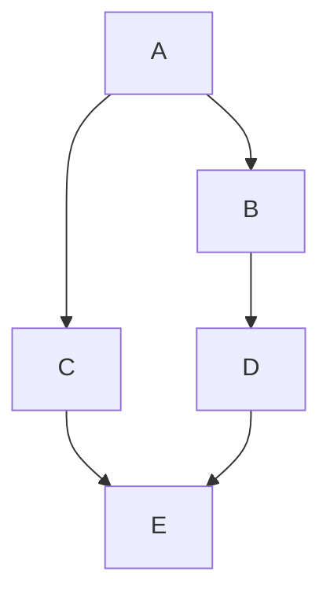

# 拓扑排序

拓扑排序（Topological Sorting）是图论中的一种经典算法，主要用于解决有向无环图（DAG, Directed Acyclic Graph）中的节点排序问题。拓扑排序的结果是一个线性序列，其中每个节点都出现在其所有前置节点之后。这种排序方法在任务调度、依赖关系管理等场景中非常有用。

## 什么是拓扑排序？

拓扑排序是对有向无环图（DAG）中的节点进行排序，使得对于图中的每一条有向边 `(u, v)`，节点 `u` 在排序中总是位于节点 `v` 之前。换句话说，拓扑排序是一种满足图中所有依赖关系的线性序列。

:::note
拓扑排序只适用于有向无环图（DAG）。如果图中存在环，则无法进行拓扑排序。
:::

### 示例

假设我们有以下有向无环图：


在这个图中，节点 `A` 是 `B` 和 `C` 的前置节点，而 `B` 和 `C` 又是 `D` 的前置节点。因此，一个可能的拓扑排序是：`A -> B -> C -> D` 或 `A -> C -> B -> D`。

## 如何实现拓扑排序？

拓扑排序可以通过两种主要方法实现：**深度优先搜索（DFS）** 和 **Kahn 算法**。下面我们将分别介绍这两种方法。

### 方法一：深度优先搜索（DFS）

DFS 是一种递归算法，它通过深度优先遍历图中的节点，并在回溯时将节点添加到结果列表中。

#### 算法步骤

1. 从图中选择一个没有前置节点的节点（即入度为 0 的节点）作为起点。
2. 对该节点进行深度优先搜索，访问其所有邻居节点。
3. 在回溯时，将当前节点添加到结果列表中。
4. 重复上述步骤，直到所有节点都被访问。

#### 代码示例

```python
from collections import defaultdict

def topological_sort_dfs(graph):
    visited = set()
    result = []

    def dfs(node):
        if node not in visited:
            visited.add(node)
            for neighbor in graph[node]:
                dfs(neighbor)
            result.append(node)

    for node in graph:
        dfs(node)

    return result[::-1]  # 反转结果列表

# 示例图
graph = {
    'A': ['B', 'C'],
    'B': ['D'],
    'C': ['D'],
    'D': []
}

print(topological_sort_dfs(graph))  # 输出: ['A', 'B', 'C', 'D']
```

### 方法二：Kahn 算法

Kahn 算法是一种基于入度的贪心算法，它通过不断移除入度为 0 的节点来实现拓扑排序。

#### 算法步骤

1. 计算图中每个节点的入度（即有多少条边指向该节点）。
2. 将所有入度为 0 的节点加入队列。
3. 从队列中取出一个节点，将其添加到结果列表中，并将其所有邻居节点的入度减 1。
4. 如果某个邻居节点的入度变为 0，则将其加入队列。
5. 重复上述步骤，直到队列为空。

#### 代码示例

```python
from collections import defaultdict, deque

def topological_sort_kahn(graph):
    in_degree = {u: 0 for u in graph}
    for u in graph:
        for v in graph[u]:
            in_degree[v] += 1

    queue = deque([u for u in in_degree if in_degree[u] == 0])
    result = []

    while queue:
        u = queue.popleft()
        result.append(u)
        for v in graph[u]:
            in_degree[v] -= 1
            if in_degree[v] == 0:
                queue.append(v)

    return result

# 示例图
graph = {
    'A': ['B', 'C'],
    'B': ['D'],
    'C': ['D'],
    'D': []
}

print(topological_sort_kahn(graph))  # 输出: ['A', 'B', 'C', 'D']
```

## 实际应用场景

拓扑排序在许多实际场景中都有应用，以下是一些常见的例子：

1. **任务调度**：在项目管理中，任务之间可能存在依赖关系。拓扑排序可以帮助确定任务的执行顺序，确保所有前置任务都已完成。
2. **课程安排**：在大学课程安排中，某些课程可能需要先修课程。拓扑排序可以帮助学生确定选课顺序。
3. **编译顺序**：在编译器中，源代码文件之间可能存在依赖关系。拓扑排序可以帮助确定文件的编译顺序。

## 总结

拓扑排序是一种重要的图论算法，广泛应用于任务调度、依赖关系管理等场景。通过深度优先搜索（DFS）或 Kahn 算法，我们可以有效地对有向无环图进行拓扑排序。掌握这一算法不仅有助于理解图论的基本概念，还能解决许多实际问题。

## 附加资源与练习

- **练习**：尝试在以下图中进行拓扑排序，并验证你的结果是否正确。



- **资源**：
  - [拓扑排序 - Wikipedia](https://zh.wikipedia.org/wiki/%E6%8B%93%E6%89%91%E6%8E%92%E5%BA%8F)
  - [Kahn 算法详解](https://www.geeksforgeeks.org/topological-sorting-indegree-based-solution/)

希望这篇教程能帮助你理解拓扑排序的基本概念和实现方法。继续练习，你将能够熟练应用这一算法！