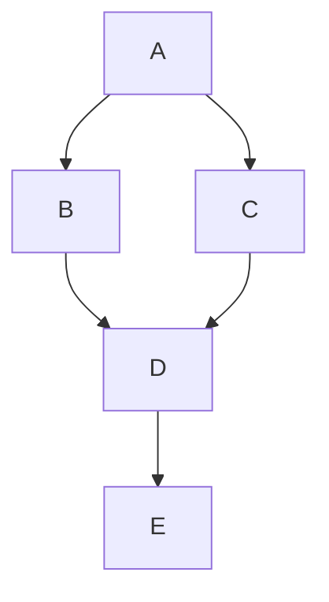

# 关键路径

关键路径（Critical Path）是项目管理中一个非常重要的概念，尤其在任务调度和资源分配中起着关键作用。它帮助我们确定项目中哪些任务是必须按时完成的，否则整个项目的完成时间将会延迟。关键路径是项目中最长的路径，决定了项目的最短完成时间。

## 什么是关键路径？

关键路径是指在项目网络图中，从开始到结束的最长路径。这条路径上的任务被称为“关键任务”，因为它们没有浮动时间（即没有延迟的余地）。如果关键路径上的任何一个任务延迟，整个项目的完成时间都会受到影响。

关键路径分析通常用于项目管理中，特别是在复杂项目中，帮助项目经理识别哪些任务需要特别关注，以确保项目按时完成。

## 关键路径的计算

要计算关键路径，我们需要以下步骤：

1. **列出所有任务及其持续时间**：首先，我们需要明确项目中所有的任务，并知道每个任务需要多长时间完成。
2. **确定任务的依赖关系**：接下来，我们需要知道哪些任务必须在其他任务完成之后才能开始。
3. **绘制项目网络图**：根据任务的依赖关系，绘制出项目的网络图。
4. **计算最早开始时间和最晚开始时间**：对于每个任务，计算其最早可以开始的时间（Earliest Start Time, ES）和最晚必须开始的时间（Latest Start Time, LS）。
5. **确定关键路径**：关键路径上的任务是那些最早开始时间和最晚开始时间相同的任务。

### 示例

假设我们有一个简单的项目，包含以下任务：

| 任务 | 持续时间 | 前置任务 |
|------|----------|----------|
| A    | 3        | -        |
| B    | 2        | A        |
| C    | 4        | A        |
| D    | 2        | B, C     |
| E    | 3        | D        |

我们可以使用以下步骤来计算关键路径：

1. **绘制项目网络图**：

2. **计算最早开始时间（ES）和最晚开始时间（LS）**：

| 任务 | 持续时间 | ES  | LS  |
|------|----------|-----|-----|
| A    | 3        | 0   | 0   |
| B    | 2        | 3   | 3   |
| C    | 4        | 3   | 3   |
| D    | 2        | 7   | 7   |
| E    | 3        | 9   | 9   |

3. **确定关键路径**：关键路径上的任务是那些 ES 和 LS 相同的任务，即 A -> C -> D -> E。

## 实际应用场景

关键路径分析在项目管理中有广泛的应用。例如，在建筑项目中，关键路径可以帮助项目经理确定哪些施工任务必须按时完成，以确保整个项目按时交付。在软件开发中，关键路径可以帮助团队识别哪些功能开发任务是最关键的，从而优先分配资源。

### 案例：软件开发项目

假设我们有一个软件开发项目，包含以下任务：

1. **需求分析**（5天）
2. **设计**（7天，依赖需求分析）
3. **编码**（10天，依赖设计）
4. **测试**（5天，依赖编码）
5. **部署**（2天，依赖测试）

通过关键路径分析，我们可以确定关键路径为：需求分析 -> 设计 -> 编码 -> 测试 -> 部署。这意味着如果任何一个任务延迟，整个项目的完成时间都会受到影响。

## 总结

关键路径是项目管理中一个非常重要的工具，它帮助我们识别项目中哪些任务是最关键的，并确保这些任务按时完成。通过计算关键路径，我们可以更好地规划项目进度，合理分配资源，从而确保项目按时交付。

## 附加资源与练习

- **练习**：尝试为一个包含多个任务的项目计算关键路径，并绘制项目网络图。
- **资源**：了解更多关于关键路径分析的内容，可以参考《项目管理知识体系指南》（PMBOK Guide）。

:::tip
关键路径分析不仅适用于大型项目，也可以应用于日常生活中的任务规划。试着用关键路径的方法来规划你的一天，看看是否能提高效率！
:::