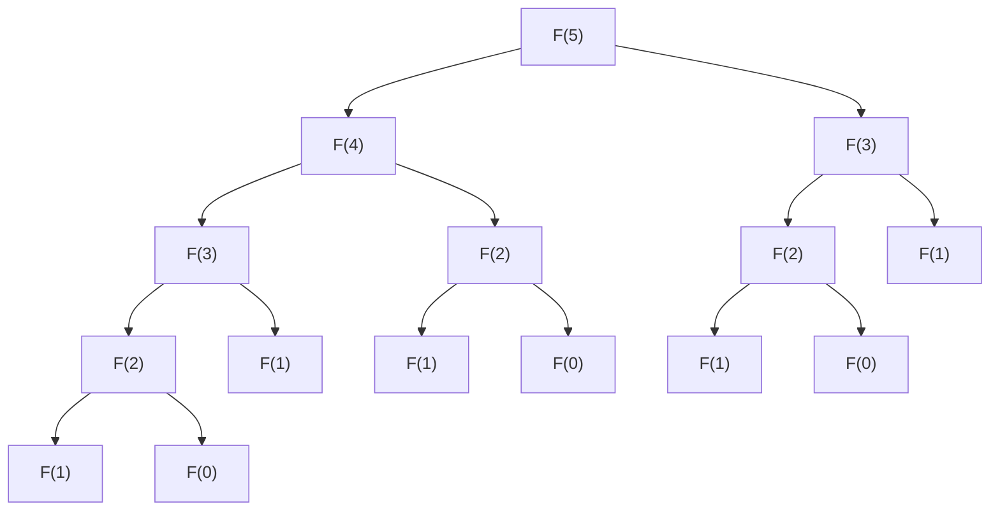

# 重叠子问题

## 介绍

在动态规划（Dynamic Programming, DP）中，**重叠子问题**是一个核心概念。它指的是在解决一个问题时，某些子问题会被多次重复计算。动态规划通过存储这些子问题的解（通常使用数组或哈希表），避免重复计算，从而显著提高算法的效率。

重叠子问题是动态规划能够优化递归算法的关键。如果没有重叠子问题，动态规划的优势就无法体现。

## 什么是重叠子问题？

假设我们有一个递归问题，例如计算斐波那契数列的第 `n` 项。斐波那契数列的定义如下：

- `F(0) = 0`
- `F(1) = 1`
- `F(n) = F(n-1) + F(n-2)` （当 `n > 1` 时）

如果我们直接使用递归来计算 `F(5)`，计算过程如下：



从图中可以看出，`F(3)`、`F(2)` 等子问题被多次计算。这就是**重叠子问题**。

## 动态规划的优化

为了避免重复计算，动态规划会将子问题的解存储起来，供后续使用。这种方法称为**记忆化**（Memoization）。以下是使用记忆化优化斐波那契数列计算的代码示例：

```python
def fibonacci(n, memo={}):
    if n in memo:
        return memo[n]
    if n <= 1:
        return n
    memo[n] = fibonacci(n-1, memo) + fibonacci(n-2, memo)
    return memo[n]

# 示例
print(fibonacci(5))  # 输出: 5
```

在这个例子中，`memo` 字典用于存储已经计算过的斐波那契数。每次计算 `F(n)` 时，首先检查 `memo` 中是否已经存在该值。如果存在，则直接返回；否则，进行计算并将结果存储在 `memo` 中。

## 实际案例：爬楼梯问题

另一个经典的动态规划问题是**爬楼梯问题**。假设你正在爬楼梯，每次你可以爬 1 阶或 2 阶。问：有多少种不同的方法可以爬到第 `n` 阶？

这个问题可以转化为斐波那契数列问题。设 `dp[n]` 表示爬到第 `n` 阶的方法数，则有：

- `dp[0] = 1` （表示在地面，只有一种方法）
- `dp[1] = 1` （只有一种方法：爬 1 阶）
- `dp[n] = dp[n-1] + dp[n-2]` （从第 `n-1` 阶爬 1 阶，或从第 `n-2` 阶爬 2 阶）

以下是使用动态规划解决爬楼梯问题的代码：

```python
def climb_stairs(n):
    if n <= 1:
        return 1
    dp = [0] * (n + 1)
    dp[0], dp[1] = 1, 1
    for i in range(2, n + 1):
        dp[i] = dp[i-1] + dp[i-2]
    return dp[n]

# 示例
print(climb_stairs(3))  # 输出: 3
```

在这个例子中，`dp` 数组用于存储每一阶的方法数，避免了重复计算。

## 总结

重叠子问题是动态规划的核心概念之一。通过识别和优化重叠子问题，我们可以显著提高算法的效率。记忆化和动态规划表是解决重叠子问题的两种常用方法。

在实际应用中，许多问题（如斐波那契数列、背包问题、最长公共子序列等）都包含重叠子问题。掌握动态规划的关键在于学会识别这些问题，并设计出高效的解决方案。

## 附加资源与练习

1. **练习**：尝试用动态规划解决以下问题：
   - 计算第 `n` 个斐波那契数。
   - 解决 0-1 背包问题。

2. **推荐阅读**：
   - 《算法导论》中的动态规划章节。
   - LeetCode 上的动态规划专题练习。

3. **进一步学习**：
   - 了解自底向上和自顶向下的动态规划方法。
   - 探索更多动态规划的应用场景，如编辑距离、矩阵链乘法等。

通过不断练习和学习，你将能够熟练运用动态规划解决复杂问题！