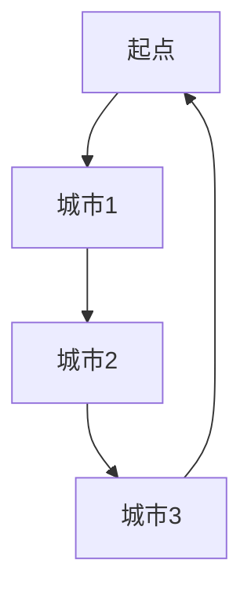

# 近似算法

## 介绍

在计算机科学中，许多问题属于**NP难问题**，这意味着在合理的时间内找到精确解是非常困难的。为了解决这些问题，我们通常会使用**近似算法**。近似算法的目标是在可接受的时间内找到一个接近最优解的解决方案，而不是精确解。

近似算法通常用于优化问题，例如**旅行商问题（TSP）**、**背包问题**等。这些算法的核心思想是通过牺牲一定的精确性来换取计算效率。

:::note
**什么是NP难问题？**
NP难问题是指那些尚未找到多项式时间算法的问题，但可以在多项式时间内验证一个解是否正确。
:::

## 贪心算法与近似算法

贪心算法是一种常见的近似算法策略。它通过每一步都选择当前最优的局部解，希望最终能够得到一个全局最优解。虽然贪心算法并不总是能得到精确解，但在许多情况下，它可以提供一个接近最优的近似解。

### 贪心算法的基本步骤

1. **初始化**：从问题的初始状态开始。
2. **选择**：在当前状态下，选择一个局部最优解。
3. **更新**：根据选择更新当前状态。
4. **重复**：重复步骤2和3，直到达到终止条件。

## 代码示例：背包问题

让我们通过一个经典的**0-1背包问题**来理解贪心算法如何作为近似算法使用。

### 问题描述

给定一组物品，每个物品有一个重量和一个价值。我们的目标是在不超过背包容量的情况下，选择一些物品使得总价值最大。

### 贪心策略

我们可以按照**单位重量的价值**（即价值/重量）从高到低排序，然后依次选择物品，直到背包无法再装下更多物品。

```python
def greedy_knapsack(items, capacity):
    # 按单位重量价值排序
    items.sort(key=lambda x: x[1]/x[0], reverse=True)
    
    total_value = 0
    for weight, value in items:
        if capacity >= weight:
            capacity -= weight
            total_value += value
        else:
            break
    return total_value

# 示例输入
items = [(10, 60), (20, 100), (30, 120)]  # (重量, 价值)
capacity = 50

# 输出
print(greedy_knapsack(items, capacity))  # 输出: 160
```

### 解释

在这个例子中，我们首先按照单位重量的价值对物品进行排序。然后，我们从价值最高的物品开始，尽可能多地装入背包。最终，我们得到了一个总价值为160的近似解。

:::tip
**贪心算法的局限性**
贪心算法并不总是能得到最优解。例如，在某些情况下，贪心策略可能会错过全局最优解。
:::

## 实际应用场景

### 旅行商问题（TSP）

旅行商问题是一个经典的NP难问题，目标是找到一条最短的路径，使得旅行商可以访问所有城市并返回起点。贪心算法可以用于近似解决TSP，例如通过每次选择最近的未访问城市作为下一步。



### 任务调度

在任务调度问题中，我们需要将一组任务分配给多个处理器，以最小化完成所有任务的总时间。贪心算法可以通过每次将任务分配给当前负载最轻的处理器来近似解决这个问题。

## 总结

近似算法是解决NP难问题的重要工具，尤其是在需要快速得到可行解的场景中。贪心算法作为一种常见的近似算法策略，通过局部最优选择来逼近全局最优解。虽然它并不总是能得到精确解，但在许多实际应用中，贪心算法提供了一个简单且高效的解决方案。

## 附加资源与练习

- **练习1**：尝试修改上述背包问题的代码，使其能够处理物品可以部分装入背包的情况。
- **练习2**：研究其他近似算法，如**动态规划**和**随机化算法**，并比较它们与贪心算法的优缺点。
- **资源**：推荐阅读《算法导论》中的近似算法章节，深入了解近似算法的理论基础。

:::caution
**注意**
近似算法的性能通常依赖于问题的特性。在实际应用中，选择合适的算法策略非常重要。
:::