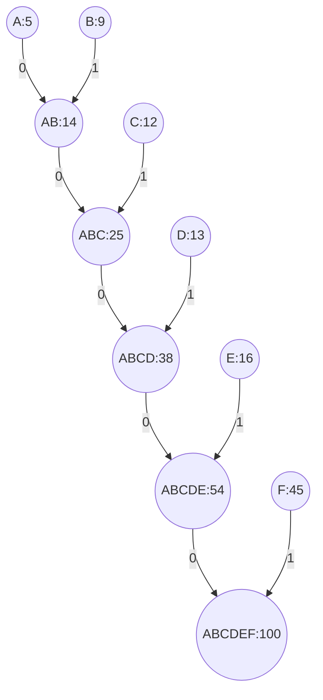

# 霍夫曼编码

霍夫曼编码（Huffman Coding）是一种用于无损数据压缩的贪心算法。它通过为每个字符分配一个可变长度的二进制编码来实现压缩，其中出现频率较高的字符使用较短的编码，而出现频率较低的字符使用较长的编码。这种方法可以有效地减少数据的存储空间或传输带宽。

## 基本概念

霍夫曼编码的核心思想是**贪心算法**，即在每一步选择中，都选择当前最优的局部解，最终得到全局最优解。具体来说，霍夫曼编码通过构建一棵**霍夫曼树**（Huffman Tree）来实现编码的分配。

### 霍夫曼树的构建

1. **统计字符频率**：首先统计待编码文本中每个字符的出现频率。
2. **构建优先队列**：将每个字符及其频率作为一个节点，放入优先队列（通常是最小堆）中。
3. **合并节点**：从优先队列中取出频率最小的两个节点，合并成一个新节点，新节点的频率为这两个节点的频率之和。将新节点重新放入优先队列中。
4. **重复合并**：重复上述步骤，直到队列中只剩一个节点，这个节点就是霍夫曼树的根节点。
5. **分配编码**：从根节点开始，向左子树走分配 `0`，向右子树走分配 `1`，直到叶子节点，得到每个字符的编码。

### 示例

假设我们有以下字符及其频率：

| 字符 | 频率 |
|------|------|
| A    | 5    |
| B    | 9    |
| C    | 12   |
| D    | 13   |
| E    | 16   |
| F    | 45   |

我们可以通过以下步骤构建霍夫曼树：



最终得到的霍夫曼编码表如下：

| 字符 | 编码 |
|------|------|
| A    | 000  |
| B    | 001  |
| C    | 010  |
| D    | 011  |
| E    | 10   |
| F    | 11   |

## 代码实现

以下是一个用 Python 实现的霍夫曼编码示例：

```python
import heapq
from collections import defaultdict, Counter

class HuffmanNode:
    def __init__(self, char, freq):
        self.char = char
        self.freq = freq
        self.left = None
        self.right = None

    def __lt__(self, other):
        return self.freq < other.freq

def build_huffman_tree(text):
    frequency = Counter(text)
    heap = [HuffmanNode(char, freq) for char, freq in frequency.items()]
    heapq.heapify(heap)

    while len(heap) > 1:
        left = heapq.heappop(heap)
        right = heapq.heappop(heap)
        merged = HuffmanNode(None, left.freq + right.freq)
        merged.left = left
        merged.right = right
        heapq.heappush(heap, merged)

    return heap[0]

def build_huffman_codes(node, prefix="", code=None):
    if code is None:
        code = {}
    if node:
        if node.char is not None:
            code[node.char] = prefix
        build_huffman_codes(node.left, prefix + "0", code)
        build_huffman_codes(node.right, prefix + "1", code)
    return code

def huffman_encoding(text):
    root = build_huffman_tree(text)
    codes = build_huffman_codes(root)
    encoded_text = ''.join([codes[char] for char in text])
    return encoded_text, codes

# 示例
text = "AABBBCCCCDDDDDEEEEEEFFFFFFFFFFF"
encoded_text, codes = huffman_encoding(text)
print("编码表:", codes)
print("编码后的文本:", encoded_text)
```


