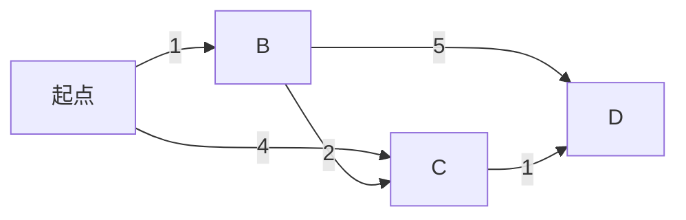

# 最短路径的贪心解法

贪心算法是一种在每一步选择中都采取当前状态下最优的选择，从而希望导致全局最优解的算法。在解决最短路径问题时，贪心算法是一种常用的方法，尤其是在处理加权图时。本文将详细介绍如何使用贪心算法解决最短路径问题，并通过代码示例和实际案例帮助你理解这一概念。

## 什么是贪心算法？

贪心算法的核心思想是：在每一步选择中，都选择当前最优的局部解，希望通过一系列局部最优解最终得到全局最优解。贪心算法并不总是能得到全局最优解，但在某些特定问题中，它可以非常高效地找到最优解。

## 最短路径问题

最短路径问题是指在图中找到从起点到终点的路径，使得路径上的边的权重之和最小。常见的算法包括 Dijkstra 算法和 Bellman-Ford 算法，其中 Dijkstra 算法就是一种典型的贪心算法。

### Dijkstra 算法

Dijkstra 算法是一种用于解决单源最短路径问题的贪心算法。它通过逐步扩展从起点到其他所有节点的最短路径来工作。算法的基本步骤如下：

1. 初始化：将起点的距离设为 0，其他所有节点的距离设为无穷大。
2. 选择当前距离起点最近的未处理节点。
3. 对于该节点的每一个邻居，更新其距离值。
4. 重复步骤 2 和 3，直到所有节点都被处理。

### 代码示例

以下是一个使用 Python 实现的 Dijkstra 算法的示例：

```python
import heapq

def dijkstra(graph, start):
    distances = {node: float('inf') for node in graph}
    distances[start] = 0
    queue = [(0, start)]
    
    while queue:
        current_distance, current_node = heapq.heappop(queue)
        
        if current_distance > distances[current_node]:
            continue
        
        for neighbor, weight in graph[current_node].items():
            distance = current_distance + weight
            
            if distance < distances[neighbor]:
                distances[neighbor] = distance
                heapq.heappush(queue, (distance, neighbor))
    
    return distances

# 示例图
graph = {
    'A': {'B': 1, 'C': 4},
    'B': {'A': 1, 'C': 2, 'D': 5},
    'C': {'A': 4, 'B': 2, 'D': 1},
    'D': {'B': 5, 'C': 1}
}

# 计算从节点 'A' 到其他节点的最短路径
distances = dijkstra(graph, 'A')
print(distances)
```

**输入：**
```python
graph = {
    'A': {'B': 1, 'C': 4},
    'B': {'A': 1, 'C': 2, 'D': 5},
    'C': {'A': 4, 'B': 2, 'D': 1},
    'D': {'B': 5, 'C': 1}
}
```

**输出：**
```python
{'A': 0, 'B': 1, 'C': 3, 'D': 4}
```

### 逐步解释

1. **初始化**：我们首先将所有节点的距离设为无穷大，起点的距离设为 0。
2. **选择最近节点**：我们从起点开始，选择距离起点最近的未处理节点。
3. **更新邻居距离**：对于当前节点的每一个邻居，我们计算从起点到该邻居的距离，并更新其距离值。
4. **重复**：我们重复上述步骤，直到所有节点都被处理。

### 实际案例

假设你正在开发一个导航系统，需要计算从用户当前位置到目的地的最短路径。你可以使用 Dijkstra 算法来计算最短路径，并为用户提供最优的导航路线。



在这个图中，起点是 `A`，终点是 `D`。通过 Dijkstra 算法，我们可以找到从 `A` 到 `D` 的最短路径是 `A -> B -> C -> D`，总距离为 4。

## 总结

贪心算法在解决最短路径问题时非常有效，尤其是使用 Dijkstra 算法。通过每一步选择当前最优的局部解，我们可以逐步构建出全局最优解。虽然贪心算法并不总是能得到全局最优解，但在许多实际应用中，它能够提供高效且准确的解决方案。

## 附加资源与练习

- **练习**：尝试修改上述代码，使其能够处理带有负权边的图。提示：你可能需要使用 Bellman-Ford 算法。
- **资源**：阅读更多关于 Dijkstra 算法和贪心算法的资料，深入理解其原理和应用场景。

:::tip
贪心算法虽然简单，但在许多实际问题中非常有效。掌握贪心算法的思想，将有助于你解决更多复杂的算法问题。
:::