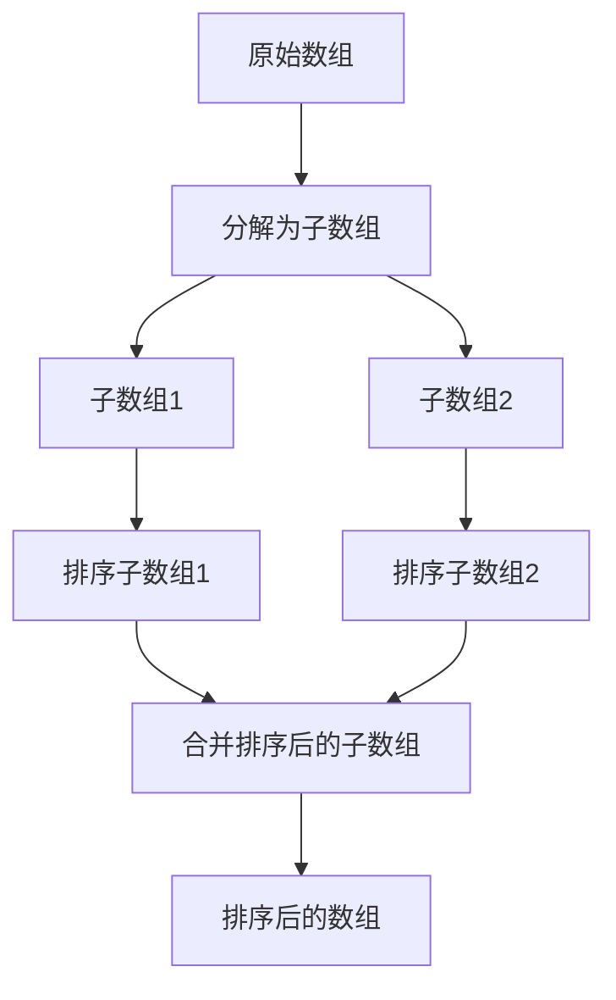

# 并行分治算法

## 介绍

分治算法是一种经典的算法设计范式，它将问题分解为多个子问题，递归地解决这些子问题，然后将结果合并以得到最终答案。并行分治算法则是在此基础上，利用多核处理器或分布式系统的计算能力，同时解决多个子问题，从而加速整体计算过程。

并行分治算法的核心思想是将问题的分解和子问题的解决过程并行化。通过这种方式，我们可以显著减少算法的运行时间，尤其是在处理大规模数据或复杂计算时。

## 基本概念

### 分治算法的三个步骤

1. **分解**：将原问题分解为若干个规模较小的子问题。
2. **解决**：递归地解决这些子问题。如果子问题的规模足够小，则直接求解。
3. **合并**：将子问题的解合并为原问题的解。

### 并行化的关键点

在并行分治算法中，关键在于如何将分解和解决步骤并行化。通常，我们可以通过以下方式实现：

- **任务分解**：将问题分解为多个独立的子任务，每个子任务可以在不同的处理器或计算节点上并行执行。
- **数据分解**：将数据分割成多个部分，每个部分由不同的处理器处理。

## 代码示例

以下是一个简单的并行分治算法示例，用于计算数组的和。我们使用 Python 的 `multiprocessing` 模块来实现并行化。

```python
import multiprocessing as mp

def parallel_sum(arr):
    if len(arr) <= 1:
        return arr[0] if arr else 0
    
    mid = len(arr) // 2
    left = arr[:mid]
    right = arr[mid:]
    
    with mp.Pool(2) as pool:
        left_sum, right_sum = pool.map(parallel_sum, [left, right])
    
    return left_sum + right_sum

if __name__ == "__main__":
    arr = [1, 2, 3, 4, 5, 6, 7, 8]
    result = parallel_sum(arr)
    print(f"Sum of array: {result}")
```

**输入**:
```python
arr = [1, 2, 3, 4, 5, 6, 7, 8]
```

**输出**:
```
Sum of array: 36
```

在这个示例中，数组被分成两部分，分别在不同的进程中计算其和，最后将结果合并。

## 实际应用场景

### 归并排序

归并排序是一个典型的分治算法，它可以通过并行化来加速排序过程。在并行归并排序中，数组被分成多个子数组，每个子数组在不同的处理器上排序，最后将排序后的子数组合并。



### 矩阵乘法

矩阵乘法也可以通过并行分治算法来加速。通过将矩阵分解为多个子矩阵，每个子矩阵的乘法可以在不同的处理器上并行计算，最后将结果合并。

## 总结

并行分治算法通过将问题分解为多个子问题并并行解决，能够显著提高算法的效率。它在处理大规模数据、复杂计算以及需要高并发处理的场景中具有广泛的应用。

## 附加资源与练习

- **练习 1**：尝试实现一个并行化的归并排序算法。
- **练习 2**：研究如何将并行分治算法应用于快速排序。
- **资源**：阅读更多关于并行计算和分治算法的书籍，如《算法导论》。

:::tip
在实际应用中，选择合适的并行化策略和工具（如 OpenMP、MPI 等）可以进一步提高算法的性能。
:::