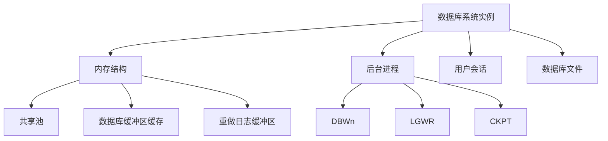

## 介绍

数据库系统实例（Database System Instance）是指数据库管理系统（DBMS）在运行时的具体表现。它包含了数据库的运行环境、内存结构、进程以及用户会话等。简单来说，数据库系统实例是数据库管理系统在特定时间点的运行状态。

数据库系统实例与数据库本身是不同的概念。数据库是存储数据的物理文件集合，而数据库系统实例是管理这些文件的运行时环境。理解这两者的区别对于学习数据库管理至关重要。

## 数据库系统实例的组成

一个数据库系统实例通常由以下几个部分组成：

1. **内存结构**：包括共享池、数据库缓冲区缓存、重做日志缓冲区等。
2. **后台进程**：如数据库写入进程（DBWn）、日志写入进程（LGWR）、检查点进程（CKPT）等。
3. **用户会话**：用户与数据库交互的会话信息。
4. **数据库文件**：包括数据文件、控制文件、重做日志文件等。



## 数据库系统实例的生命周期

数据库系统实例的生命周期包括以下几个阶段：

1. **启动（Startup）**：数据库实例启动时，会加载数据库文件并初始化内存结构。
2. **运行（Running）**：数据库实例处于运行状态，用户可以执行查询、插入、更新等操作。
3. **关闭（Shutdown）**：数据库实例关闭时，会释放内存并保存数据到磁盘。

### 启动数据库实例

在大多数数据库管理系统中，启动数据库实例的命令如下：

```sql
STARTUP;
```

### 关闭数据库实例

关闭数据库实例的命令如下：

```sql
SHUTDOWN;
```

:::note
在实际操作中，关闭数据库实例时需要注意数据的完整性和一致性，避免数据丢失。
:::

## 实际案例

假设你正在管理一个在线商城的数据库系统。每天都有大量的用户访问商城，进行商品浏览、下单、支付等操作。数据库系统实例在这个过程中扮演了至关重要的角色。

1. **启动阶段**：每天早上，数据库管理员启动数据库实例，确保系统能够处理用户的请求。
2. **运行阶段**：在运行阶段，数据库实例管理着用户的会话、缓存数据、处理事务等。例如，当用户下单时，数据库实例会确保订单数据被正确写入数据库。
3. **关闭阶段**：每天晚上，数据库管理员关闭数据库实例，进行数据备份和维护。

:::tip
在实际应用中，数据库系统实例的配置和优化对系统性能有着重要影响。例如，合理配置内存结构可以显著提高查询速度。
:::

## 总结

数据库系统实例是数据库管理系统在运行时的具体表现，它包含了内存结构、后台进程、用户会话和数据库文件等组成部分。理解数据库系统实例的概念和生命周期对于管理数据库系统至关重要。

在实际应用中，数据库系统实例的管理和优化是数据库管理员的重要职责。通过合理配置和优化，可以显著提高数据库系统的性能和稳定性。

## 附加资源与练习

### 附加资源

- [数据库系统概念](https://example.com/database-concepts)
- [数据库管理指南](https://example.com/database-management)

### 练习

1. 尝试在你的本地环境中启动和关闭一个数据库实例，观察其行为。
2. 研究不同数据库管理系统（如MySQL、PostgreSQL、Oracle）的实例管理命令，比较它们的异同。
3. 思考在实际应用中，如何通过优化数据库系统实例的配置来提高系统性能。

:::caution
在进行数据库实例操作时，请确保你有足够的权限，并备份重要数据，以避免数据丢失。
:::