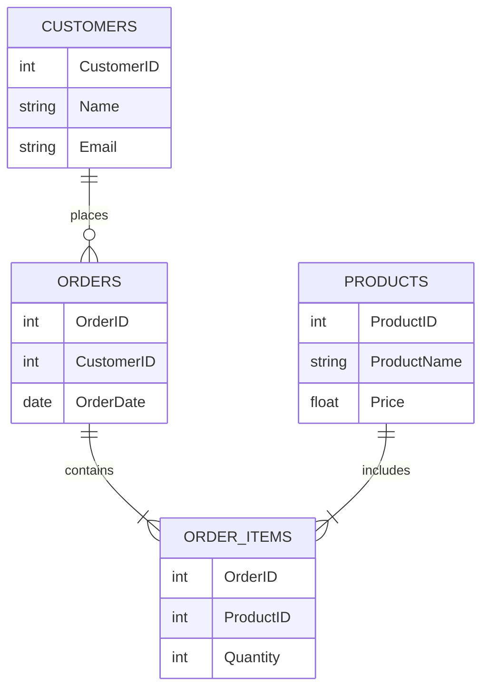

# 数据模型介绍

在数据库系统中，**数据模型**是用于描述数据、数据关系以及数据约束的一种抽象工具。它为数据库的设计和管理提供了基础框架。理解数据模型是学习数据库的第一步，因为它决定了数据如何存储、组织和操作。

## 什么是数据模型？

数据模型是数据库系统中用于表示数据结构和数据关系的概念性工具。它定义了数据的组织形式、数据之间的关系以及数据的操作规则。数据模型可以帮助开发者和数据库管理员更好地理解数据，从而设计出高效的数据库系统。

### 数据模型的类型

数据模型主要分为以下几类：

1. **层次模型（Hierarchical Model）**  
   层次模型是一种树状结构，数据以父子关系组织。每个父节点可以有多个子节点，但每个子节点只能有一个父节点。

2. **网状模型（Network Model）**  
   网状模型允许一个子节点有多个父节点，数据之间的关系更加复杂。

3. **关系模型（Relational Model）**  
   关系模型是目前最常用的数据模型。它使用表格（称为关系）来存储数据，并通过主键和外键来建立表之间的关系。

4. **面向对象模型（Object-Oriented Model）**  
   面向对象模型将数据表示为对象，类似于面向对象编程中的类。它支持继承、封装和多态等特性。

5. **文档模型（Document Model）**  
   文档模型通常用于NoSQL数据库，数据以文档（如JSON或XML）的形式存储。

6. **图模型（Graph Model）**  
   图模型用于表示复杂的关系网络，数据以节点和边的形式存储。

## 关系模型示例

关系模型是最常见的数据模型，下面是一个简单的示例：

```sql
-- 创建一个学生表
CREATE TABLE Students (
    StudentID INT PRIMARY KEY,
    Name VARCHAR(50),
    Age INT
);

-- 创建一个课程表
CREATE TABLE Courses (
    CourseID INT PRIMARY KEY,
    CourseName VARCHAR(50)
);

-- 创建一个选课表，表示学生和课程之间的关系
CREATE TABLE Enrollments (
    StudentID INT,
    CourseID INT,
    FOREIGN KEY (StudentID) REFERENCES Students(StudentID),
    FOREIGN KEY (CourseID) REFERENCES Courses(CourseID)
);
```

在这个示例中，`Students` 表和 `Courses` 表通过 `Enrollments` 表建立了多对多的关系。

## 数据模型的实际应用

### 案例：电商网站数据库设计

假设我们要为一个电商网站设计数据库，以下是可能的数据模型：



在这个案例中：
- `CUSTOMERS` 表存储客户信息。
- `ORDERS` 表存储订单信息，并通过 `CustomerID` 与 `CUSTOMERS` 表关联。
- `PRODUCTS` 表存储产品信息。
- `ORDER_ITEMS` 表表示订单和产品之间的多对多关系。

## 总结

数据模型是数据库设计的核心，它决定了数据如何存储和操作。通过本文，我们了解了常见的数据模型类型，并通过实际案例展示了如何应用关系模型设计数据库。

### 附加资源

- [数据库系统概念](https://www.db-book.com/) - 一本经典的数据库教材，适合深入学习。
- [SQL教程](https://www.w3schools.com/sql/) - 学习SQL的入门教程。

### 练习

1. 设计一个图书馆管理系统的数据模型，包括书籍、读者和借阅记录。
2. 使用SQL创建一个简单的博客系统数据库，包括用户、文章和评论表。

:::tip
在学习数据模型时，建议多动手实践，尝试设计不同的数据库模型，并通过SQL语句实现它们。
:::