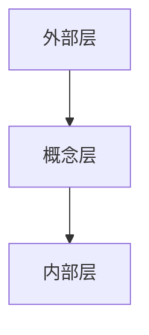

# 数据库管理系统(DBMS)

## 什么是数据库管理系统(DBMS)?

数据库管理系统（Database Management System，简称 DBMS）是一种用于创建、管理和操作数据库的软件系统。它为用户和应用程序提供了一个接口，使得数据的存储、检索、更新和管理变得更加高效和安全。DBMS 是数据库的核心组件，负责处理数据的组织、存储和访问。

:::note
**数据库** 是一个有组织的数据集合，通常以电子方式存储在计算机系统中。而 **DBMS** 是管理这些数据的软件工具。
:::

## DBMS 的主要功能

DBMS 提供了多种功能，以确保数据的高效管理和使用。以下是其主要功能：

1. **数据存储与管理**：DBMS 负责将数据存储在数据库中，并提供管理这些数据的工具。
2. **数据检索**：用户可以通过查询语言（如 SQL）从数据库中检索数据。
3. **数据安全**：DBMS 提供了访问控制和数据加密等功能，以确保数据的安全性。
4. **数据完整性**：DBMS 确保数据的准确性和一致性，防止数据损坏或丢失。
5. **并发控制**：DBMS 允许多个用户同时访问数据库，同时确保数据的一致性。
6. **备份与恢复**：DBMS 提供了数据备份和恢复功能，以防止数据丢失。

## DBMS 的类型

DBMS 可以分为多种类型，每种类型适用于不同的应用场景：

1. **关系型数据库管理系统 (RDBMS)**：使用表格来存储数据，并通过 SQL 进行查询。常见的 RDBMS 包括 MySQL、PostgreSQL 和 Oracle。
2. **非关系型数据库管理系统 (NoSQL)**：适用于非结构化或半结构化数据，常见的 NoSQL 数据库包括 MongoDB 和 Cassandra。
3. **对象数据库管理系统 (ODBMS)**：将数据存储为对象，适用于面向对象编程语言。
4. **分布式数据库管理系统 (DDBMS)**：数据分布在多个物理位置，适用于大规模分布式系统。

## DBMS 的实际应用

DBMS 在现代应用程序中无处不在。以下是一些实际应用场景：

1. **电子商务网站**：存储产品信息、用户数据和订单记录。
2. **银行系统**：管理客户账户、交易记录和贷款信息。
3. **社交媒体平台**：存储用户资料、帖子和互动数据。
4. **医疗系统**：管理患者记录、诊断结果和治疗计划。

## 代码示例：使用 SQL 查询数据

以下是一个简单的 SQL 查询示例，展示了如何使用 SQL 从数据库中检索数据：

```sql
-- 创建一个简单的表
CREATE TABLE Users (
    id INT PRIMARY KEY,
    name VARCHAR(100),
    email VARCHAR(100)
);

-- 插入一些数据
INSERT INTO Users (id, name, email) VALUES (1, 'Alice', 'alice@example.com');
INSERT INTO Users (id, name, email) VALUES (2, 'Bob', 'bob@example.com');

-- 查询所有用户
SELECT * FROM Users;
```

**输出**：

| id | name  | email           |
|----|-------|-----------------|
| 1  | Alice | alice@example.com |
| 2  | Bob   | bob@example.com   |

:::tip
SQL 是关系型数据库的标准查询语言，掌握 SQL 是学习 DBMS 的基础。
:::

## DBMS 的架构

DBMS 的架构通常分为三层：

1. **外部层**：用户或应用程序与数据库交互的接口。
2. **概念层**：数据库的逻辑结构，定义了数据的组织方式。
3. **内部层**：数据的物理存储方式，包括文件结构和索引。



## 总结

数据库管理系统(DBMS)是现代数据管理的核心工具。它提供了数据存储、检索、安全和管理的功能，广泛应用于各种行业和领域。通过学习 DBMS，你将能够更好地理解和操作数据库，为开发高效、安全的应用程序打下坚实的基础。

## 附加资源与练习

- **练习**：尝试使用 MySQL 或 PostgreSQL 创建一个简单的数据库，并执行一些基本的 SQL 查询。
- **资源**：
  - [SQL 教程](https://www.w3schools.com/sql/)
  - [MySQL 官方文档](https://dev.mysql.com/doc/)
  - [PostgreSQL 官方文档](https://www.postgresql.org/docs/)

:::caution
在学习 DBMS 时，务必注意数据的安全性和完整性，避免误操作导致数据丢失。
:::