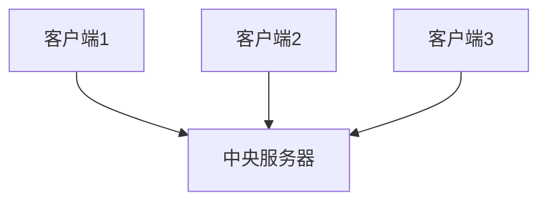
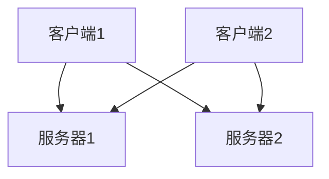

# 数据库架构

数据库架构是数据库系统的核心设计，它定义了数据的组织方式、存储结构以及数据之间的关系。理解数据库架构对于设计和优化数据库系统至关重要。本文将逐步介绍数据库架构的基本概念、类型以及实际应用场景。

## 什么是数据库架构？

数据库架构是指数据库系统的整体结构设计，包括数据的存储方式、数据之间的关系以及数据的访问方法。它决定了数据库的性能、可扩展性和安全性。数据库架构通常分为三个层次：

1. **外部层（External Level）**：用户或应用程序看到的数据库视图。每个用户或应用程序可能有不同的视图。
2. **概念层（Conceptual Level）**：数据库的全局视图，定义了数据的逻辑结构和关系。
3. **内部层（Internal Level）**：数据库的物理存储结构，包括数据的存储方式、索引和文件组织。

## 数据库架构的类型

数据库架构主要分为两种类型：**集中式架构**和**分布式架构**。

### 1. 集中式架构

在集中式架构中，所有数据都存储在一个中央服务器上。用户通过客户端应用程序访问中央服务器上的数据。这种架构简单易管理，但在高并发或大数据量情况下可能会遇到性能瓶颈。



### 2. 分布式架构

在分布式架构中，数据分布在多个服务器上。每个服务器可以独立处理请求，从而提高系统的可扩展性和容错性。分布式架构适用于大规模数据处理和高并发场景。



## 数据库架构的实际应用

### 案例1：电子商务网站

假设我们有一个电子商务网站，用户可以在网站上浏览商品、下订单和查看订单状态。我们可以使用集中式架构来存储商品信息和用户订单数据。所有数据都存储在一个中央数据库中，用户通过网站前端访问这些数据。

```sql
-- 创建商品表
CREATE TABLE Products (
    ProductID INT PRIMARY KEY,
    ProductName VARCHAR(100),
    Price DECIMAL(10, 2)
);

-- 创建订单表
CREATE TABLE Orders (
    OrderID INT PRIMARY KEY,
    UserID INT,
    ProductID INT,
    Quantity INT,
    OrderDate DATE
);
```

### 案例2：社交媒体平台

对于一个社交媒体平台，用户可以在平台上发布动态、评论和点赞。由于用户数量庞大，数据量巨大，我们可以使用分布式架构来存储用户动态和评论数据。每个服务器存储一部分用户数据，用户请求会被路由到相应的服务器。

```sql
-- 创建用户动态表
CREATE TABLE Posts (
    PostID INT PRIMARY KEY,
    UserID INT,
    Content TEXT,
    PostDate DATETIME
);

-- 创建评论表
CREATE TABLE Comments (
    CommentID INT PRIMARY KEY,
    PostID INT,
    UserID INT,
    Content TEXT,
    CommentDate DATETIME
);
```

## 总结

数据库架构是数据库系统的核心设计，它决定了数据的组织方式、存储结构以及数据之间的关系。集中式架构适用于小型系统，而分布式架构适用于大规模数据处理和高并发场景。理解数据库架构有助于设计和优化数据库系统，提高系统的性能和可扩展性。

## 附加资源

- [数据库系统概念](https://www.db-book.com/)：一本经典的数据库教材，深入讲解数据库架构和设计。
- [SQL教程](https://www.w3schools.com/sql/)：学习SQL语言，掌握数据库操作的基本技能。

## 练习

1. 设计一个简单的集中式数据库架构，用于存储学生信息和成绩。
2. 设计一个分布式数据库架构，用于存储大型社交网络中的用户动态和评论数据。

:::tip
在实际应用中，选择合适的数据库架构需要根据业务需求、数据量和性能要求进行权衡。
:::