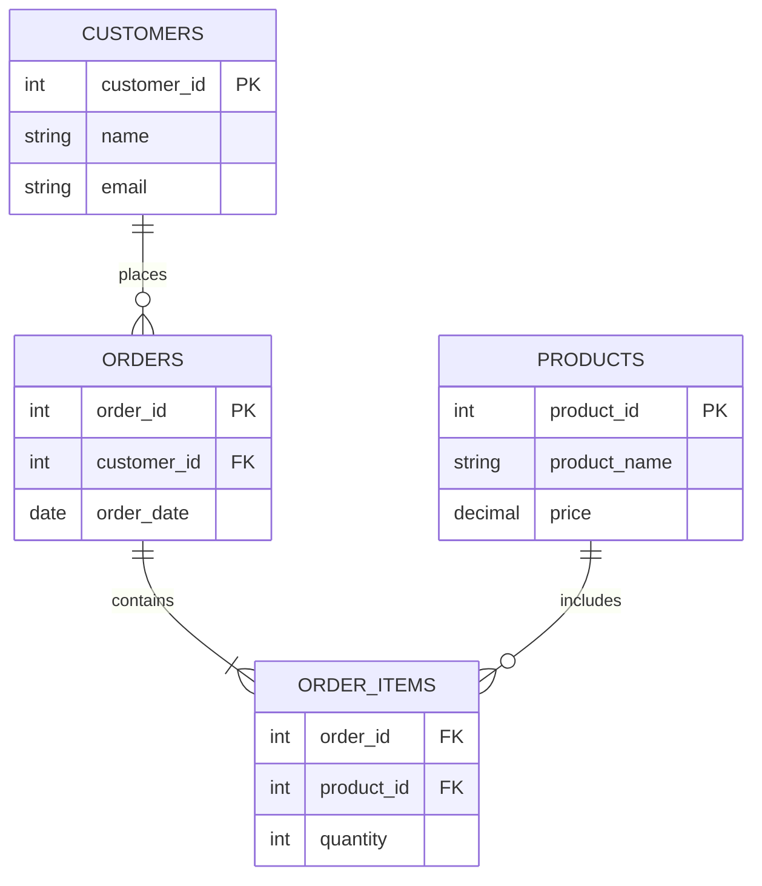

# 数据库设计原则

数据库设计是构建高效、可维护的数据库系统的关键步骤。良好的数据库设计不仅能提高数据存储和检索的效率，还能确保数据的完整性和一致性。本文将介绍数据库设计的基本原则，并通过实际案例帮助你理解这些原则的应用。

## 1. 什么是数据库设计？

数据库设计是指根据业务需求，规划和组织数据存储结构的过程。它包括定义表、字段、关系以及约束条件等。一个好的数据库设计能够满足业务需求，同时保证数据的高效管理和维护。

## 2. 数据库设计的基本原则

### 2.1 数据规范化

数据规范化是数据库设计的核心原则之一。它通过将数据分解为多个表，减少数据冗余，并确保数据的一致性。规范化通常分为几个范式（Normal Forms），最常见的是第一范式（1NF）、第二范式（2NF）和第三范式（3NF）。

#### 2.1.1 第一范式（1NF）

第一范式要求表中的每个字段都是原子的，即不可再分。例如，一个包含多个值的字段（如“电话号码”）应该拆分为多个记录。

**示例：**

```sql
-- 不符合1NF的表
CREATE TABLE Contacts (
    id INT PRIMARY KEY,
    name VARCHAR(100),
    phone_numbers VARCHAR(200)
);

-- 符合1NF的表
CREATE TABLE Contacts (
    id INT PRIMARY KEY,
    name VARCHAR(100),
    phone_number VARCHAR(20)
);
```

#### 2.1.2 第二范式（2NF）

第二范式要求表中的每个非主键字段都完全依赖于主键，而不是部分依赖。这意味着如果一个表有复合主键，那么所有非主键字段必须依赖于整个主键，而不是其中的一部分。

**示例：**

```sql
-- 不符合2NF的表
CREATE TABLE Orders (
    order_id INT,
    product_id INT,
    product_name VARCHAR(100),
    quantity INT,
    PRIMARY KEY (order_id, product_id)
);

-- 符合2NF的表
CREATE TABLE Orders (
    order_id INT,
    product_id INT,
    quantity INT,
    PRIMARY KEY (order_id, product_id)
);

CREATE TABLE Products (
    product_id INT PRIMARY KEY,
    product_name VARCHAR(100)
);
```

#### 2.1.3 第三范式（3NF）

第三范式要求表中的每个非主键字段都不依赖于其他非主键字段。换句话说，所有字段都应该直接依赖于主键。

**示例：**

```sql
-- 不符合3NF的表
CREATE TABLE Employees (
    employee_id INT PRIMARY KEY,
    name VARCHAR(100),
    department VARCHAR(100),
    department_location VARCHAR(100)
);

-- 符合3NF的表
CREATE TABLE Employees (
    employee_id INT PRIMARY KEY,
    name VARCHAR(100),
    department_id INT
);

CREATE TABLE Departments (
    department_id INT PRIMARY KEY,
    department_name VARCHAR(100),
    department_location VARCHAR(100)
);
```

### 2.2 数据完整性

数据完整性是指确保数据库中的数据准确、一致和有效。常见的完整性约束包括：

- **实体完整性**：确保每个表都有主键，且主键值唯一且非空。
- **参照完整性**：确保外键值必须引用另一个表中的有效主键值。
- **域完整性**：确保字段值符合预定义的数据类型和约束条件。

**示例：**

```sql
CREATE TABLE Orders (
    order_id INT PRIMARY KEY,
    customer_id INT,
    order_date DATE,
    FOREIGN KEY (customer_id) REFERENCES Customers(customer_id)
);
```

### 2.3 性能优化

在设计数据库时，性能优化是一个重要的考虑因素。以下是一些常见的优化策略：

- **索引**：为经常查询的字段创建索引，以提高查询速度。
- **分区**：将大表分成多个小表，以减少查询时的数据扫描量。
- **缓存**：使用缓存技术减少数据库的访问频率。

**示例：**

```sql
CREATE INDEX idx_customer_name ON Customers(name);
```

### 2.4 可扩展性

数据库设计应考虑到未来的扩展需求。例如，设计时应避免硬编码，尽量使用可配置的字段和表结构。

## 3. 实际案例

假设我们正在为一个在线商店设计数据库。以下是数据库设计的一个简单示例：



在这个设计中，我们遵循了数据规范化的原则，将数据分解为多个表，并通过外键建立关系。这样不仅减少了数据冗余，还提高了数据的一致性和可维护性。

## 4. 总结

数据库设计是构建高效、可维护的数据库系统的关键步骤。通过遵循数据规范化、数据完整性、性能优化和可扩展性等原则，你可以设计出满足业务需求且易于维护的数据库结构。

## 5. 附加资源与练习

- **练习**：尝试为一个图书馆管理系统设计数据库，并确保遵循数据库设计的基本原则。
- **资源**：
  - [数据库设计教程](https://www.example.com/database-design-tutorial)
  - [SQL 规范化指南](https://www.example.com/sql-normalization-guide)

:::tip
在实际项目中，数据库设计是一个迭代的过程。不要害怕在项目初期进行多次调整，以确保设计能够满足不断变化的业务需求。
:::