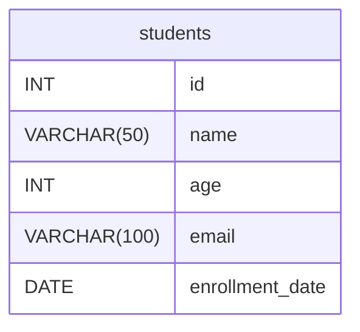

## 介绍

在 SQL 中，表是存储数据的基本结构。每个表由行和列组成，列定义了数据的类型和结构，而行则是实际存储的数据记录。创建表是数据库设计的第一步，也是最重要的一步。通过创建表，我们可以定义数据的存储方式，并为后续的数据操作（如插入、更新、删除）打下基础。

在本教程中，我们将学习如何使用 SQL 的 `CREATE TABLE` 语句来创建表，并逐步讲解表的结构定义、数据类型和约束条件。

---

## 创建表的基本语法

在 SQL 中，创建表的基本语法如下：

```sql
CREATE TABLE 表名 (
    列名1 数据类型 [约束条件],
    列名2 数据类型 [约束条件],
    ...
);
```

- **表名**：表的名称，必须是唯一的。
- **列名**：表中每一列的名称。
- **数据类型**：定义列中存储的数据类型，例如整数、字符串、日期等。
- **约束条件**：对列中数据的限制条件，例如主键、唯一性、非空等。

---

## 数据类型

在创建表时，必须为每一列指定数据类型。常见的数据类型包括：

- **整数类型**：`INT`、`SMALLINT`、`BIGINT`
- **浮点数类型**：`FLOAT`、`DOUBLE`、`DECIMAL`
- **字符串类型**：`VARCHAR(n)`、`CHAR(n)`、`TEXT`
- **日期和时间类型**：`DATE`、`TIME`、`DATETIME`
- **布尔类型**：`BOOLEAN`

:::tip
选择合适的数据类型非常重要，因为它会影响数据的存储效率和查询性能。
:::

---

## 约束条件

约束条件用于限制列中的数据，确保数据的完整性和一致性。常见的约束条件包括：

- **主键（PRIMARY KEY）**：唯一标识表中的每一行。
- **唯一性（UNIQUE）**：确保列中的值唯一。
- **非空（NOT NULL）**：确保列中不能有空值。
- **外键（FOREIGN KEY）**：建立表与表之间的关系。
- **默认值（DEFAULT）**：为列指定默认值。

---

## 实际案例

假设我们要创建一个存储学生信息的表，表名为 `students`，包含以下列：

- `id`：学生的唯一标识（整数类型，主键）。
- `name`：学生的姓名（字符串类型，最大长度 50，非空）。
- `age`：学生的年龄（整数类型）。
- `email`：学生的电子邮件（字符串类型，最大长度 100，唯一）。
- `enrollment_date`：学生的注册日期（日期类型）。

以下是创建该表的 SQL 语句：

```sql
CREATE TABLE students (
    id INT PRIMARY KEY,
    name VARCHAR(50) NOT NULL,
    age INT,
    email VARCHAR(100) UNIQUE,
    enrollment_date DATE
);
```

### 解释

1. `id INT PRIMARY KEY`：`id` 列是整数类型，并且是主键。
2. `name VARCHAR(50) NOT NULL`：`name` 列是字符串类型，最大长度为 50，且不能为空。
3. `age INT`：`age` 列是整数类型。
4. `email VARCHAR(100) UNIQUE`：`email` 列是字符串类型，最大长度为 100，且值必须唯一。
5. `enrollment_date DATE`：`enrollment_date` 列是日期类型。

---

## 表的关系图

为了更好地理解表的结构，我们可以使用 Mermaid 绘制表的关系图：



---

## 总结

通过本教程，我们学习了如何使用 SQL 的 `CREATE TABLE` 语句创建表，并了解了表的结构定义、数据类型和约束条件。创建表是数据库设计的基础，合理的设计可以提高数据的存储效率和查询性能。

---

## 附加资源与练习

### 练习

1. 创建一个存储商品信息的表 `products`，包含以下列：
   - `product_id`：商品编号（整数类型，主键）。
   - `product_name`：商品名称（字符串类型，最大长度 100，非空）。
   - `price`：商品价格（浮点数类型）。
   - `stock`：库存数量（整数类型，默认值为 0）。

2. 修改 `students` 表，添加一列 `gender`（字符串类型，最大长度 10）。

### 附加资源

- [SQL 数据类型文档](https://www.example.com/sql-data-types)
- [SQL 约束条件详解](https://www.example.com/sql-constraints)