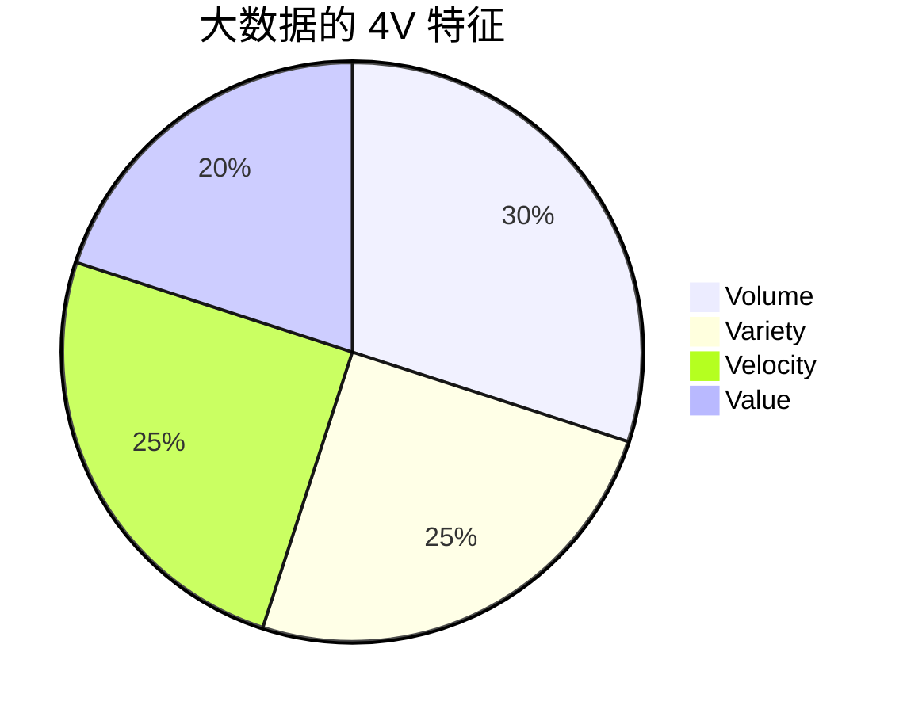

# 大数据概述

## 什么是大数据？

大数据（Big Data）是指无法通过传统数据处理工具在合理时间内捕获、管理和处理的数据集合。这些数据通常具有**体量大**、**类型多**、**速度快**和**价值密度低**的特点。随着互联网、物联网和智能设备的普及，数据量呈指数级增长，大数据技术应运而生。

:::note
大数据不仅仅是“数据量大”，它还涉及数据的多样性、速度和价值。
:::

## 大数据的 4V 特征

大数据通常用 **4V** 来描述其核心特征：

1. **Volume（体量）**：数据量巨大，通常以 TB、PB 甚至 EB 为单位。
2. **Variety（多样性）**：数据类型多样，包括结构化数据（如数据库）、半结构化数据（如 XML、JSON）和非结构化数据（如文本、图像、视频）。
3. **Velocity（速度）**：数据生成和处理的速度快，例如实时数据流。
4. **Value（价值）**：数据中蕴含的价值密度低，需要通过分析挖掘出有价值的信息。



## 大数据的技术栈

为了处理和分析大数据，业界开发了一系列技术和工具。以下是大数据技术栈的核心组成部分：

1. **数据存储**：如 Hadoop HDFS、Amazon S3。
2. **数据处理**：如 Apache Spark、Apache Flink。
3. **数据分析**：如 Apache Hive、Presto。
4. **数据可视化**：如 Tableau、Power BI。

:::tip
初学者可以从学习 Hadoop 和 Spark 开始，它们是处理大数据的核心工具。
:::

## 大数据的实际应用场景

大数据技术已经广泛应用于各个领域，以下是一些典型的应用场景：

1. **电商推荐系统**：通过分析用户行为数据，推荐个性化商品。
2. **金融风控**：通过分析交易数据，识别异常行为，防范欺诈。
3. **医疗健康**：通过分析患者数据，辅助疾病诊断和治疗。
4. **智慧城市**：通过分析交通、环境等数据，优化城市管理。

### 案例：电商推荐系统

假设我们有一个电商平台，用户的行为数据（如浏览、购买记录）被实时收集并存储。我们可以使用 Apache Spark 对这些数据进行分析，生成推荐结果。

```python
from pyspark.sql import SparkSession

# 初始化 Spark 会话
spark = SparkSession.builder.appName("EcommerceRecommendation").getOrCreate()

# 加载用户行为数据
data = spark.read.csv("user_behavior.csv", header=True, inferSchema=True)

# 分析用户行为并生成推荐
recommendations = data.groupBy("user_id").count().orderBy("count", ascending=False)

# 显示推荐结果
recommendations.show()
```

**输入示例**（`user_behavior.csv`）：

| user_id | product_id | action   | timestamp           |
|---------|------------|----------|---------------------|
| 1       | 101        | view     | 2023-10-01 12:00:00 |
| 1       | 101        | purchase | 2023-10-01 12:05:00 |
| 2       | 102        | view     | 2023-10-01 12:10:00 |

**输出示例**：

| user_id | count |
|---------|-------|
| 1       | 2     |
| 2       | 1     |

## 总结

大数据是当今数字时代的核心驱动力之一。通过理解大数据的 4V 特征、技术栈以及实际应用场景，您可以更好地掌握这一领域的基础知识。随着数据量的不断增长，大数据技术将在未来发挥更加重要的作用。

## 附加资源与练习

- **资源**：
  - [Apache Hadoop 官方文档](https://hadoop.apache.org/)
  - [Apache Spark 官方文档](https://spark.apache.org/)
- **练习**：
  1. 使用 Python 和 Pandas 分析一个小型数据集，尝试计算数据的统计特征。
  2. 在本地安装 Hadoop 或 Spark，并尝试运行一个简单的数据处理任务。

:::caution
在学习大数据技术时，建议从本地小规模数据集开始，逐步过渡到分布式环境。
:::