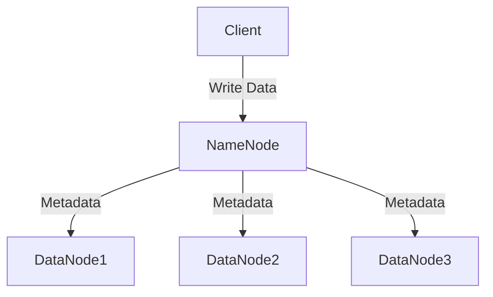
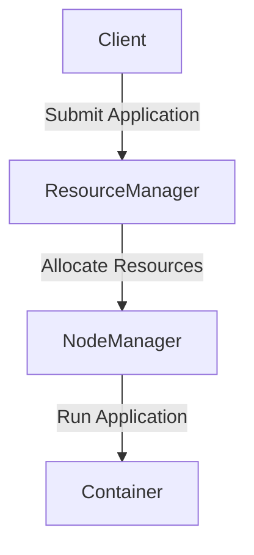

## 介绍

Hadoop是一个开源的分布式计算框架，专为处理大规模数据集而设计。它由Apache基金会开发，广泛应用于大数据处理与分析领域。Hadoop生态系统由多个组件组成，每个组件都有其特定的功能，共同协作以实现高效的数据存储、处理和分析。

## Hadoop的核心组件

### 1. Hadoop Distributed File System (HDFS)

HDFS是Hadoop的分布式文件系统，用于存储大规模数据集。它将数据分散存储在多个节点上，确保高容错性和高吞吐量。



### 2. MapReduce

MapReduce是Hadoop的编程模型，用于处理大规模数据集。它将任务分解为多个小任务，分布在集群中的多个节点上并行处理。

```java
// 示例：WordCount MapReduce程序
public class WordCount {
    public static class TokenizerMapper extends Mapper<Object, Text, Text, IntWritable> {
        private final static IntWritable one = new IntWritable(1);
        private Text word = new Text();

        public void map(Object key, Text value, Context context) throws IOException, InterruptedException {
            StringTokenizer itr = new StringTokenizer(value.toString());
            while (itr.hasMoreTokens()) {
                word.set(itr.nextToken());
                context.write(word, one);
            }
        }
    }

    public static class IntSumReducer extends Reducer<Text, IntWritable, Text, IntWritable> {
        private IntWritable result = new IntWritable();

        public void reduce(Text key, Iterable<IntWritable> values, Context context) throws IOException, InterruptedException {
            int sum = 0;
            for (IntWritable val : values) {
                sum += val.get();
            }
            result.set(sum);
            context.write(key, result);
        }
    }

    public static void main(String[] args) throws Exception {
        Configuration conf = new Configuration();
        Job job = Job.getInstance(conf, "word count");
        job.setJarByClass(WordCount.class);
        job.setMapperClass(TokenizerMapper.class);
        job.setCombinerClass(IntSumReducer.class);
        job.setReducerClass(IntSumReducer.class);
        job.setOutputKeyClass(Text.class);
        job.setOutputValueClass(IntWritable.class);
        FileInputFormat.addInputPath(job, new Path(args[0]));
        FileOutputFormat.setOutputPath(job, new Path(args[1]));
        System.exit(job.waitForCompletion(true) ? 0 : 1);
    }
}
```

### 3. YARN (Yet Another Resource Negotiator)

YARN是Hadoop的资源管理框架，负责集群资源的管理和任务调度。它允许多个应用程序共享集群资源，提高资源利用率。



### 4. Hive

Hive是一个数据仓库工具，用于查询和分析存储在HDFS中的大规模数据集。它提供了类似SQL的查询语言（HiveQL），使得非程序员也能轻松处理大数据。

```sql
-- 示例：HiveQL查询
SELECT department, COUNT(*) as employee_count
FROM employees
GROUP BY department;
```

### 5. Pig

Pig是一个高级数据流语言和执行框架，用于处理大规模数据集。它简化了MapReduce编程，使得复杂的数据处理任务更易于实现。

```pig
-- 示例：Pig脚本
data = LOAD 'input/data.txt' USING PigStorage(',') AS (name:chararray, age:int, city:chararray);
filtered_data = FILTER data BY age > 30;
grouped_data = GROUP filtered_data BY city;
result = FOREACH grouped_data GENERATE group, COUNT(filtered_data);
STORE result INTO 'output/result';
```

### 6. HBase

HBase是一个分布式、面向列的数据库，专为处理大规模数据集而设计。它提供了实时读写访问能力，适用于需要低延迟的应用场景。

```java
// 示例：HBase Java API
Configuration config = HBaseConfiguration.create();
Connection connection = ConnectionFactory.createConnection(config);
Table table = connection.getTable(TableName.valueOf("my_table"));
Put put = new Put(Bytes.toBytes("row1"));
put.addColumn(Bytes.toBytes("cf"), Bytes.toBytes("col1"), Bytes.toBytes("value1"));
table.put(put);
table.close();
connection.close();
```

## 实际应用场景

### 1. 日志分析

许多公司使用Hadoop生态系统来分析服务器日志，以监控系统性能、检测异常行为和改进用户体验。

### 2. 推荐系统

电商平台和流媒体服务使用Hadoop生态系统处理用户行为数据，生成个性化推荐。

### 3. 金融数据分析

金融机构使用Hadoop生态系统进行风险评估、欺诈检测和市场趋势分析。

## 总结

Hadoop生态系统为大数据处理与分析提供了强大的工具和框架。通过HDFS、MapReduce、YARN、Hive、Pig和HBase等组件，用户可以高效地存储、处理和分析大规模数据集。掌握这些工具将帮助你在数据科学和大数据领域取得成功。

## 附加资源与练习

- **资源**:
  - [Hadoop官方文档](https://hadoop.apache.org/docs/current/)
  - [Hive官方文档](https://cwiki.apache.org/confluence/display/Hive/Home)
  - [Pig官方文档](https://pig.apache.org/docs/r0.17.0/)
  - [HBase官方文档](https://hbase.apache.org/book.html)

- **练习**:
  1. 编写一个简单的MapReduce程序，计算输入文件中每个单词的出现次数。
  2. 使用HiveQL查询一个包含员工信息的表，找出每个部门的平均工资。
  3. 使用Pig脚本处理一个包含用户行为数据的文件，找出最活跃的用户。
