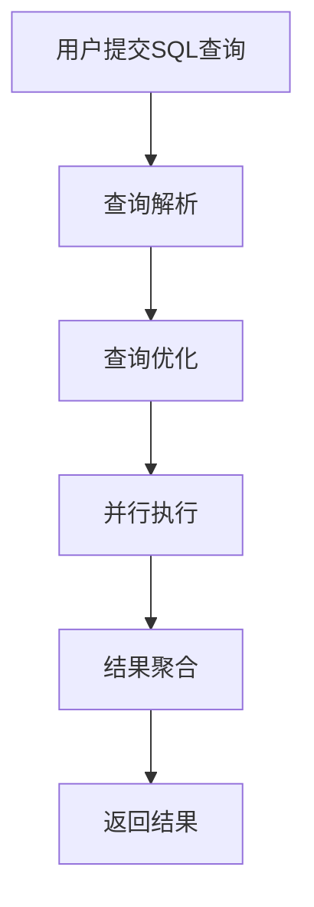

# 大数据查询引擎

## 介绍

在大数据时代，数据量呈指数级增长，如何高效地查询和分析这些数据成为了一个重要问题。**大数据查询引擎**应运而生，它是一种专门用于处理大规模数据集的工具，能够快速执行复杂的查询操作。无论是结构化数据（如关系型数据库）还是非结构化数据（如日志文件），大数据查询引擎都能提供高效的查询能力。

## 什么是大数据查询引擎？

大数据查询引擎是一种软件系统，旨在从大规模数据集中提取有价值的信息。它通过优化查询执行计划、并行处理和分布式计算等技术，显著提高了查询效率。常见的大数据查询引擎包括 **Apache Hive**、**Apache Spark SQL**、**Presto** 和 **Apache Drill** 等。

:::note
大数据查询引擎通常与分布式存储系统（如 Hadoop HDFS 或 Amazon S3）结合使用，以处理存储在多个节点上的数据。
:::

## 大数据查询引擎的工作原理

大数据查询引擎的核心在于其查询优化和执行机制。以下是其工作原理的简要概述：

1. **查询解析**：引擎首先解析用户提交的 SQL 查询，生成抽象语法树（AST）。
2. **查询优化**：引擎根据数据分布和查询条件，生成最优的执行计划。
3. **并行执行**：查询被分解为多个任务，分配到集群中的多个节点上并行执行。
4. **结果聚合**：各节点的结果被汇总并返回给用户。



## 实际案例：使用 Apache Spark SQL 查询数据

以下是一个使用 Apache Spark SQL 查询数据的简单示例。假设我们有一个存储在 CSV 文件中的数据集，包含用户的姓名、年龄和城市信息。

### 输入数据（CSV 文件）
```csv
name,age,city
Alice,23,New York
Bob,30,San Francisco
Charlie,25,Los Angeles
```

### 代码示例
```python
from pyspark.sql import SparkSession

# 创建 SparkSession
spark = SparkSession.builder.appName("BigDataQueryExample").getOrCreate()

# 读取 CSV 文件
df = spark.read.csv("user_data.csv", header=True, inferSchema=True)

# 注册为临时表
df.createOrReplaceTempView("users")

# 执行 SQL 查询
result = spark.sql("SELECT name, age FROM users WHERE age > 25")

# 显示结果
result.show()
```

### 输出结果
```
+-----+---+
| name|age|
+-----+---+
|  Bob| 30|
+-----+---+
```

:::tip
在实际应用中，Spark SQL 可以处理 TB 甚至 PB 级别的数据，并且支持多种数据源（如 HDFS、S3、Hive 等）。
:::

## 大数据查询引擎的应用场景

大数据查询引擎广泛应用于以下场景：

1. **数据分析**：企业使用查询引擎分析用户行为、销售数据等，以支持决策。
2. **日志处理**：从海量日志数据中提取关键信息，用于监控和故障排查。
3. **实时查询**：在实时数据流中执行查询，例如金融交易监控。
4. **数据仓库**：构建数据仓库，支持复杂的 OLAP（在线分析处理）查询。

## 总结

大数据查询引擎是现代数据基础设施的重要组成部分，它通过高效的查询优化和分布式计算能力，使得处理大规模数据集成为可能。无论是数据分析师、数据工程师还是开发人员，掌握大数据查询引擎的使用都是一项宝贵的技能。

## 附加资源与练习

- **资源**：
  - [Apache Spark 官方文档](https://spark.apache.org/docs/latest/sql-programming-guide.html)
  - [Presto 官方文档](https://prestodb.io/docs/current/)
  - [Apache Hive 官方文档](https://cwiki.apache.org/confluence/display/Hive/Home)

- **练习**：
  1. 使用 Apache Spark SQL 查询一个包含 100 万条记录的数据集，并计算每个城市的平均年龄。
  2. 尝试将查询结果保存到 Parquet 文件中，并比较其与 CSV 文件的存储效率。

:::caution
在实际操作中，请确保集群资源充足，以避免因内存不足导致的查询失败。
:::