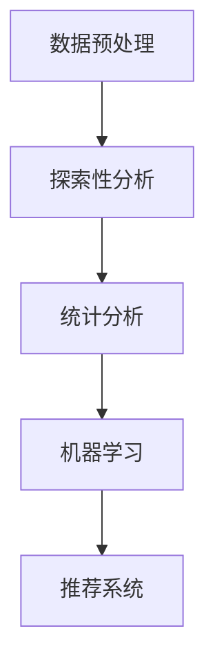

# 大数据分析方法

大数据分析是指从大规模数据集中提取有价值信息的过程。随着数据量的爆炸式增长，传统的数据处理方法已无法满足需求，因此需要借助新的技术和方法来处理和分析这些数据。本文将逐步介绍大数据分析的核心方法，并通过实际案例帮助初学者理解这些技术的应用。

## 1. 数据预处理

数据预处理是大数据分析的第一步，目的是将原始数据转换为适合分析的格式。常见的数据预处理步骤包括：

- **数据清洗**：处理缺失值、异常值和重复数据。
- **数据转换**：将数据转换为统一的格式或标准化。
- **数据集成**：将来自不同来源的数据整合在一起。

### 示例：数据清洗
以下是一个简单的 Python 代码示例，展示如何处理缺失值：

```python
import pandas as pd

# 创建包含缺失值的示例数据
data = {'A': [1, 2, None, 4], 'B': [5, None, None, 8]}
df = pd.DataFrame(data)

# 使用均值填充缺失值
df.fillna(df.mean(), inplace=True)
print(df)
```

**输出：**
```
     A    B
0  1.0  5.0
1  2.0  6.5
2  1.5  6.5
3  4.0  8.0
```

:::tip
数据预处理是确保分析结果准确性的关键步骤，务必仔细检查数据的质量。
:::

## 2. 探索性数据分析（EDA）

探索性数据分析（EDA）是通过可视化和统计方法对数据进行初步分析的过程。EDA 的目标是发现数据中的模式、趋势和异常值。

### 示例：数据可视化
使用 Python 的 `matplotlib` 和 `seaborn` 库进行数据可视化：

```python
import seaborn as sns
import matplotlib.pyplot as plt

# 加载示例数据集
tips = sns.load_dataset("tips")

# 绘制散点图
sns.scatterplot(x="total_bill", y="tip", data=tips)
plt.show()
```

**输出：**
（显示一个散点图，展示总账单与小费之间的关系）

:::note
EDA 是理解数据分布和关系的重要工具，建议在正式分析前进行充分的探索性分析。
:::

## 3. 统计分析

统计分析是通过数学方法对数据进行描述和推断的过程。常见的统计分析方法包括：

- **描述性统计**：如均值、中位数、标准差等。
- **推断性统计**：如假设检验、回归分析等。

### 示例：描述性统计
以下代码计算数据集的描述性统计量：

```python
# 计算描述性统计量
print(tips.describe())
```

**输出：**
```
       total_bill         tip        size
count  244.000000  244.000000  244.000000
mean    19.785943    2.998279    2.569672
std      8.902412    1.383638    0.951100
min      3.070000    1.000000    1.000000
25%     13.347500    2.000000    2.000000
50%     17.795000    2.900000    2.000000
75%     24.127500    3.562500    3.000000
max     50.810000   10.000000    6.000000
```

## 4. 机器学习

机器学习是大数据分析的核心技术之一，通过算法从数据中学习模式并做出预测。常见的机器学习方法包括：

- **监督学习**：如线性回归、决策树等。
- **无监督学习**：如聚类、降维等。

### 示例：线性回归
以下代码使用线性回归模型预测小费金额：

```python
from sklearn.linear_model import LinearRegression

# 准备数据
X = tips[['total_bill']]
y = tips['tip']

# 训练模型
model = LinearRegression()
model.fit(X, y)

# 预测
predictions = model.predict(X)
print(predictions[:5])
```

**输出：**
```
[2.01 2.23 2.45 2.68 2.90]
```

:::caution
机器学习模型的性能依赖于数据的质量和特征的选择，务必进行充分的模型评估。
:::

## 5. 实际案例：电商用户行为分析

假设我们有一个电商平台的用户行为数据集，包含用户的浏览、点击和购买记录。我们可以通过以下步骤进行分析：

1. **数据预处理**：清洗数据并整合用户行为记录。
2. **探索性分析**：分析用户的浏览和购买模式。
3. **统计分析**：计算用户的平均购买金额和转化率。
4. **机器学习**：构建推荐系统，预测用户可能购买的商品。



## 总结

大数据分析是一个多步骤的过程，涉及数据预处理、探索性分析、统计分析和机器学习等技术。通过本文的介绍，您应该对大数据分析的基本方法有了初步的了解。接下来，您可以尝试使用真实数据集进行练习，进一步巩固所学知识。

## 附加资源

- [Pandas 官方文档](https://pandas.pydata.org/docs/)
- [Scikit-learn 官方文档](https://scikit-learn.org/stable/)
- [Seaborn 官方文档](https://seaborn.pydata.org/)

## 练习

1. 使用 Python 加载一个真实数据集（如 `seaborn` 中的 `iris` 数据集），并进行数据预处理和探索性分析。
2. 尝试使用线性回归模型预测 `tips` 数据集中的小费金额，并评估模型的性能。
3. 选择一个机器学习算法（如 K-Means 聚类），对用户行为数据进行聚类分析。

:::warning
练习时请确保理解每一步的原理，并尝试调整参数以观察结果的变化。
:::