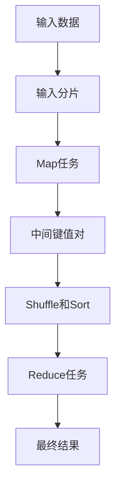

# MapReduce编程模型

MapReduce是一种用于处理大规模数据集的编程模型，最初由Google提出，并在Hadoop等开源框架中得到了广泛应用。它通过将任务分解为“Map”和“Reduce”两个阶段，简化了分布式计算的复杂性，使得开发者能够轻松处理海量数据。

## 什么是MapReduce？

MapReduce的核心思想是将数据处理任务分为两个主要阶段：**Map**和**Reduce**。

1. **Map阶段**：将输入数据分解为独立的键值对（key-value pairs），并对每个键值对进行处理。
2. **Reduce阶段**：将Map阶段输出的键值对进行汇总，生成最终结果。

这种分而治之的方法使得MapReduce能够高效地处理大规模数据集，尤其是在分布式环境中。

## MapReduce的工作原理

为了更好地理解MapReduce的工作原理，我们可以将其分为以下几个步骤：

1. **输入分片**：输入数据被分割成多个小块（分片），每个分片由一个Map任务处理。
2. **Map任务**：每个Map任务处理一个分片，生成一组中间键值对。
3. **Shuffle和Sort**：系统将Map任务输出的键值对按照键进行排序和分组，以便Reduce任务处理。
4. **Reduce任务**：每个Reduce任务处理一组具有相同键的中间键值对，生成最终结果。



## 代码示例

以下是一个简单的MapReduce示例，用于统计文本中每个单词的出现次数。

### Map函数
Map函数将输入的文本行分解为单词，并为每个单词生成一个键值对，其中键是单词，值是1。

```python
def map_function(line):
    words = line.split()
    for word in words:
        yield (word, 1)
```

### Reduce函数
Reduce函数将具有相同键的值进行累加，得到每个单词的总出现次数。

```python
def reduce_function(word, counts):
    yield (word, sum(counts))
```

### 输入和输出
假设输入文本如下：

```
hello world
hello mapreduce
world mapreduce
```

Map阶段的输出为：

```
("hello", 1)
("world", 1)
("hello", 1)
("mapreduce", 1)
("world", 1)
("mapreduce", 1)
```

Reduce阶段的输出为：

```
("hello", 2)
("world", 2)
("mapreduce", 2)
```

## 实际应用场景

MapReduce广泛应用于各种大数据处理任务，例如：

1. **日志分析**：分析服务器日志以统计访问量、错误率等。
2. **搜索引擎**：构建倒排索引以支持快速搜索。
3. **数据挖掘**：从海量数据中提取有用信息，如用户行为分析。

:::tip
在实际应用中，MapReduce通常与分布式文件系统（如HDFS）结合使用，以处理存储在多个节点上的数据。
:::

## 总结

MapReduce是一种强大的编程模型，能够高效处理大规模数据集。通过将任务分解为Map和Reduce两个阶段，开发者可以轻松实现分布式计算。本文介绍了MapReduce的基本概念、工作原理，并通过代码示例和实际应用场景帮助初学者理解其用途。

## 附加资源与练习

1. **练习**：尝试编写一个MapReduce程序，统计一段文本中每个字母的出现次数。
2. **资源**：
   - [Hadoop官方文档](https://hadoop.apache.org/docs/current/)
   - 《Hadoop权威指南》——Tom White

:::caution
在实际开发中，MapReduce的性能可能会受到数据倾斜（某些键的值过多）的影响，因此需要合理设计Map和Reduce函数。
:::