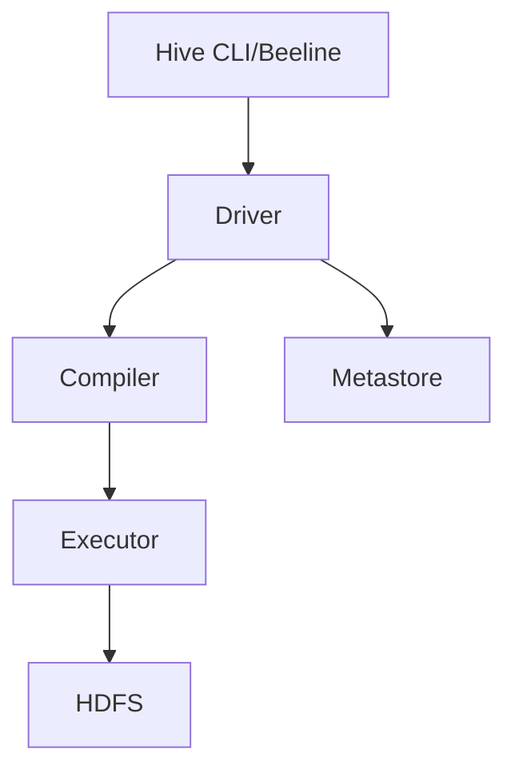

# Hive数据仓库

## 介绍

Hive是一个基于Hadoop的数据仓库工具，旨在简化大规模数据集的处理和分析。它允许用户使用类似SQL的查询语言（称为HiveQL）来查询和管理存储在Hadoop分布式文件系统（HDFS）中的数据。Hive特别适合处理结构化数据，并且能够将复杂的MapReduce任务转换为简单的SQL查询。

Hive的主要优势在于它能够将SQL查询转换为MapReduce任务，从而让熟悉SQL的用户能够轻松地处理大数据。Hive还支持自定义函数（UDF）、分区、分桶等高级功能，使其成为大数据处理与分析中的重要工具。

## Hive架构

Hive的架构主要由以下几个组件组成：

1. **Hive CLI/Beeline**：命令行界面，用于提交HiveQL查询。
2. **Metastore**：存储元数据（如表结构、分区信息等）的数据库。
3. **Driver**：负责将HiveQL查询转换为MapReduce任务。
4. **Compiler**：将HiveQL查询解析并优化为执行计划。
5. **Executor**：执行优化后的查询计划。
6. **HDFS**：存储实际数据的分布式文件系统。



## HiveQL基础

HiveQL是Hive的查询语言，它与SQL非常相似。以下是一些基本的HiveQL操作示例：

### 创建表

```sql
CREATE TABLE IF NOT EXISTS employees (
    id INT,
    name STRING,
    salary FLOAT,
    department STRING
)
ROW FORMAT DELIMITED
FIELDS TERMINATED BY ','
STORED AS TEXTFILE;
```

### 加载数据

```sql
LOAD DATA LOCAL INPATH '/path/to/employees.csv' INTO TABLE employees;
```

### 查询数据

```sql
SELECT * FROM employees WHERE department = 'Engineering';
```

### 输出示例

假设`employees.csv`文件内容如下：

```
1,John Doe,50000,Engineering
2,Jane Smith,60000,Marketing
3,Alice Johnson,55000,Engineering
```

执行上述查询后，输出将是：

```
1   John Doe    50000   Engineering
3   Alice Johnson   55000   Engineering
```

## 分区与分桶

### 分区

分区是一种将数据按特定列的值进行分组存储的技术。例如，我们可以按部门对员工表进行分区：

```sql
CREATE TABLE employees_partitioned (
    id INT,
    name STRING,
    salary FLOAT
)
PARTITIONED BY (department STRING)
ROW FORMAT DELIMITED
FIELDS TERMINATED BY ','
STORED AS TEXTFILE;
```

### 分桶

分桶是将数据进一步细分为更小的部分，通常用于提高查询性能。例如，我们可以按员工ID对表进行分桶：

```sql
CREATE TABLE employees_bucketed (
    id INT,
    name STRING,
    salary FLOAT,
    department STRING
)
CLUSTERED BY (id) INTO 4 BUCKETS
ROW FORMAT DELIMITED
FIELDS TERMINATED BY ','
STORED AS TEXTFILE;
```

## 实际案例

假设我们有一个大型电商网站，每天生成数百万条订单记录。我们可以使用Hive来存储和分析这些数据。以下是一个简单的案例：

1. **创建订单表**：

```sql
CREATE TABLE orders (
    order_id INT,
    customer_id INT,
    order_date STRING,
    total_amount FLOAT
)
ROW FORMAT DELIMITED
FIELDS TERMINATED BY ','
STORED AS TEXTFILE;
```

2. **加载订单数据**：

```sql
LOAD DATA LOCAL INPATH '/path/to/orders.csv' INTO TABLE orders;
```

3. **查询每日销售额**：

```sql
SELECT order_date, SUM(total_amount) AS daily_sales
FROM orders
GROUP BY order_date;
```

4. **输出示例**：

假设`orders.csv`文件内容如下：

```
1,101,2023-10-01,150.50
2,102,2023-10-01,200.00
3,103,2023-10-02,300.00
```

执行上述查询后，输出将是：

```
2023-10-01  350.50
2023-10-02  300.00
```

## 总结

Hive是一个强大的数据仓库工具，特别适合处理大规模结构化数据。通过HiveQL，用户可以轻松地查询和管理存储在HDFS中的数据。Hive还支持分区、分桶等高级功能，进一步提高了数据处理的效率。

## 附加资源与练习

- **官方文档**：[Apache Hive官方文档](https://hive.apache.org/)
- **练习**：尝试创建一个包含分区和分桶的表，并加载数据后进行查询。
- **进阶学习**：学习如何使用Hive的自定义函数（UDF）来处理复杂的数据分析任务。

:::tip
建议初学者在学习Hive时，先从简单的SQL查询开始，逐步掌握分区、分桶等高级功能。
:::