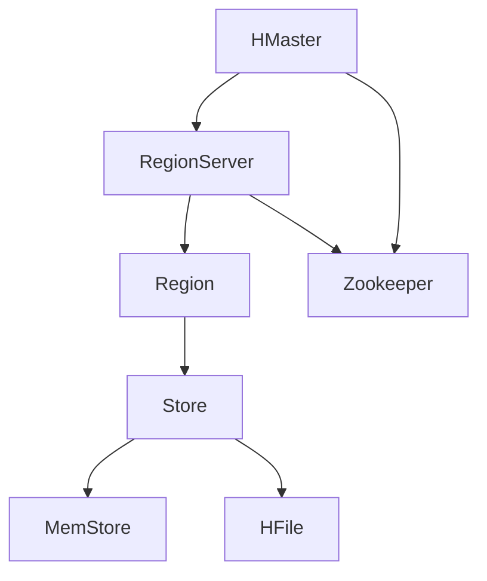

# HBase列族数据库

## 介绍

HBase是一个开源的、分布式的、面向列的数据库，它是基于Google的Bigtable论文设计的。HBase是Hadoop生态系统的一部分，专门用于处理大规模数据集。与传统的行存储数据库不同，HBase采用列族存储模型，这使得它在处理稀疏数据时非常高效。

HBase的主要特点包括：

- **分布式架构**：HBase可以在多台机器上运行，支持水平扩展。
- **高可用性**：通过HDFS（Hadoop分布式文件系统）提供数据冗余和故障恢复。
- **强一致性**：HBase保证数据的强一致性，确保读写操作的原子性。
- **灵活的数据模型**：HBase支持动态列族和列，允许在运行时添加新的列。

## HBase的基本概念

### 表（Table）

HBase中的数据存储在表中，表由行和列组成。每一行都有一个唯一的行键（Row Key），用于标识该行。

### 列族（Column Family）

列族是HBase中的一个重要概念。列族是列的集合，表中的每一列都属于某个列族。列族在表创建时定义，并且不能动态修改。列族的设计对HBase的性能有重要影响。

### 单元格（Cell）

单元格是HBase中存储数据的最小单位，由行键、列族、列限定符（Column Qualifier）和时间戳（Timestamp）唯一标识。

### 时间戳（Timestamp）

HBase中的每个单元格都有一个时间戳，用于标识数据的版本。HBase支持多版本数据存储，可以通过时间戳访问不同版本的数据。

## HBase的架构

HBase的架构包括以下几个主要组件：

- **HMaster**：负责管理表的元数据和区域（Region）的分配。
- **RegionServer**：负责存储和管理实际的数据。
- **Zookeeper**：用于协调HBase集群中的各个节点。



## HBase的实际应用

### 场景：日志存储与分析

假设我们有一个大型网站，每天产生大量的访问日志。我们需要将这些日志存储起来，并能够快速查询某个用户在某段时间内的访问记录。

#### 表设计

我们可以设计一个名为 `user_logs` 的表，其中包含一个列族 `cf`，用于存储日志数据。

```bash
create 'user_logs', 'cf'
```

#### 插入数据

我们可以使用HBase的Java API插入数据：

```java
import org.apache.hadoop.hbase.client.Connection;
import org.apache.hadoop.hbase.client.ConnectionFactory;
import org.apache.hadoop.hbase.client.Put;
import org.apache.hadoop.hbase.client.Table;
import org.apache.hadoop.hbase.util.Bytes;

public class HBaseExample {
    public static void main(String[] args) throws Exception {
        Connection connection = ConnectionFactory.createConnection();
        Table table = connection.getTable(TableName.valueOf("user_logs"));

        Put put = new Put(Bytes.toBytes("user1"));
        put.addColumn(Bytes.toBytes("cf"), Bytes.toBytes("timestamp"), Bytes.toBytes("2023-10-01T12:00:00Z"));
        put.addColumn(Bytes.toBytes("cf"), Bytes.toBytes("action"), Bytes.toBytes("login"));

        table.put(put);
        table.close();
        connection.close();
    }
}
```

#### 查询数据

我们可以使用HBase的Java API查询数据：

```java
import org.apache.hadoop.hbase.client.Connection;
import org.apache.hadoop.hbase.client.ConnectionFactory;
import org.apache.hadoop.hbase.client.Get;
import org.apache.hadoop.hbase.client.Result;
import org.apache.hadoop.hbase.client.Table;
import org.apache.hadoop.hbase.util.Bytes;

public class HBaseExample {
    public static void main(String[] args) throws Exception {
        Connection connection = ConnectionFactory.createConnection();
        Table table = connection.getTable(TableName.valueOf("user_logs"));

        Get get = new Get(Bytes.toBytes("user1"));
        Result result = table.get(get);

        byte[] timestamp = result.getValue(Bytes.toBytes("cf"), Bytes.toBytes("timestamp"));
        byte[] action = result.getValue(Bytes.toBytes("cf"), Bytes.toBytes("action"));

        System.out.println("Timestamp: " + Bytes.toString(timestamp));
        System.out.println("Action: " + Bytes.toString(action));

        table.close();
        connection.close();
    }
}
```

## 总结

HBase是一个强大的分布式列族数据库，特别适合处理大规模稀疏数据。通过本文，我们了解了HBase的基本概念、架构以及如何在实际场景中使用HBase存储和查询数据。

## 附加资源

- [HBase官方文档](https://hbase.apache.org/)
- [HBase in Action](https://www.manning.com/books/hbase-in-action) - 一本深入讲解HBase的书籍。
- [HBase Tutorial](https://www.tutorialspoint.com/hbase/index.htm) - 一个适合初学者的HBase教程。

## 练习

1. 创建一个HBase表，并插入一些数据。
2. 编写一个Java程序，查询并打印出表中的数据。
3. 尝试在HBase中存储多版本数据，并通过时间戳查询不同版本的数据。

:::tip
在练习过程中，如果遇到问题，可以参考HBase的官方文档或社区论坛获取帮助。
:::