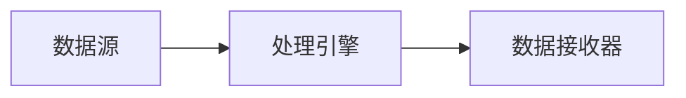

# 流数据处理框架

## 介绍

流数据处理框架是一种用于实时处理连续数据流的工具或系统。与传统的批处理不同，流数据处理框架能够在数据生成的同时进行处理，从而实现低延迟的实时分析和响应。这种框架在现代大数据应用中非常重要，尤其是在需要实时监控、实时推荐系统或实时欺诈检测等场景中。

流数据处理框架的核心思想是**“数据流”**，即数据以连续的方式生成和处理，而不是一次性加载和处理。常见的流数据处理框架包括 Apache Kafka Streams、Apache Flink、Apache Storm 和 Apache Spark Streaming。

## 流数据处理的基本概念

### 1. 数据流（Data Stream）
数据流是指连续生成的数据序列。这些数据通常以事件的形式出现，例如用户点击、传感器数据或交易记录。数据流的特点是**无界性**，即数据会源源不断地生成，没有明确的结束点。

### 2. 窗口（Window）
由于数据流是无界的，流处理框架通常使用**窗口**来对数据进行分段处理。窗口可以是时间窗口（例如每5分钟的数据）或计数窗口（例如每1000条数据）。窗口操作允许我们对数据流进行聚合、统计或其他计算。

### 3. 状态管理（State Management）
流处理框架需要维护处理过程中的状态信息。例如，计算某个时间段内的平均值时，需要保存当前的总和和计数。状态管理是流处理框架的核心功能之一。

### 4. 容错性（Fault Tolerance）
由于流数据处理是实时进行的，系统需要具备容错能力，以确保在发生故障时不会丢失数据或计算结果。常见的容错机制包括检查点（Checkpointing）和重放（Replay）。

## 流数据处理框架的工作原理

流数据处理框架通常由以下几个组件组成：

1. **数据源（Source）**：数据流的起点，例如 Kafka 主题、传感器或日志文件。
2. **处理引擎（Processing Engine）**：负责对数据流进行实时处理，例如过滤、聚合或转换。
3. **数据接收器（Sink）**：处理结果的输出目标，例如数据库、消息队列或仪表盘。

以下是一个简单的流数据处理流程示例：



## 代码示例：使用 Apache Flink 进行简单的流数据处理

以下是一个使用 Apache Flink 处理数据流的简单示例。假设我们有一个数据流，其中包含用户的点击事件，我们希望统计每分钟的点击次数。

```java
import org.apache.flink.streaming.api.environment.StreamExecutionEnvironment;
import org.apache.flink.streaming.api.datastream.DataStream;
import org.apache.flink.streaming.api.windowing.time.Time;

public class ClickCounter {
    public static void main(String[] args) throws Exception {
        // 创建流处理环境
        StreamExecutionEnvironment env = StreamExecutionEnvironment.getExecutionEnvironment();

        // 模拟数据流（用户点击事件）
        DataStream<String> clicks = env.socketTextStream("localhost", 9999);

        // 处理数据流：统计每分钟的点击次数
        clicks
            .map(click -> 1) // 将每条点击事件映射为1
            .timeWindowAll(Time.minutes(1)) // 定义1分钟的时间窗口
            .sum(0) // 对窗口内的数据进行求和
            .print(); // 输出结果

        // 启动流处理任务
        env.execute("Click Counter");
    }
}
```

### 输入示例
假设数据流中的点击事件如下：
```
user1
user2
user1
user3
```

### 输出示例
程序将输出每分钟的点击次数：
```
4
```

## 实际应用场景

### 1. 实时监控
流数据处理框架可以用于实时监控系统状态。例如，监控服务器的 CPU 使用率或网络流量，并在异常时触发警报。

### 2. 实时推荐系统
在电商或视频平台中，流数据处理框架可以实时分析用户行为，并根据用户的实时兴趣推荐商品或内容。

### 3. 实时欺诈检测
在金融领域，流数据处理框架可以实时分析交易数据，检测异常交易行为，从而防止欺诈。

## 总结

流数据处理框架是现代大数据生态系统中的重要组成部分，能够帮助我们实时处理和分析连续生成的数据流。通过本文，我们了解了流数据处理的基本概念、工作原理以及实际应用场景。我们还通过一个简单的 Apache Flink 示例展示了如何实现流数据处理。

:::tip 提示
如果你想深入学习流数据处理框架，可以尝试以下练习：
1. 使用 Apache Kafka 和 Apache Flink 构建一个实时日志分析系统。
2. 尝试使用不同的窗口类型（例如滑动窗口或会话窗口）来处理数据流。
:::

## 附加资源
- [Apache Flink 官方文档](https://flink.apache.org/)
- [Apache Kafka Streams 官方文档](https://kafka.apache.org/documentation/streams/)
- [流数据处理入门指南](https://www.oreilly.com/library/view/streaming-systems/9781491983867/)