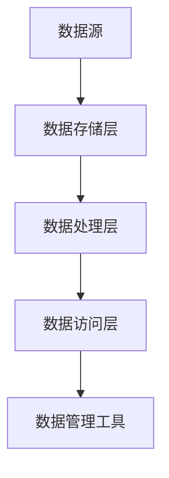

# 数据湖概念

## 介绍

数据湖（Data Lake）是一种用于存储大量结构化、半结构化和非结构化数据的存储系统。与传统的数据库或数据仓库不同，数据湖允许以原始格式存储数据，而不需要预先定义数据结构或模式。这种灵活性使得数据湖成为大数据处理与分析中的重要工具。

数据湖的核心思想是“存储一切，分析一切”。它能够存储来自多种来源的数据，如日志文件、传感器数据、社交媒体数据等，并在需要时对这些数据进行分析和处理。

## 数据湖的架构

数据湖的架构通常包括以下几个关键组件：

1. **数据存储层**：这是数据湖的核心部分，用于存储原始数据。常用的存储技术包括 Hadoop 分布式文件系统（HDFS）、Amazon S3、Azure Data Lake Storage 等。

2. **数据处理层**：这一层负责对存储的数据进行处理和分析。常用的工具包括 Apache Spark、Apache Hive、Presto 等。

3. **数据访问层**：这一层提供对数据的访问接口，支持多种查询语言和工具，如 SQL、Python、R 等。

4. **数据管理工具**：这些工具用于管理数据的元数据、数据质量、数据安全等。



## 数据湖的优势

1. **灵活性**：数据湖允许以原始格式存储数据，不需要预先定义数据结构或模式。

2. **可扩展性**：数据湖可以轻松扩展到 PB 甚至 EB 级别的数据量。

3. **成本效益**：与传统的数据库或数据仓库相比，数据湖的存储成本更低。

4. **支持多种数据类型**：数据湖可以存储结构化、半结构化和非结构化数据。

## 实际案例

### 案例 1：社交媒体数据分析

假设我们有一个社交媒体平台，每天产生大量的用户行为数据（如点赞、评论、分享等）。这些数据可以存储在数据湖中，供后续分析使用。

```python
# 示例：将社交媒体数据存储到数据湖中
import pandas as pd

# 模拟社交媒体数据
data = {
    'user_id': [1, 2, 3],
    'action': ['like', 'comment', 'share'],
    'timestamp': ['2023-10-01 12:00', '2023-10-01 12:05', '2023-10-01 12:10']
}

df = pd.DataFrame(data)

# 将数据存储到数据湖中
df.to_parquet('s3://my-data-lake/social-media-data/2023-10-01.parquet')
```

### 案例 2：物联网传感器数据分析

假设我们有一个物联网系统，每天产生大量的传感器数据（如温度、湿度、压力等）。这些数据可以存储在数据湖中，供后续分析使用。

```python
# 示例：将传感器数据存储到数据湖中
import pandas as pd

# 模拟传感器数据
data = {
    'sensor_id': [101, 102, 103],
    'temperature': [25.5, 26.0, 24.8],
    'humidity': [60, 62, 58],
    'timestamp': ['2023-10-01 12:00', '2023-10-01 12:05', '2023-10-01 12:10']
}

df = pd.DataFrame(data)

# 将数据存储到数据湖中
df.to_parquet('s3://my-data-lake/sensor-data/2023-10-01.parquet')
```

## 总结

数据湖是一种灵活、可扩展且成本效益高的数据存储解决方案，适用于处理和分析大量结构化、半结构化和非结构化数据。通过数据湖，企业可以更好地利用其数据资产，进行深入的分析和洞察。

## 附加资源

- [Apache Hadoop 官方文档](https://hadoop.apache.org/docs/current/)
- [Amazon S3 官方文档](https://docs.aws.amazon.com/s3/)
- [Apache Spark 官方文档](https://spark.apache.org/docs/latest/)

## 练习

1. 尝试使用 Python 和 Pandas 将一些模拟数据存储到本地文件系统中，模拟数据湖的存储过程。
2. 使用 Apache Spark 读取存储在数据湖中的数据，并进行简单的分析（如计算平均值、最大值等）。