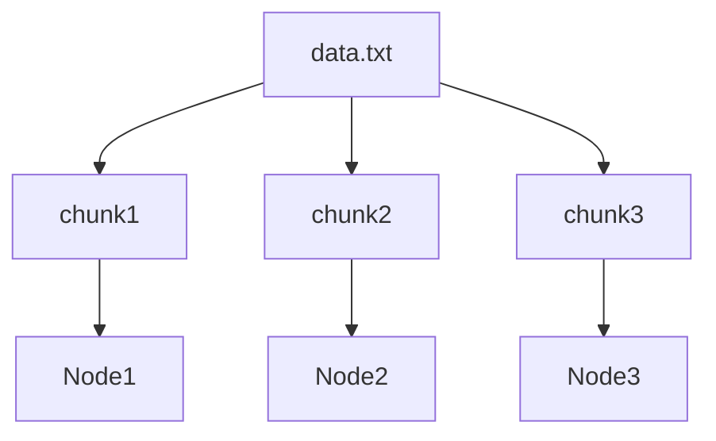
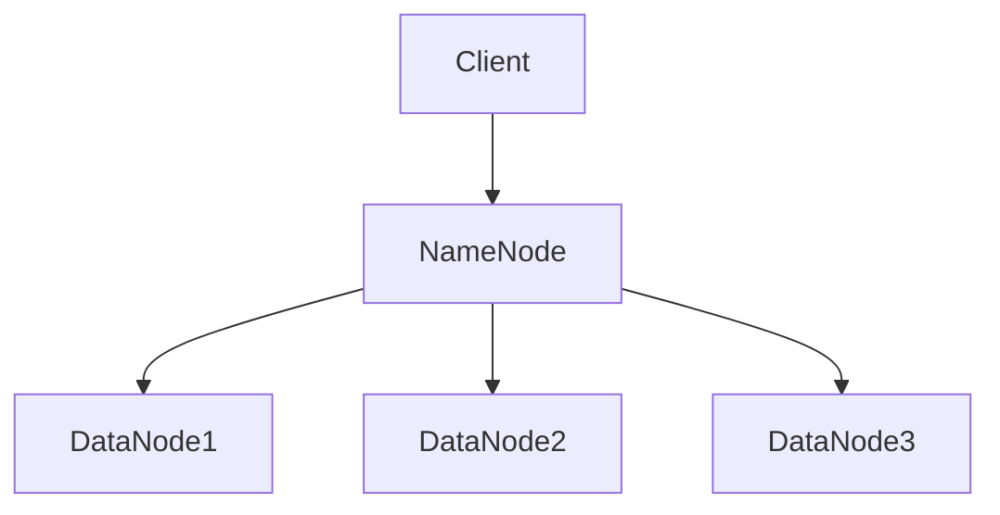

# 分布式文件系统

## 介绍

分布式文件系统（Distributed File System, DFS）是一种允许跨多台计算机存储和访问文件的系统。与传统的本地文件系统不同，分布式文件系统将文件分散存储在多个节点上，并通过网络进行访问。这种设计使得系统能够处理大规模数据，并提供高可用性和容错能力。

:::note
分布式文件系统是大数据处理的基础设施之一，广泛应用于云计算、大数据分析和分布式存储等领域。
:::

## 分布式文件系统的工作原理

分布式文件系统的核心思想是将文件分割成多个块（chunks），并将这些块分散存储在不同的节点上。每个块通常会有多个副本，以提高数据的可靠性和可用性。系统通过元数据服务器（Metadata Server）来管理文件的存储位置和访问权限。

### 文件分块与存储

假设我们有一个大文件 `data.txt`，分布式文件系统会将其分割成多个块，例如 `chunk1`, `chunk2`, `chunk3`，并将这些块存储在不同的节点上。



### 元数据管理

元数据服务器负责记录每个文件的块存储位置、副本数量以及访问权限等信息。当客户端请求访问某个文件时，元数据服务器会返回该文件的块位置信息，客户端可以直接从相应的节点读取数据。

## 实际案例：HDFS

Hadoop 分布式文件系统（HDFS）是最著名的分布式文件系统之一，广泛应用于大数据处理。HDFS 的设计目标是存储超大文件，并提供高吞吐量的数据访问。

### HDFS 架构

HDFS 采用主从架构，包括以下组件：

- **NameNode**：负责管理文件系统的元数据。
- **DataNode**：负责存储实际的数据块。



### HDFS 文件写入示例

以下是一个简单的 HDFS 文件写入示例：

```python
from hdfs import InsecureClient

# 连接到 HDFS
client = InsecureClient('http://namenode:50070', user='hadoop')

# 写入文件
with client.write('/user/hadoop/data.txt', overwrite=True) as writer:
    writer.write('Hello, HDFS!')
```

### HDFS 文件读取示例

以下是一个简单的 HDFS 文件读取示例：

```python
from hdfs import InsecureClient

# 连接到 HDFS
client = InsecureClient('http://namenode:50070', user='hadoop')

# 读取文件
with client.read('/user/hadoop/data.txt') as reader:
    content = reader.read()
    print(content)
```

:::tip
在实际应用中，HDFS 通常与 MapReduce 或 Spark 等计算框架结合使用，以实现大规模数据处理。
:::

## 总结

分布式文件系统是大数据处理的核心组件之一，它通过将文件分散存储在多个节点上，提供了高可用性、容错性和可扩展性。HDFS 是最著名的分布式文件系统之一，广泛应用于大数据处理领域。

## 附加资源与练习

- **资源**：
  - [HDFS 官方文档](https://hadoop.apache.org/docs/stable/hadoop-project-dist/hadoop-hdfs/HdfsDesign.html)
  - [分布式系统原理与范型](https://www.amazon.com/Distributed-Systems-Principles-Paradigms-2nd/dp/0132392275)

- **练习**：
  1. 尝试在本地搭建一个 HDFS 集群，并上传、下载文件。
  2. 使用 Python 编写一个脚本，将本地文件上传到 HDFS，并读取其内容。

:::caution
在搭建 HDFS 集群时，请确保配置正确，并注意数据备份和安全性。
:::