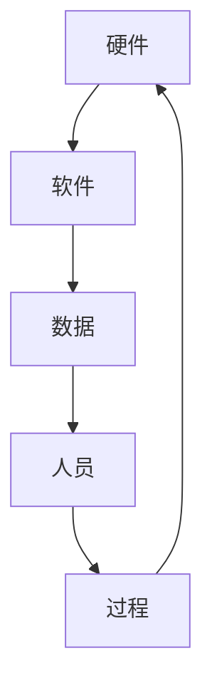
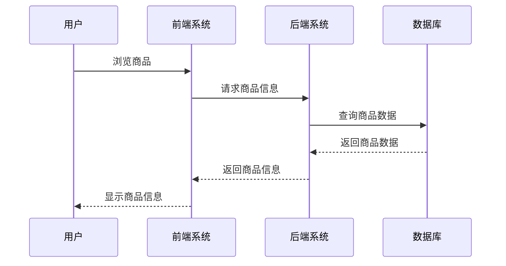
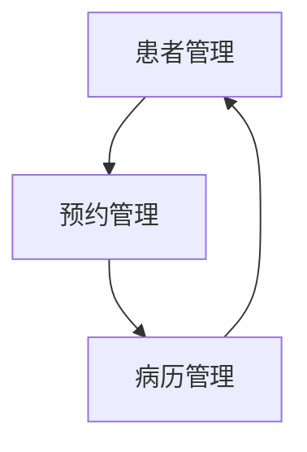

# 信息系统概述

## 什么是信息系统？

信息系统（Information System，简称 IS）是指收集、处理、存储和分发信息的系统。它由硬件、软件、数据、人员和过程组成，旨在支持组织的决策制定、运营管理和战略规划。信息系统不仅仅是技术工具，它还涉及人与技术的交互，以及如何利用技术来解决问题和创造价值。

:::note
信息系统不仅仅是计算机系统，它还包括数据、人员、流程和技术之间的相互作用。
:::

## 信息系统的组成部分

一个典型的信息系统通常由以下几个部分组成：

1. **硬件**：包括计算机、服务器、网络设备等物理设备。
2. **软件**：包括操作系统、应用程序、数据库管理系统等。
3. **数据**：信息系统处理的核心内容，可以是结构化数据（如数据库中的表格）或非结构化数据（如文档、图片）。
4. **人员**：包括系统管理员、开发人员、用户等。
5. **过程**：指信息系统的操作流程和管理规范。

## 信息系统的类型

根据功能和用途，信息系统可以分为以下几类：

1. **事务处理系统（TPS）**：用于处理日常事务，如订单处理、库存管理等。
2. **管理信息系统（MIS）**：为中层管理人员提供决策支持，通常基于事务处理系统的数据。
3. **决策支持系统（DSS）**：帮助高层管理人员进行战略决策，通常包含复杂的分析工具。
4. **专家系统（ES）**：模拟人类专家的决策过程，用于解决特定领域的问题。
5. **办公自动化系统（OAS）**：提高办公效率，如文档管理、电子邮件系统等。

:::tip
不同类型的信息系统适用于不同的组织层级和业务需求。选择合适的信息系统可以提高组织的效率和竞争力。
:::

## 信息系统的实际应用

### 案例 1：电子商务平台

电子商务平台是一个典型的信息系统应用场景。它通过以下方式支持在线购物：

1. **前端系统**：用户界面，允许用户浏览商品、下订单。
2. **后端系统**：处理订单、管理库存、处理支付。
3. **数据库**：存储商品信息、用户数据、订单记录。

### 案例 2：医院管理系统

医院管理系统帮助医院管理患者信息、预约、病历等。它通常包括以下模块：

1. **患者管理**：记录患者的基本信息和就诊记录。
2. **预约管理**：管理医生的预约时间。
3. **病历管理**：存储和检索患者的病历。

## 信息系统的开发过程

信息系统的开发通常遵循以下步骤：

1. **需求分析**：明确系统的功能和性能要求。
2. **系统设计**：设计系统的架构、数据库和用户界面。
3. **系统实现**：编写代码、配置硬件和软件。
4. **系统测试**：测试系统的功能和性能。
5. **系统部署**：将系统部署到生产环境。
6. **系统维护**：修复错误、更新功能。

:::caution
在系统开发过程中，需求分析是最关键的步骤。如果需求不明确，可能会导致系统无法满足用户的实际需求。
:::

## 总结

信息系统是现代组织不可或缺的一部分。它通过整合硬件、软件、数据、人员和过程，帮助组织提高效率、降低成本、增强竞争力。无论是电子商务平台还是医院管理系统，信息系统都在我们的日常生活中发挥着重要作用。

## 附加资源与练习

- **推荐阅读**：
  - 《管理信息系统》（Laudon & Laudon）
  - 《信息系统导论》（O'Brien & Marakas）
- **练习**：
  - 选择一个你熟悉的企业或组织，分析其信息系统的组成部分。
  - 设计一个简单的信息系统，描述其功能、组成部分和开发过程。

:::warning
学习信息系统需要理论与实践相结合。建议在学习过程中多动手实践，以加深理解。
:::