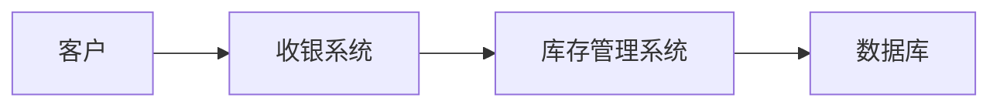

# 信息系统分类

信息系统（Information System, IS）是指通过收集、处理、存储和传播信息来支持组织决策和运营的系统。信息系统的分类有助于我们更好地理解其功能和应用场景。本文将详细介绍信息系统的常见分类，并通过实际案例帮助初学者掌握这一概念。

---

## 什么是信息系统？

信息系统是由硬件、软件、数据、人员和流程组成的集合，旨在支持组织的决策、协调和控制。它可以帮助组织更高效地管理资源、优化业务流程并提高决策质量。

信息系统的分类通常基于其功能、应用领域或技术架构。以下是几种常见的信息系统分类方式。

---

## 1. 按功能分类

按功能分类是最常见的信息系统分类方式之一。以下是几种主要的功能类型：

### 1.1 事务处理系统（Transaction Processing System, TPS）
事务处理系统用于处理日常事务，例如销售订单处理、库存管理和工资发放。它的主要特点是高效、可靠，能够处理大量事务。

**示例：**
- 超市的收银系统。
- 银行的ATM交易系统。

### 1.2 管理信息系统（Management Information System, MIS）
管理信息系统为中层管理者提供结构化报告，帮助他们监控和控制组织的运营。MIS通常基于TPS的数据生成汇总报告。

**示例：**
- 月度销售报告。
- 库存状态报告。

### 1.3 决策支持系统（Decision Support System, DSS）
决策支持系统帮助高层管理者进行非结构化或半结构化决策。它通过分析数据和模型提供决策建议。

**示例：**
- 市场趋势分析工具。
- 财务预测模型。

### 1.4 执行支持系统（Executive Support System, ESS）
执行支持系统为高层管理者提供战略层面的信息，帮助他们制定长期计划。

**示例：**
- 公司年度财务分析仪表盘。
- 行业竞争分析工具。

---

## 2. 按应用领域分类

信息系统还可以根据其应用领域进行分类。以下是几种常见的应用领域：

### 2.1 企业资源规划系统（Enterprise Resource Planning, ERP）
ERP系统集成了组织的所有核心业务流程，例如财务、人力资源、供应链管理等。

**示例：**
- SAP ERP。
- Oracle ERP。

### 2.2 客户关系管理系统（Customer Relationship Management, CRM）
CRM系统用于管理与客户相关的所有信息，帮助企业提高客户满意度和忠诚度。

**示例：**
- Salesforce。
- HubSpot。

### 2.3 供应链管理系统（Supply Chain Management, SCM）
SCM系统用于优化供应链的各个环节，包括采购、生产、物流等。

**示例：**
- 亚马逊的物流管理系统。
- 沃尔玛的库存管理系统。

---

## 3. 按技术架构分类

信息系统还可以根据其技术架构进行分类，例如：

### 3.1 集中式系统
集中式系统的所有数据和应用程序都存储在一个中央服务器上。

**示例：**
- 传统的主机-终端架构。

### 3.2 分布式系统
分布式系统的数据和应用程序分布在多个节点上，通过网络进行通信。

**示例：**
- 云计算平台（如AWS、Azure）。

---

## 实际案例

### 案例 1：超市的收银系统
超市的收银系统是一个典型的事务处理系统（TPS）。它实时处理客户的购买交易，并更新库存数据。通过收银系统，超市可以快速完成交易并确保库存数据的准确性。

### 案例 2：Salesforce CRM
Salesforce是一个客户关系管理系统（CRM），帮助企业存储和管理客户信息。通过Salesforce，企业可以跟踪客户互动、分析销售数据并制定营销策略。

---

## 总结

信息系统的分类有助于我们更好地理解其功能和应用场景。无论是按功能、应用领域还是技术架构分类，每种类型的信息系统都有其独特的价值和用途。掌握这些分类方式，可以帮助初学者更好地理解信息系统的设计和应用。

---

## 附加资源与练习

### 资源
- 《管理信息系统》（Laudon & Laudon）——经典教材，适合深入学习。
- [信息系统基础课程](https://www.coursera.org)——在线学习平台上的相关课程。

### 练习
1. 列举你日常生活中使用的信息系统，并尝试将其分类。
2. 设计一个简单的TPS系统流程图，描述其工作原理。

:::tip
如果你对某个分类有疑问，可以尝试通过实际案例来加深理解。例如，观察超市收银系统的工作流程，思考它属于哪种信息系统。
:::