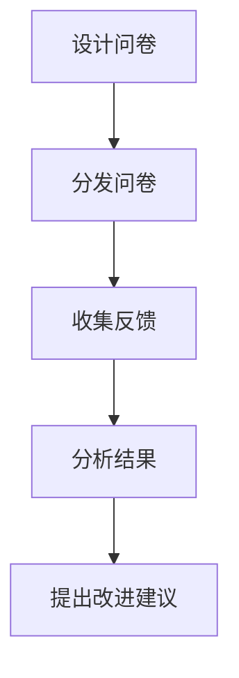

## 介绍

信息系统评估是指对信息系统的性能、效率、可靠性和成本效益等方面进行全面分析和评价的过程。通过评估，组织可以确定信息系统是否满足业务需求，是否存在改进空间，以及是否需要进一步投资或优化。对于初学者来说，理解信息系统评估的基本方法和工具是掌握信息系统管理的重要一步。

## 信息系统评估的重要性

信息系统评估的主要目的是确保信息系统能够有效地支持组织的业务目标。通过评估，可以发现系统中的潜在问题，优化资源配置，并提高系统的整体性能。以下是信息系统评估的几个关键目标：

1. **性能评估**：评估系统的响应时间、吞吐量和资源利用率。
2. **可靠性评估**：评估系统的稳定性和容错能力。
3. **成本效益分析**：评估系统的投资回报率（ROI）和总拥有成本（TCO）。
4. **用户满意度**：评估系统是否满足用户需求，用户体验如何。

## 信息系统评估方法

信息系统评估方法可以分为定量评估和定性评估两大类。以下是几种常用的评估方法：

### 1. 定量评估方法

定量评估方法主要通过数据和指标来衡量系统的性能。以下是几种常见的定量评估方法：

#### 1.1 性能测试

性能测试是通过模拟用户操作来评估系统的响应时间、吞吐量和资源利用率。常用的性能测试工具包括 `JMeter` 和 `LoadRunner`。

```bash
# 使用 JMeter 进行性能测试的示例命令
jmeter -n -t test_plan.jmx -l result.jtl
```

**输入**：`test_plan.jmx`（测试计划文件）<br />
**输出**：`result.jtl`（测试结果文件）

#### 1.2 成本效益分析

成本效益分析是通过比较系统的投资成本和预期收益来评估系统的经济性。常用的指标包括投资回报率（ROI）和总拥有成本（TCO）。

```python
# 计算投资回报率（ROI）的示例代码
def calculate_roi(investment, gain):
    return (gain - investment) / investment

investment = 100000  # 投资成本
gain = 150000  # 预期收益
roi = calculate_roi(investment, gain)
print(f"投资回报率（ROI）为: {roi:.2%}")
```

**输出**：`投资回报率（ROI）为: 50.00%`

### 2. 定性评估方法

定性评估方法主要通过专家意见、用户反馈和案例分析来评估系统的性能和效果。以下是几种常见的定性评估方法：

#### 2.1 专家评审

专家评审是通过邀请领域专家对系统进行评估，提出改进建议。专家评审通常包括技术评审、架构评审和安全评审等。

#### 2.2 用户调查

用户调查是通过问卷或访谈收集用户对系统的使用体验和满意度。常用的调查工具包括 `Google Forms` 和 `SurveyMonkey`。



## 实际案例

### 案例：电子商务网站的性能评估

假设我们有一个电子商务网站，需要评估其在高并发情况下的性能。我们可以使用 `JMeter` 进行性能测试，模拟多个用户同时访问网站。

```bash
# 使用 JMeter 进行并发测试的示例命令
jmeter -n -t ecommerce_test_plan.jmx -l ecommerce_result.jtl
```

**输入**：`ecommerce_test_plan.jmx`（测试计划文件）<br />
**输出**：`ecommerce_result.jtl`（测试结果文件）

通过分析测试结果，我们可以发现网站在高并发情况下的响应时间是否在可接受范围内，是否存在性能瓶颈。

## 总结

信息系统评估是确保信息系统能够有效支持业务目标的重要过程。通过定量和定性评估方法，我们可以全面了解系统的性能、可靠性和成本效益。对于初学者来说，掌握这些评估方法将有助于更好地管理和优化信息系统。

## 附加资源

- [JMeter 官方文档](https://jmeter.apache.org/usermanual/index.html)
- [Google Forms 使用指南](https://support.google.com/docs/answer/6281888?hl=zh-CN)
- [SurveyMonkey 使用指南](https://www.surveymonkey.com/mp/101/)

## 练习

1. 使用 `JMeter` 对一个简单的网站进行性能测试，并分析测试结果。
2. 设计一个用户调查问卷，收集用户对某个信息系统的使用体验和满意度。
3. 计算一个信息系统的投资回报率（ROI），假设投资成本为 50,000 元，预期收益为 80,000 元。
