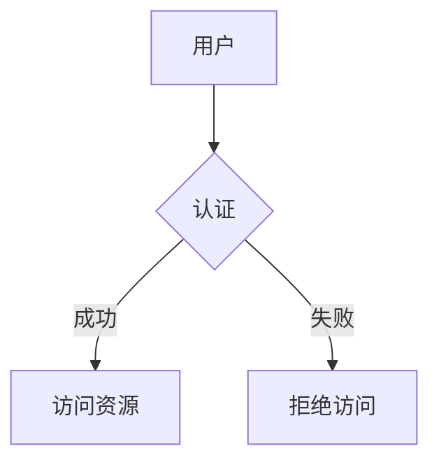

# 信息系统安全

## 介绍

信息系统安全是指保护信息系统免受未经授权的访问、使用、披露、破坏、修改或破坏的过程。随着信息技术的快速发展，信息系统安全变得越来越重要。无论是个人、企业还是政府机构，都需要确保其信息系统的安全性，以防止数据泄露、网络攻击和其他安全威胁。

## 信息系统安全的基本概念

### 1. 机密性（Confidentiality）

机密性确保信息只能被授权的人员访问。例如，银行账户信息只能由账户持有人和银行工作人员访问。

### 2. 完整性（Integrity）

完整性确保信息在存储和传输过程中不被篡改。例如，确保电子邮件在发送过程中没有被修改。

### 3. 可用性（Availability）

可用性确保授权用户可以在需要时访问信息和资源。例如，确保在线购物网站在高峰时段仍然能够正常运行。

## 信息系统安全的威胁

### 1. 恶意软件（Malware）

恶意软件包括病毒、蠕虫、特洛伊木马等，它们可以破坏系统、窃取数据或控制设备。

### 2. 网络攻击（Cyber Attacks）

网络攻击包括分布式拒绝服务（DDoS）攻击、钓鱼攻击等，旨在破坏系统或窃取信息。

### 3. 内部威胁（Internal Threats）

内部威胁可能来自员工、承包商或其他有权访问系统的人员，他们可能有意或无意地泄露敏感信息。

## 信息系统安全的防护措施

### 1. 防火墙（Firewall）

防火墙是一种网络安全系统，用于监控和控制传入和传出的网络流量，基于预定的安全规则。

```python
# 示例：简单的防火墙规则
def firewall_rule(packet):
    if packet['source_ip'] == '192.168.1.1':
        return "允许"
    else:
        return "拒绝"
```

### 2. 加密（Encryption）

加密是将信息转换为不可读的形式，以防止未经授权的访问。常见的加密算法包括AES、RSA等。

```python
# 示例：使用AES加密
from Crypto.Cipher import AES

key = b'Sixteen byte key'
cipher = AES.new(key, AES.MODE_EAX)
data = b'Secret message'
nonce = cipher.nonce
ciphertext, tag = cipher.encrypt_and_digest(data)

print(f"加密后的数据: {ciphertext}")
```

### 3. 访问控制（Access Control）

访问控制确保只有授权用户才能访问特定资源。常见的访问控制方法包括密码、生物识别和多因素认证。



## 实际案例

### 案例1：数据泄露

2017年，Equifax公司遭受了一次大规模的数据泄露事件，导致1.43亿用户的个人信息被泄露。这次事件的原因是未能及时修补一个已知的漏洞。

:::caution
**注意：** 及时更新和修补系统是防止数据泄露的重要措施。
:::

### 案例2：勒索软件攻击

2021年，Colonial Pipeline公司遭受了勒索软件攻击，导致其管道系统关闭，影响了美国东海岸的燃料供应。公司最终支付了440万美元的赎金以恢复系统。

:::warning
**警告：** 定期备份数据并制定应急计划是应对勒索软件攻击的关键。
:::

## 总结

信息系统安全是保护数据和系统免受各种威胁的关键。通过理解基本概念、识别潜在威胁并采取适当的防护措施，可以有效降低安全风险。无论是个人还是组织，都应该重视信息系统安全，并采取必要的措施来保护其信息资产。

## 附加资源

- [NIST Cybersecurity Framework](https://www.nist.gov/cyberframework)
- [OWASP Top Ten Project](https://owasp.org/www-project-top-ten/)
- [CIS Controls](https://www.cisecurity.org/controls/)

## 练习

1. 解释机密性、完整性和可用性之间的区别。
2. 编写一个简单的Python脚本，模拟防火墙规则的应用。
3. 研究一个最近的信息安全事件，并分析其原因和影响。

通过学习和实践，你将能够更好地理解和应用信息系统安全的基本概念，从而保护你的数据和系统免受威胁。