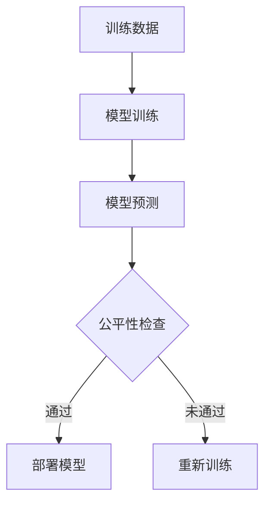
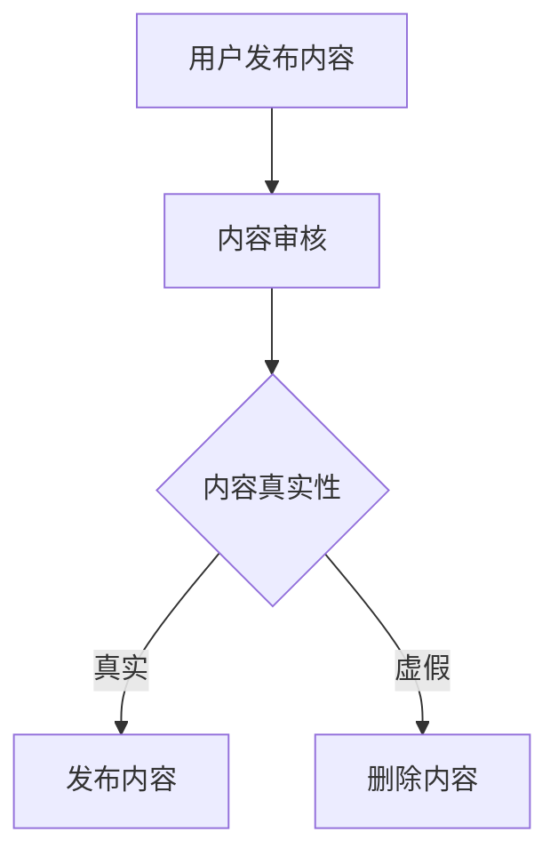

## 引言

信息系统伦理是指在设计、开发、使用和管理信息系统时，遵循的道德原则和行为规范。随着信息技术的快速发展，信息系统伦理变得越来越重要，因为它直接关系到个人隐私、数据安全、公平性和社会责任等问题。本文将逐步介绍信息系统伦理的核心概念，并通过实际案例帮助您理解其重要性。

## 什么是信息系统伦理？

信息系统伦理涉及以下几个方面：

1. **隐私保护**：确保个人数据的安全和隐私。
2. **数据安全**：防止数据被未经授权的访问、篡改或泄露。
3. **公平性**：确保信息系统的使用不会导致不公平的待遇或歧视。
4. **社会责任**：信息系统开发者和管理者应对其系统的社会影响负责。

## 隐私保护

隐私保护是信息系统伦理的核心之一。在设计和使用信息系统时，必须确保用户的个人数据得到充分保护。以下是一个简单的代码示例，展示如何在编程中实现数据加密：

```python
from cryptography.fernet import Fernet

# 生成密钥
key = Fernet.generate_key()
cipher_suite = Fernet(key)

# 加密数据
data = "敏感信息".encode()
encrypted_data = cipher_suite.encrypt(data)
print("加密后的数据:", encrypted_data)

# 解密数据
decrypted_data = cipher_suite.decrypt(encrypted_data)
print("解密后的数据:", decrypted_data.decode())
```

**输入：**
```
敏感信息
```

**输出：**
```
加密后的数据: b'gAAAAABf2...'
解密后的数据: 敏感信息
```

:::note
在实际应用中，密钥管理非常重要，必须确保密钥的安全存储和传输。
:::

## 数据安全

数据安全是信息系统伦理的另一个重要方面。以下是一个简单的代码示例，展示如何检查用户密码的强度：

```python
import re

def check_password_strength(password):
    if len(password) < 8:
        return "密码太短"
    if not re.search("[a-z]", password):
        return "密码必须包含小写字母"
    if not re.search("[A-Z]", password):
        return "密码必须包含大写字母"
    if not re.search("[0-9]", password):
        return "密码必须包含数字"
    if not re.search("[!@#$%^&*()]", password):
        return "密码必须包含特殊字符"
    return "密码强度足够"

password = "Password123!"
print(check_password_strength(password))
```

**输入：**
```
Password123!
```

**输出：**
```
密码强度足够
```

:::tip
强密码策略可以有效防止暴力破解攻击，提高系统的安全性。
:::

## 公平性

公平性要求信息系统在设计和使用时，避免对任何群体或个人造成不公平的待遇。例如，在机器学习模型中，必须确保训练数据的多样性，以避免偏见。



:::caution
如果训练数据存在偏见，模型可能会对某些群体产生不公平的预测结果。
:::

## 社会责任

信息系统开发者和管理者应对其系统的社会影响负责。例如，社交媒体平台应采取措施防止虚假信息的传播。



:::warning
虚假信息的传播可能对社会造成严重影响，平台必须采取有效措施进行管理。
:::

## 实际案例

### 案例一：Facebook 数据泄露事件

2018年，Facebook 因数据泄露事件受到广泛批评。该事件暴露了数百万用户的个人数据，引发了全球对隐私保护的关注。这一事件提醒我们，信息系统开发者必须严格遵守伦理原则，确保用户数据的安全。

### 案例二：AI 招聘系统的偏见

某公司开发的 AI 招聘系统因训练数据存在偏见，导致对女性候选人的不公平待遇。这一案例表明，公平性在信息系统中的重要性，开发者必须确保系统的公平性和透明性。

## 总结

信息系统伦理是确保信息系统在设计、开发和使用过程中遵循道德原则的重要领域。通过保护隐私、确保数据安全、维护公平性和承担社会责任，我们可以构建更加可信和可靠的信息系统。

## 附加资源

- [ACM 伦理准则](https://www.acm.org/code-of-ethics)
- [IEEE 伦理准则](https://www.ieee.org/about/corporate/governance/p7-8.html)
- [数据隐私保护指南](https://www.gdpr-info.eu/)

## 练习

1. 编写一个程序，检查用户输入的密码是否符合强密码策略。
2. 设计一个简单的数据加密和解密程序，确保数据的安全性。
3. 思考并讨论如何在机器学习模型中避免偏见，确保公平性。

通过本文的学习，您应该对信息系统伦理有了初步的了解。希望您能在实际应用中遵循这些伦理原则，构建更加安全和可信的信息系统。