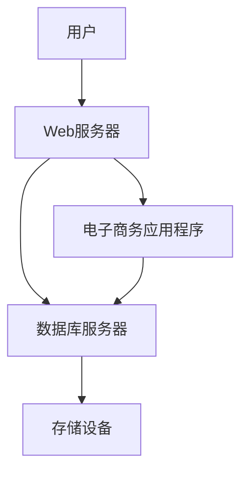

# 信息系统架构

信息系统架构是设计和构建信息系统的框架，它定义了系统的组成部分、它们之间的关系以及它们如何协同工作以实现特定的业务目标。对于初学者来说，理解信息系统架构是掌握信息系统开发和管理的基础。

## 什么是信息系统架构？

信息系统架构是指信息系统的整体结构，包括硬件、软件、数据、网络和人员等组成部分。它提供了一个蓝图，帮助开发者和企业理解系统如何运作，以及如何优化系统以满足业务需求。

## 信息系统架构的组成部分

信息系统架构通常包括以下几个主要组成部分：

1. **硬件**：包括服务器、存储设备、网络设备等物理设备。
2. **软件**：包括操作系统、数据库管理系统、应用程序等。
3. **数据**：系统处理的数据，包括结构化数据（如数据库）和非结构化数据（如文档、图像）。
4. **网络**：连接各个硬件和软件组件的通信基础设施。
5. **人员**：使用和管理系统的人员，包括开发人员、管理员和最终用户。

## 信息系统架构的类型

信息系统架构可以分为以下几种类型：

1. **集中式架构**：所有资源和处理都集中在单一的主机或服务器上。
2. **分布式架构**：资源和处理分布在多个节点上，通过网络连接。
3. **客户端-服务器架构**：客户端请求服务，服务器提供服务。
4. **面向服务的架构（SOA）**：将系统功能作为服务提供给其他系统或应用程序。

## 实际案例

### 案例：电子商务网站的信息系统架构

假设我们有一个电子商务网站，其信息系统架构可能包括以下组件：

- **硬件**：Web服务器、数据库服务器、存储设备。
- **软件**：操作系统（如Linux）、Web服务器软件（如Apache）、数据库管理系统（如MySQL）、电子商务应用程序。
- **数据**：产品信息、用户信息、订单信息。
- **网络**：互联网连接、内部网络。
- **人员**：网站管理员、开发人员、客户服务人员。



## 代码示例

以下是一个简单的Python代码示例，展示了如何从数据库中获取产品信息：

```python
import mysql.connector

# 连接到数据库
db = mysql.connector.connect(
    host="localhost",
    user="root",
    password="password",
    database="ecommerce"
)

# 创建游标对象
cursor = db.cursor()

# 执行SQL查询
cursor.execute("SELECT * FROM products")

# 获取查询结果
results = cursor.fetchall()

# 打印结果
for row in results:
    print(row)

# 关闭连接
db.close()
```

**输入**：数据库连接信息和SQL查询。

**输出**：产品信息的列表。

## 总结

信息系统架构是设计和构建信息系统的关键框架。通过理解其组成部分和类型，初学者可以更好地掌握信息系统的开发和管理。实际案例和代码示例进一步展示了信息系统架构在实际中的应用。

## 附加资源

- [信息系统架构基础](https://example.com/information-systems-architecture)
- [分布式系统设计](https://example.com/distributed-systems)
- [面向服务的架构（SOA）指南](https://example.com/soa-guide)

## 练习

1. 描述你所在公司或学校的信息系统架构。
2. 尝试设计一个简单的信息系统架构，包括硬件、软件、数据、网络和人员。
3. 编写一个简单的Python脚本，连接到数据库并查询数据。

:::tip
在设计和实现信息系统架构时，始终考虑系统的可扩展性、安全性和性能。
:::