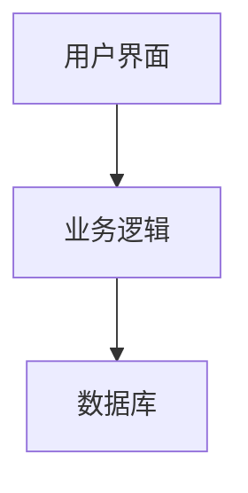

# 信息系统生命周期

信息系统生命周期（Information System Life Cycle, ISLC）是指从信息系统的规划、开发、实施、运行到最终退役的整个过程。理解这一生命周期对于初学者来说至关重要，因为它帮助我们系统地管理和维护信息系统，确保其在整个生命周期内高效运行。

## 1. 规划阶段

### 1.1 需求分析
在规划阶段，首先需要进行需求分析。这一步骤的目的是明确系统的目标和功能需求。例如，一个电子商务网站可能需要用户注册、商品展示、购物车和支付功能。

```plaintext
需求示例：
- 用户注册和登录功能
- 商品分类和搜索功能
- 购物车和订单管理功能
- 支付和物流跟踪功能
```

### 1.2 可行性研究
可行性研究包括技术可行性、经济可行性和操作可行性。技术可行性评估现有技术是否能够支持系统开发；经济可行性评估项目的成本和收益；操作可行性评估系统是否能够被用户接受和使用。

:::note
可行性研究是确保项目成功的关键步骤，避免在后期开发中出现不可预见的问题。
:::

## 2. 设计阶段

### 2.1 系统设计
系统设计包括架构设计、数据库设计和用户界面设计。架构设计确定系统的整体结构；数据库设计确定数据的存储和管理方式；用户界面设计确保系统的易用性。



### 2.2 详细设计
详细设计阶段将系统设计细化到每个模块和功能。例如，用户注册模块的设计可能包括输入验证、数据存储和错误处理。

```plaintext
用户注册模块设计：
1. 输入用户名和密码
2. 验证输入格式
3. 检查用户名是否已存在
4. 存储用户信息
5. 返回注册成功或失败信息
```

## 3. 开发阶段

### 3.1 编码
在开发阶段，程序员根据设计文档编写代码。以下是一个简单的用户注册功能的伪代码示例：

```python
def register_user(username, password):
    if validate_input(username, password):
        if not user_exists(username):
            save_user(username, password)
            return "注册成功"
        else:
            return "用户名已存在"
    else:
        return "输入格式错误"
```

### 3.2 测试
开发完成后，需要进行单元测试、集成测试和系统测试，确保每个模块和整个系统都能正常工作。

:::tip
测试是开发过程中不可或缺的一部分，确保系统的稳定性和可靠性。
:::

## 4. 实施阶段

### 4.1 部署
在实施阶段，系统被部署到生产环境中。这可能包括服务器配置、数据库迁移和用户培训。

### 4.2 维护
系统上线后，需要进行日常维护，包括bug修复、性能优化和功能更新。

## 5. 退役阶段

### 5.1 系统退役
当系统不再满足业务需求或技术过时时，需要进行系统退役。这可能包括数据迁移、系统关闭和用户通知。

:::caution
系统退役需要谨慎处理，确保数据安全和用户通知到位。
:::

## 实际案例

### 案例：电子商务网站的生命周期
1. **规划阶段**：确定网站的功能需求，如用户注册、商品展示、购物车和支付功能。
2. **设计阶段**：设计网站架构、数据库和用户界面。
3. **开发阶段**：编写代码并进行测试。
4. **实施阶段**：部署网站并进行用户培训。
5. **维护阶段**：修复bug、优化性能和更新功能。
6. **退役阶段**：当网站技术过时时，进行数据迁移和系统关闭。

## 总结

信息系统生命周期涵盖了从规划到退役的各个阶段，每个阶段都有其特定的任务和目标。理解这一生命周期有助于我们更好地管理和维护信息系统，确保其在整个生命周期内高效运行。

## 附加资源

- [信息系统生命周期 - 维基百科](https://en.wikipedia.org/wiki/Information_system_life_cycle)
- [软件工程：实践者的研究方法](https://www.amazon.com/Software-Engineering-Practitioners-Roger-Pressman/dp/0073375977)

## 练习

1. 描述信息系统生命周期的各个阶段，并举例说明每个阶段的任务。
2. 设计一个简单的用户注册模块，并编写伪代码。
3. 讨论系统退役时需要考虑的关键因素。
