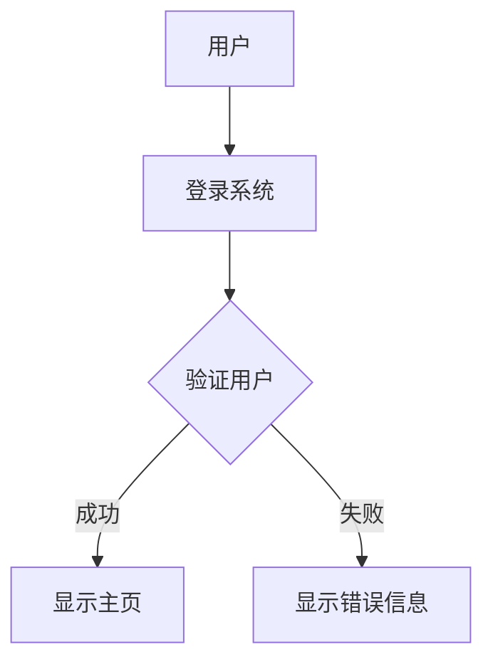

# 需求工程基础

需求工程是软件开发过程中的关键环节，它涉及识别、分析、记录和管理系统需求。需求工程的目标是确保开发团队和利益相关者对系统的功能和性能达成一致，从而为后续的设计和开发奠定基础。

## 什么是需求工程？

需求工程是软件工程中的一个子领域，专注于系统需求的获取、分析、规格说明、验证和管理。需求是系统必须满足的条件或能力，通常分为功能性需求和非功能性需求。

- **功能性需求**：描述系统应该做什么。例如，用户登录功能、数据存储功能等。
- **非功能性需求**：描述系统如何运行。例如，性能、安全性、可用性等。

需求工程的主要任务包括：
1. **需求获取**：与利益相关者沟通，收集需求。
2. **需求分析**：理解和细化需求，解决冲突。
3. **需求规格说明**：将需求文档化。
4. **需求验证**：确保需求的正确性和完整性。
5. **需求管理**：跟踪需求的变化和实现情况。

## 需求工程的主要步骤

### 1. 需求获取

需求获取是需求工程的第一步，目的是通过与利益相关者的沟通，收集系统的需求。常用的方法包括访谈、问卷调查、观察和头脑风暴等。

:::tip
在需求获取阶段，尽量使用开放性问题，以便获取更多详细信息。
:::

### 2. 需求分析

需求分析的目的是理解和细化收集到的需求，解决需求之间的冲突，并确保需求的可行性。常用的分析技术包括：
- **用例图**：描述系统与外部实体的交互。
- **数据流图**：展示数据在系统中的流动。

### 3. 需求规格说明

需求规格说明是将需求文档化的过程，通常使用自然语言或形式化语言编写。常见的文档包括需求规格说明书（SRS）。

:::note
需求规格说明书应清晰、无歧义，并包含所有功能性需求和非功能性需求。
:::

### 4. 需求验证

需求验证是确保需求的正确性和完整性的过程。常用的验证方法包括：
- **评审**：由团队成员和利益相关者共同审查需求文档。
- **原型**：通过构建原型系统，验证需求的可行性。

### 5. 需求管理

需求管理是跟踪需求的变化和实现情况的过程。常用的工具包括需求管理软件（如JIRA、Trello）和版本控制系统（如Git）。

## 实际案例：在线购物系统的需求工程

假设我们要开发一个在线购物系统，以下是需求工程的实际应用：

1. **需求获取**：
   - 用户需要能够浏览商品、添加到购物车、下订单。
   - 管理员需要能够管理商品库存和订单。

2. **需求分析**：
   - 使用用例图描述用户和管理员的功能。
   - 分析系统的性能需求，如响应时间不超过2秒。

3. **需求规格说明**：
   - 编写需求规格说明书，详细描述每个功能的需求。

4. **需求验证**：
   - 通过评审会议，确保需求文档的完整性和正确性。
   - 构建原型系统，验证用户界面的可用性。

5. **需求管理**：
   - 使用JIRA跟踪每个需求的实现进度。
   - 使用Git管理需求文档的版本。

## 总结

需求工程是软件开发过程中至关重要的一环，它确保开发团队和利益相关者对系统的需求达成一致。通过需求获取、分析、规格说明、验证和管理，可以有效降低项目风险，提高开发效率。

:::caution
需求工程是一个迭代过程，需求可能会随着项目的进展而变化，因此需要持续管理和更新。
:::

## 附加资源与练习

- **推荐阅读**：
  - 《软件需求》（Karl E. Wiegers）
  - 《需求工程：基础、原理和技术》（Klaus Pohl）
- **练习**：
  - 尝试为一个简单的图书馆管理系统编写需求规格说明书。
  - 使用用例图描述一个在线学习平台的功能需求。